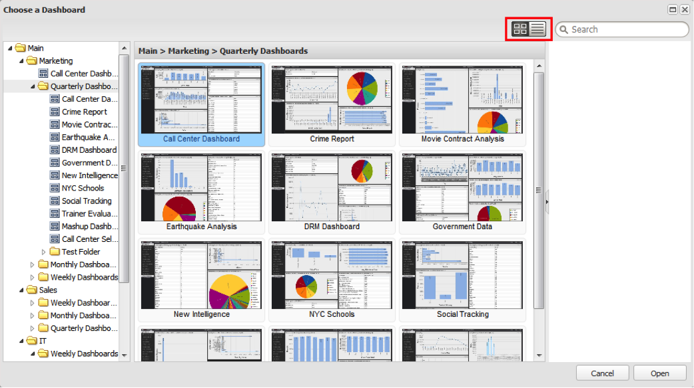

# Vyer i instrumentpanelswebbläsaren{#dashboard-browser-views}

Beskriver miniatyrbildsvyn och listvyn.

Det finns två vyer som kan användas för att navigera på instrumentpaneler i Dashboard Browser: miniatyrbildsvyn och listvyn. Miniatyrbildsvyn innehåller miniatyrbilder av kontrollpaneler när du bläddrar, medan listvyn är en mer detaljorienterad tabellbaserad vy av de tillgängliga kontrollpanelerna.

## Miniatyrbildsvy {#section-b522ce5e6e184ef9a0e1b9a42f7a9ae0}

Miniatyrbildsvyn innehåller ett galleri med miniatyrbilder som motsvarar de kontrollpaneler som du har tillgång till. Om en miniatyrbild visar en standardikon kontaktar du administratören för att få en miniatyrbild för den instrumentpanelen. Med ikonerna till vänster om sökfältet kan du växla mellan miniatyrbilder och listvyer.

I miniatyrbildsvyn visar den vänstra navigeringspanelen i Dashboard Browser mapphierarkin som ordnar lagringen av kontrollpaneler. Om du vill visa innehållet i en mapp klickar du på mappen för att visa dess innehåll som miniatyrbilder på mittpanelen i kontrollpanelen. Om inga instrumentpaneler sparas på den nivån i mappen visas meddelandet&quot;inga instrumentpaneler på den här platsen&quot; i fönstrets mittpanel.

Du kan också utforska undermappar genom att klicka på pilen till vänster om den mapp som är i intresse. Då visas en lista med undermappar och kontrollpaneler i den markerade mappen. Om du väljer en mapp som innehåller minst en kontrollpanel visas en miniatyrbild för var och en av kontrollpanelerna på nivån för den aktuella markeringen. Mittpanelens rubrik ändras också för att ange sökvägen till den markerade mappen.

Du kan sedan välja den aktuella instrumentpanelen genom att klicka på den. När du har klickat på en miniatyrbild för kontrollpanelen fylls den högra ramen i med information om kontrollpanelen. Instrumentpanelsinformationen innehåller en miniatyrvy av den valda instrumentpanelen, dess namn, en kort beskrivning, ägare, datum när den skapades, senaste ändringsdatum, profil(er) som används för att kompilera data, synlighetskontroller och erbjuder ett urval av åtgärder.

## Listvy {#section-aa79d51168a7430ea2816413dc6cc73a}

Listvyn innehåller tabellbaserad information om de kontrollpaneler som du har åtkomst till. Varje rad i listvyns tabell representerar en unik kontrollpanel. Om du klickar på kolumnrubriker kan du sortera tabellen efter den kolumnen i antingen fallande eller stigande ordning.

Om du klickar på en instrumentpanelspost visas instrumentpanelens information på den högra panelen i instrumentpanelens webbläsare. Om du vill växla mellan vyer markerar du önskat visningsalternativ på nytt.
