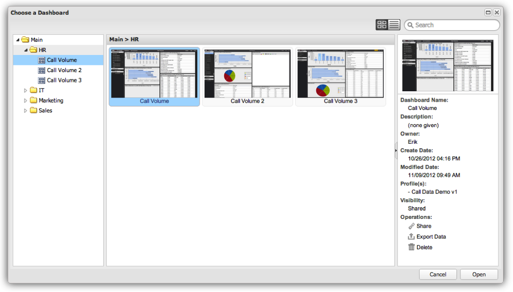

# Instrumentpanelsläsaren{#dashboard-browser}

Kontrollpanelens webbläsare gör det lättare att bläddra bland, söka efter och öppna kontrollpaneler som du och andra medlemmar i organisationen har skapat och sparat.

Du kan bläddra bland och komma åt alla instrumentpaneler som du har behörighet att visa (mer information om åtkomstkontroller finns i avsnittet Åtkomstkontroller). Instrumentpanelsläsaren fungerar bra när du behöver hitta en kontrollpanel, men du är inte säker på vilken du behöver eller var den finns. Instrumentpanelsläsaren är också användbar när du vill få mer information och utföra specialfunktioner på en viss kontrollpanel.

## Öppnar instrumentpanelsläsaren {#section-10e158d738684219ab997ef050b675d7}

När du loggar in på instrumentpanelen i Adobe Data Workbench visas instrumentpanelsläsaren som standard. Du kan också när som helst öppna Instrumentpanelsläsaren genom att klicka på kontrollpanelmenyn i verktygsfältet och välja **[!UICONTROL Browse…]**.

