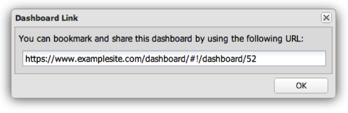

# Andra kontrollpanelsfunktioner{#other-dashboard-functions}

Specialfunktionerna är att dela, exportera och ta bort kontrollpaneler och de utförs från informationspanelen för en vald kontrollpanel.

## Dela en hyperlänk för instrumentpanel {#section-16b592f157de404fb25bd2c739d2e2c1}

Åtgärden **[!UICONTROL Share]** ger en URL som kan användas för att antingen bokmärka instrumentpanelen eller skicka en länk via e-post så att en annan användare kan komma åt instrumentpanelen. Ett länkfönster för kontrollpanelen visas med den information som behövs för att dela länken till den önskade kontrollpanelen.

>[!NOTE]
>
>Mottagarna av länken måste också ha tillgång till kontrollpanelen för att kunna visa kontrollpanelen.

## Exporterar instrumentpanelsdata {#section-ace2f5f8807548ee8436f5c1dc2cd9d2}

Åtgärden **[!UICONTROL Export Data]** initierar en export av den valda kontrollpanelen som ska sparas som en Excel- eller CSV-fil (kommaseparerade värden).

## Kontrollpaneler tas bort {#section-adc10cb1b3174ff699c024ddc8f994fa}

Åtgärden **[!UICONTROL Delete]** tar bort en instrumentpanel. Om du vill ta bort en kontrollpanel måste användaren vara ägare till kontrollpanelen eller ha administratörsåtkomst. Om du klickar på åtgärden Ta bort visas ett fönster som bekräftar att du vill ta bort instrumentpanelen.

