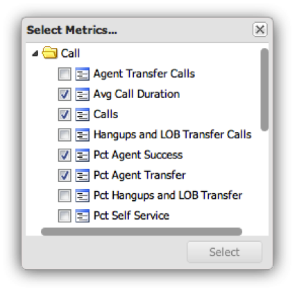

# Konfigurera visualiseringar{#configuring-visualizations}

Visar hur du konfigurerar rubrik, profil, Dimension, mått, filter, Visa överkant, Sortera efter och Tidsperiod.

Varje visualisering på kontrollpanelens arbetsyta har en egen konfiguration. När en visualisering först läggs till på kontrollpanelens arbetsyta visas dess konfigurationsfönster automatiskt. När du har konfigurerat visualiseringen kan du när som helst ändra den genom att klicka på kugghjulsikonen i den övre högra delen av visualiseringsfönstret.

>[!NOTE]
>
>Konfigurationsalternativen varierar något beroende på vilken typ av visualisering som visas.

## Visualiseringstitel {#section-0414844283d745ae912e85f8ea14a51d}

I det här fältet kan du anpassa den titel som visas högst upp i visualiseringen. Som standard är rubriken inställd på **[!UICONTROL Automatic Title]**, vilket automatiskt genererar en titel för visualiseringsfönstret. Genom att rensa knappen **[!UICONTROL Automatic Title]** kan du placera valfri titel i det här fältet. (Det här fältet gäller för alla visualiseringar.)

## Profil {#section-16eb0def0a2d4eb289f5bb9200d14754}

I det här fältet kan du välja vilken profil du vill visualisera data från. Om du klickar på listrutan visas en lista med profiler som du har åtkomst till. (Det här fältet gäller inte för Rich Text-visualiseringar.)

Profiler är datauppsättningar som definieras i Data workbench och som innehåller data om en viss domän, tillsammans med mått, mått och filter som medföljer data. En profil är ofta utformad för att uppfylla ett visst ändamål (som marknadsföring eller webbplatstrafik).

>[!NOTE]
>
>Du kan bara se de profiler som du har beviljats åtkomst till. Mer information finns i Åtkomstkontroller.

## Dimension {#section-4ebb8c4308a146c3a35c7ac7ab6b579f}

Här kan du välja vilken dimension du vill visualisera. Listan fylls i från listan med tillgängliga dimensioner från den profil som valts i fältet Profil. Klicka på önskad dimension och klicka sedan på knappen Välj. (Det här fältet gäller inte för visualiseringar av metriska förklaringar och RTF.)

Dimensioner är kategorier av liknande datatyper. Dimensionen Dagar i veckan består till exempel av följande dataelement: Söndag, måndag, tisdag, onsdag, torsdag, fredag och lördag. Dimensioner visar vad som mäts.

## Mått {#section-7d46f2f1b9fe4e539b5eb0a0dc6e5ad3}

Gör att du kan välja vilka mätvärden som ska visas. Mätvärden är kvantitativa objekt och definieras av något kvantifierbart uttryck. Sidvyer per session hämtas till exempel från uttrycket för antalet sidvyer delat med antalet sessioner. Mätarna svarar på frågan&quot;hur många?&quot;

Enkelmetriska visualiseringar har ett enda metriskt urvalsfönster:

Multimetriska visualiseringar har ett flermetriskt urvalsfönster:

Listan fylls i från listan med mätvärden som är tillgängliga från den profil som valts i fältet Profil.

Klicka på önskade mätvärden och klicka sedan på **[!UICONTROL Select]**. (Det här fältet gäller inte för Rich Text-visualiseringar.)

## Filter {#section-f8619ae2f8e54735a2c1b0fbb8bb1281}

Välj de filter som du vill använda för visualiseringen. I filterurvalsfönstret kan du välja flera filter från filterlistan. Listan fylls i från listan med tillgängliga filter från den profil som valts i fältet Profil. Klicka på önskat filter och sedan på **[!UICONTROL Select]**.

>[!NOTE]
>
>Filter som tillämpas här tillämpas bara på motsvarande visualisering, inte på hela instrumentpanelen. Detta är användbart när du vill jämföra resultatet av två olika visualiseringar med olika filter.

## Visa hopp {#section-7ce71cb0fa6446998b710b427e68b133}

Visualiseringar på kontrollpanelen är inte utformade för att visa alla data. I stället kan du ange hur många dimensionsposter du vill visa i visualiseringen. Här visas det högsta antalet dimensioner beroende på det sorteringsvärde som anges nedan. (Det här fältet gäller inte för visualiseringar av tabeller, metriska förklaringar och RTF.)

## Sortera efter {#section-f686249e20444359bff87c00cc2ba29f}

På så sätt kan du ange hur data ska sorteras när de visas inom visualiseringen. (Det här fältet gäller inte för visualiseringar av tabeller, metriska förklaringar och RTF.) Det finns flera sorteringsalternativ:

* **[!UICONTROL Default]** - Returnera osorterade data baserat på den sorteringsordning som lagras i data workbench. Det här är alternativet för tidsbaserade data som timme, dag, vecka eller månad.
* **[!UICONTROL Dimension]** -Sortera data baserat på det alfanumeriska dimensionsvärdet.
* **[!UICONTROL Metric]** - Sortera data baserat på måttvärdet och är bra för att snabbt visualisera de övre dimensionerna.
* **[!UICONTROL Descending]** - Sortera data i fallande ordning.
* **[!UICONTROL Ascending]** - Sortera data i stigande ordning.

## Tidsperiod {#section-6220368e9e524b46ac735add6ab9edb0}

Med den här visualiseringen kan du ange önskat start- och/eller slutdatum för de data som ska visas i visualiseringen.

Om du väljer **[!UICONTROL All Dates]**visas hela datumintervallet som är tillgängligt i profilen.

Om du väljer **[!UICONTROL Range]** visas endast de data som ligger inom ett angivet intervall. Om du vill ange datumintervallet kan du skriva in start- och/eller slutdatumet eller använda en kalenderinmatning genom att välja kalenderikonen.

(Det här fältet gäller inte för Rich Text-visualiseringar.)

>[!NOTE]
>
>Datumintervall som används här används bara för motsvarande visualisering, inte för hela instrumentpanelen. Detta är användbart när du vill jämföra resultatet av två olika visualiseringar med olika datumintervall.

