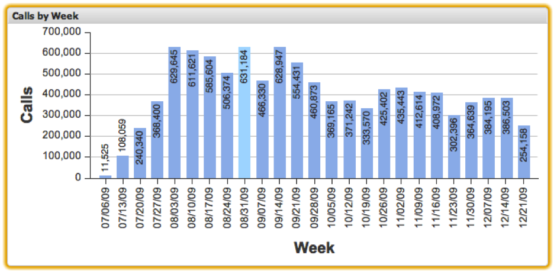

# Kolumndiagram{#column-charts}

{{eol}}

Med kolumndiagramvisualiseringar kan du visualisera mått- och dimensionsdata där varje dataelement representeras som en lodrät kolumn i diagrammet. I kolumndiagram kan upp till 200 unika dataelement visas i diagrammet samtidigt. Dimensionsvärdena etiketteras längs x-axeln, medan måttskalevärdena anges längs y-axeln. Kolumnen för varje dimensionsvärde etiketteras med dess exakta måttvärde.

