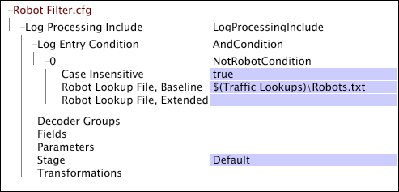

# Webbspecifika inställningar för loggbearbetning{#web-specific-settings-for-log-processing}

{{eol}}

Information om webbspecifika inställningar som definieras i Loggbearbetning av datauppsättning inkluderar filer som levereras med Adobe-profiler för platsen.

Den filtrering som definieras av dessa inställningar sker efter att loggposterna lämnat avkodarna och omvandlingarna tillämpas, men före utvärdering av [!DNL Log Entry Condition].

* [HTTP-statusfiltrering](../../../home/c-dataset-const-proc/c-config-web-data/c-web-spec-log-proc.md#section-ac66acdcb6aa467d81c3721199e540fd)
* [Robot-filtrering](../../../home/c-dataset-const-proc/c-config-web-data/c-web-spec-log-proc.md#section-7f43681dfbc64b969619cb88f97d5ad5)

## HTTP-statusfiltrering {#section-ac66acdcb6aa467d81c3721199e540fd}

Du kan konfigurera implementeringen av [!DNL Site] om du vill ta bort loggposter med sc-status-koder på 400 eller högre från datauppsättningen. Slutförda begäranden har statuskoder som är mindre än 400. Standardimplementeringen innehåller en [!DNL Log Processing Dataset Include] filen som HTTP-statusfiltrering har konfigurerats i.

**Redigera konfigurationsinställningarna för HTTP-statusfiltrering**

1. Öppna [!DNL Profile Manager] i din datauppsättningsprofil och öppna [!DNL Dataset\Log Processing\Traffic\HTTP Status Filter.cfg] -fil.

   >[!NOTE]
   >
   >Om du har anpassat implementeringen av [!DNL Site]kan filen som innehåller dessa konfigurationsinställningar skilja sig från den plats som beskrivs.

1. Granska eller redigera parametervärdena för filen efter behov. Använd följande exempel som guide.

   

   Mer information om [!DNL Range] villkor, se [Villkor](../../../home/c-dataset-const-proc/c-conditions/c-abt-cond.md).

1. Spara [!DNL HTTP Status Filter.cfg] genom att högerklicka **[!UICONTROL (modified)]** längst upp i fönstret och klicka på **[!UICONTROL Save]**.

1. Om du vill att de lokalt gjorda ändringarna ska gälla går du till [!DNL Profile Manager]högerklickar du på bockmarkeringen för filen i dialogrutan [!DNL User] kolumn och klicka sedan på **[!UICONTROL Save to]** > *&lt;**[!UICONTROL profile name]**>*, där profilnamnet är namnet på datauppsättningsprofilen eller den ärvda profilen som datauppsättningsfilen tillhör.

   >[!NOTE]
   >
   >Spara inte den ändrade konfigurationsfilen i någon av de interna profilerna som tillhandahålls av Adobe, eftersom ändringarna skrivs över när du installerar uppdateringar för de här profilerna.

## Robot-filtrering {#section-7f43681dfbc64b969619cb88f97d5ad5}

Du kan konfigurera implementeringen av [!DNL Site] om du vill använda sökfiler för att ta bort loggposter som genererats av kända robotar, testskript och IP-adresser för interna användare från datauppsättningen. Standardimplementeringen innehåller en [!DNL Log Processing Dataset Include] filen som robotfiltreringen är konfigurerad i.

**Redigera konfigurationsinställningarna för robotfiltrering**

1. Öppna [!DNL Profile Manager] i din datauppsättningsprofil och öppna [!DNL Dataset\Log Processing\Traffic\Robot Filter.cfg] -fil.

   >[!NOTE]
   >
   >Om du har anpassat implementeringen av [!DNL Site]kan filen som innehåller dessa konfigurationsinställningar skilja sig från den plats som beskrivs.

1. Granska eller redigera filens parametrar med hjälp av följande exempel och information som guider:

   

   Filen innehåller en [!DNL NotRobotCondition] som definieras av följande tre parametrar:

   * **Filtrering av skiftlägesokänslig robot:** Sant eller falskt. Om värdet är true beaktas inte versaler (övre/nedre) vid robotfiltrering.
   * **Robot-sökningsfil, baslinje:** Sökvägen och filnamnet för textfilen som innehåller en lista över webbläsaranvändaragenter som är kända robotar och som ska filtreras bort från datauppsättningen. Adobe tillhandahåller en robotsökningsfil för baslinje. Om du inte anger en sökväg söker data workbench-servern efter filen i katalogen Lookups i installationskatalogen för data workbench-servern.
   * **Robot-sökningsfil, utökad:** Sökväg och filnamn för en valfri textfil som innehåller en lista över webbläsaranvändaragenter eller IP-adresser som definierar robotar som är specifika för implementeringen. Den här listan kan innehålla interna övervakningsrobotar, testskript och IP-adresser för interna användare som ska filtreras bort från datauppsättningen. Om du inte anger en sökväg söker data workbench-servern efter filen i katalogen Lookups i installationskatalogen för data workbench-servern.

   Om en loggposts användaragent för webbläsare inte finns med i någon av sökfilerna, anses loggposten ha genererats av en riktig besökare och inte filtrerats från datauppsättningen.

   >[!NOTE]
   >
   >Matchning i robotsökningsfiler använder delsträngar för att jämföra med loggfälten c-ip och cs(user-agent). Om söksträngen börjar med &quot;$&quot; måste den matcha framsidan av strängen som testas, och om den slutar med &quot;$&quot; måste söksträngen matcha slutet av strängen som testas. Om söksträngen både börjar med och slutar med &quot;$&quot; måste strängarna matcha exakt för att loggposten ska filtreras bort. Om du till exempel vill testa för alla IP-adresser i ett klass C-block använder du en sträng som $231.78.123. för att tvinga fram en matchning framför strängen. Detta matchar adresserna 231.78.123.0 till 231.78.123.255.

1. Spara filen genom att högerklicka **[!UICONTROL (modified)]** längst upp i fönstret och klicka på **[!UICONTROL Save]**.

1. Om du vill att de lokalt gjorda ändringarna ska gälla går du till [!DNL Profile Manager]högerklickar du på bockmarkeringen för filen i dialogrutan [!DNL User] kolumn och klicka sedan på **[!UICONTROL Save to]** > *&lt;**[!UICONTROL profile name]**>*, där profilnamnet är namnet på datauppsättningsprofilen eller den ärvda profilen som datauppsättningsfilen tillhör.

   Spara inte den ändrade konfigurationsfilen i någon av de interna profilerna som tillhandahålls av Adobe, eftersom ändringarna skrivs över när du installerar uppdateringar för de här profilerna.

   >[!NOTE]
   >
   >Om det är viktigt att de underliggande loggposterna som används för att konstruera en datauppsättning inte ändras (även om omformningarna som används för att konstruera och uppdatera datauppsättningen och dess dimensioner ändras) bör Robot Lookup File, Baseline och Robot Lookup File, Extended, versionskontrolleras. Om du placerar ett versionsnummer i de här filerna säkerställer du att uppdateringar av standardfilerna för robotsökning inte oavsiktligt ändrar tidigare genererade rapporteringsdatauppsättningar genom att lägga till eller ta bort poster i dessa filer.
