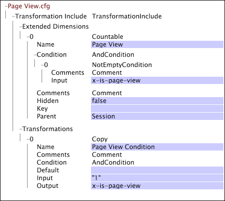

# Webbspecifika inställningar för omvandling{#web-specific-settings-for-transformation}

Information om webbspecifika inställningar som definieras i Transformation DataSet Inkludera filer som levereras med Adobe-profiler för Site.

De villkor, dimensioner och parametrar som definieras av de här inställningarna skapas under datauppsättningens omformningsfas.

* [Sidvisningsvillkor](../../../home/c-dataset-const-proc/c-config-web-data/c-web-spec-transf.md#section-cc2807a12a88492f8b64a43234a1f835)
* [URI-dimension](../../../home/c-dataset-const-proc/c-config-web-data/c-web-spec-transf.md#section-348f7e9099d049d197a7cdcbc8a6c234)
* [Referensdimension](../../../home/c-dataset-const-proc/c-config-web-data/c-web-spec-transf.md#section-8a97ec34d18b4814b5f95495ac4f8638)
* [Sessionsparametrar](../../../home/c-dataset-const-proc/c-config-web-data/c-web-spec-transf.md#section-0a209b0c504041a5801f7f71a963c8b1)

## Sidvisningsvillkor {#section-cc2807a12a88492f8b64a43234a1f835}

Detta [!DNL Page View Condition] är en villkorsåtgärd som avgör om en viss loggpost (d.v.s. en sidförfrågan) ska inkluderas i de data som samlas in om en besökares sidvisningshistorik. När loggposten uppfyller [!DNL Page View Condition]villkoren blir den ett element i sidvyns räkningsbara dimension. Om en loggpost inte uppfyller kraven [!DNL Page View Condition]är dess datafält fortfarande tillgängliga med andra dimensioner. Förutom sidvisningsdimensionen kan följande dimensioner påverkas av resultatet av [!DNL Page View Condition]:

* **[!DNL URI]och[!DNL Page]:**Dessa mått påverkas direkt av[!DNL Page View Condition]. Om den angivna sidan inte skickar[!DNL Page View Condition,]den tas den inte med i URI- eller siddimensionerna.

* **[!DNL Visitor Page Views]och[!DNL Session Page Views]:**Dimensionerna för sidvyer och sidvyer för besökare är antalet sidor som visas av en besökare till eller under en viss session. Sidor som filtreras bort av[!DNL Page View Condition]är inte en del av det här antalet.

* **Sessionsnummer:** Indirekt [!DNL Page View Condition] påverkar sessionsnummerdimensionen. Sessionsnummerdimensionen har skapats före [!DNL Page View Condition]; Därför är det möjligt att ha sessioner utan sidvyer när du överväger [!DNL Session Number] i relation till [!DNL Page Views]sidvyn.

Din standardimplementering av [!DNL Site] innehåller en [!DNL Transformation Dataset Include] fil där sidvyns räkningsbara dimension och tillhörande [!DNL Page View Condition] har definierats.

Mer information om räkningsbara dimensioner finns i [Utökade dimensioner](../../../home/c-dataset-const-proc/c-ex-dim/c-abt-ex-dim.md).

**Så här redigerar du konfigurationsinställningarna för sidvisningsvillkoren**

1. Öppna filen [!DNL Profile Manager] i datauppsättningsprofilen och öppna [!DNL Dataset\Transformation\Traffic\Page View.cfg] filen.

   >[!NOTE]
   >
   >Om du har anpassat din implementering av [!DNL Site]kan filen där dessa konfigurationsinställningar finns skilja sig från den plats som beskrivs.

1. Granska eller redigera parametrarnas värden efter [!DNL Page View Condition] behov. Använd följande exempel som guide. I den här filen [!DNL Page View Condition] definieras den av en [!DNL Copy] omformning. Observera att den här filen även innehåller definitionen av den räkningsbara sidvisningsdimensionen.

   

   >[!NOTE]
   >
   >Mer information om räkningsbara dimensioner finns i [Utökade dimensioner](../../../home/c-dataset-const-proc/c-ex-dim/c-abt-ex-dim.md). Mer information om [!DNL Copy] omformningen finns i [Dataomformningar](../../../home/c-dataset-const-proc/c-data-trans/c-abt-transf.md).

1. Spara filen genom att högerklicka **[!UICONTROL (modified)]** högst upp i fönstret och sedan klicka på **[!UICONTROL Save]**.

1. Om du vill göra de lokalt gjorda ändringarna gällande [!DNL Profile Manager]högerklickar du på bockmarkeringen för filen i [!DNL User] kolumnen och klickar sedan på **[!UICONTROL Save to]** > *&lt;**[!UICONTROL profile name]**>*, där profilnamnet är namnet på datauppsättningsprofilen eller den ärvda profilen som datauppsättningsfilen tillhör.

   >[!NOTE]
   >
   >Spara inte den ändrade konfigurationsfilen i någon av de interna profiler som tillhandahålls av Adobe, eftersom dina ändringar skrivs över när du installerar uppdateringar för dessa profiler.

## URI-dimension {#section-348f7e9099d049d197a7cdcbc8a6c234}

Om du arbetar med [!DNL Site]måste du definiera den URI-dimension vars element är URI-matningar för de visade webbplatssidorna. Standardimplementeringen innehåller en [!DNL Transformation Dataset Include] fil där den enkla URI-dimensionen definieras.

Mer information om enkla dimensioner finns i [Utökade dimensioner](../../../home/c-dataset-const-proc/c-ex-dim/c-abt-ex-dim.md).

**Redigera konfigurationsinställningarna för URI-dimensionen**

1. Öppna filen [!DNL Profile Manager] i datauppsättningsprofilen och öppna [!DNL Dataset\Transformation\Traffic\URI.cfg] filen.

   >[!NOTE]
   >
   >Om du har anpassat din implementering av [!DNL Site]kan filen där dessa konfigurationsinställningar finns skilja sig från den plats som beskrivs.

1. Granska eller redigera parametervärdena för filen efter behov. Använd följande exempel och information som stödlinjer.

Konfigurationsinställningarna för URI-dimensionen innehåller följande två parametrar:

* **Skiftlägeskänslig:** Sant eller falskt. Om värdet är true beaktas skiftläge för bokstäver (övre/nedre) när unika sidor identifieras. Standardvärdet är true.
* **Maximalt antal element:** Det högsta antalet element (dvs. URI:er) för URI-dimensionen. Standardvärdet är 32768.

   >[!NOTE]
   >
   >Om du ändrar det här värdet kan det orsaka allvarliga prestandaproblem. Ändra inte det här värdet utan att rådfråga Adobe.

* Spara [!DNL URI.cfg] filen genom att högerklicka **[!UICONTROL (modified)]** längst upp i fönstret och sedan klicka på **[!UICONTROL Save]**.

* Om du vill göra de lokalt gjorda ändringarna gällande [!DNL Profile Manager]högerklickar du på bockmarkeringen för filen i [!DNL User] kolumnen och klickar sedan på **[!UICONTROL Save to]** > *&lt;**[!UICONTROL profile name]**>*, där profilnamnet är namnet på datauppsättningsprofilen eller den ärvda profilen som datauppsättningsfilen tillhör.

   >[!NOTE]
   >
   >Spara inte den ändrade konfigurationsfilen i någon av de interna profiler som tillhandahålls av Adobe, eftersom dina ändringar skrivs över när du installerar uppdateringar för dessa profiler.

## Referensdimension {#section-8a97ec34d18b4814b5f95495ac4f8638}

Om du arbetar med [!DNL Site]måste du definiera referensdimensionen vars element består av den andra nivån för referenspersonernas andra nivå i de första loggposterna i alla sessioner. Standardimplementeringen innehåller en [!DNL Transformation Dataset Include] fil där den enkla referensdimensionen är definierad.

Mer information om enkla dimensioner finns i [Utökade dimensioner](../../../home/c-dataset-const-proc/c-ex-dim/c-abt-ex-dim.md).

**Så här redigerar du konfigurationsinställningarna för referensdimensionen**

1. Öppna filen [!DNL Profile Manager] i datauppsättningsprofilen och öppna [!DNL Dataset\Transformation\Traffic\Referrer.cfg] filen.

   >[!NOTE]
   >
   >Om du har anpassat din implementering av [!DNL Site]kan filen där dessa konfigurationsinställningar finns skilja sig från den plats som beskrivs.

1. Granska eller redigera parametervärdena för filen efter behov. Använd följande exempel och information som stödlinjer.

   

   Konfigurationsinställningarna för referensdimensionen inkluderar parametern Maximum Elements, som anger det maximala antalet element (det vill säga referenter) för referensdimensionen. Standardvärdet är 32768.

   >[!NOTE]
   >
   >I exemplet ovan är [!DNL Maximum Elements] parametern inställd på 0. När den här parametern är inställd på 0 använder data workbench-servern det interna standardvärdet 32768.

1. Spara [!DNL Referrer.cfg] filen genom att högerklicka **[!UICONTROL (modified)]** längst upp i fönstret och sedan klicka på **[!UICONTROL Save]**.

1. Om du vill göra de lokalt gjorda ändringarna gällande [!DNL Profile Manager]högerklickar du på bockmarkeringen för filen i [!DNL User] kolumnen och klickar sedan på **[!UICONTROL Save to]** > *&lt;**[!UICONTROL profile name]**>*, där profilnamnet är namnet på datauppsättningsprofilen eller den ärvda profilen som datauppsättningsfilen tillhör.

   >[!NOTE]
   >
   >Spara inte den ändrade konfigurationsfilen i någon av de interna profiler som tillhandahålls av Adobe, eftersom dina ändringar skrivs över när du installerar uppdateringar för dessa profiler.

## Sessionsparametrar {#section-0a209b0c504041a5801f7f71a963c8b1}

Om du arbetar med [!DNL Site]kan du ange parametrar som definierar gränserna för en besökarsession på en webbplats. De här parametrarna är bara giltiga när de definieras i en [!DNL Transformation Dataset Include] fil i din [!DNL Site] implementering.

Följande parametrar är unika eftersom de kan vara medlemmar i [!DNL Transformation Dataset Include] filens [!DNL Parameters] vektor, eller så kan de listas som enskilda parametrar i [!DNL Transformation.cfg]filen. En parameter kan definieras exakt en gång, så parametrarna definieras antingen i [!DNL Transformation.cfg]filen eller i datasetens [!DNL Parameters] vektor include-fil - inte i båda filerna.
**Maximal sessionstid och tidsgräns för session**

Maximal sessionstid och tidsgräns för session är strängparametrar som definierar längden på en besökares session. De här parametrarna fungerar med parametern Internal Domains för att bestämma sessionslängden.

Maximal sessionsvaraktighet anger den längsta sessionslängden innan en ny session startas. På så sätt kan webbsidor med automatiskt innehåll uppdateras från att du skapar sessioner som är godtyckligt långa. Om referenten för ett klick är inställd på en av posterna i parametern Internal Domains, används den här tidsgränsen för att definiera slutet av en session. Ingen session får vara längre än den angivna maximala sessionslängden, oavsett hur många klick den innehåller. Rekommenderat värde är 48 timmar.

Sessionstimeout anger den tid som måste förflyta mellan loggposterna för en viss besökare för att avgöra slutet av en session och början av en ny session (d.v.s. den vanliga tidsgränsen som används för att definiera en användarsession). Det rekommenderade värdet för den här parametern är 30 minuter. Om referenten för ett klick inte är inställd på en av referenserna i parametern Internal Domains, används den här tidsgränsen för att definiera sessionen. Om cs(referer-domain) för en loggpost finns i listan över interna domäner avgör Maximal sessionstid om den aktuella loggposten är en del av en befintlig session eller om en ny session påbörjas.

Tänk dig en situation där en besökare anropas bort från datorn under en längre tid än tidsgränsen för sessionen när han eller hon befinner sig mitt i surfandet. När han kommer tillbaka fortsätter han att surfa där han slutade. Eftersom besökaren aldrig lämnar webbplatsen eller stänger webbläsaren är cs(referrer-domain) för nästa klickning densamma som den interna domänen, och den ursprungliga sessionen förblir aktiv så länge inställningen för Maximal sessionstid inte nås. Om webbplatsens domän listas som en intern domän och den maximala tidsgränsen inte nås, visas besökarens interaktion som en enda session och inte som två separata sessioner. Om besökaren återgår till sin dator och nästa klickning har en extern (eller tom) referent, startar en ny session.

>[!NOTE]
>
>Omvandlingen [!DNL Sessionize] spelar också en roll [!DNL Timeout Condition] när det gäller att bestämma längden på en besökarsession. Om Tidsgräns för session och Maximal sessionstid inte är tillämpliga, kontrolleras [!DNL Timeout Condition] loggposten för att avgöra om en loggpost ska anses vara början av en ny session. Mer information finns i [Dataomvandlingar](../../../home/c-dataset-const-proc/c-data-trans/c-abt-transf.md).

**Så här redigerar du parametrarna Maximal sessionstid och Timeout för session**

Om du arbetar med [!DNL Site]innehåller standardimplementeringen troligtvis en [!DNL Transformation Dataset Include] fil där namnen och de rekommenderade värdena för parametrarna anges.

1. Öppna [!DNL Profile Manager] i datauppsättningsprofilen och gå till [!DNL Dataset\Transformation\Traffic\Session Parameters.cfg].

   >[!NOTE]
   >
   >Om du har anpassat implementeringen av [!DNL Site]kan filen som parametrarna definieras i skilja sig från den plats som beskrivs.

1. Redigera parametervärdena efter behov. Var noga med att ange önskade enheter (minuter, timmar och så vidare).

   

1. Spara [!DNL Session Parameters.cfg] filen genom att högerklicka **[!UICONTROL (modified)]** högst upp i fönstret och klicka på **[!UICONTROL Save]**.

1. Om du vill göra de lokalt gjorda ändringarna gällande [!DNL Profile Manager]högerklickar du på bockmarkeringen för filen i [!DNL User] kolumnen och klickar sedan på **[!UICONTROL Save to]** > **[!UICONTROL profile name]**, där profilnamnet är namnet på datauppsättningsprofilen eller den ärvda profilen som datauppsättningsfilen tillhör.

   >[!NOTE]
   >
   >Spara inte den ändrade konfigurationsfilen i någon av de interna profiler som tillhandahålls av Adobe, eftersom dina ändringar skrivs över när du installerar uppdateringar för dessa profiler.

**[!DNL Internal Domains]**

[!DNL Internal Domains] är en vektorparameter som listar domännivåvärdar (interna referenter) som ska behandlas som en del av en viss webbplats. Värdarna tas bort från referensdimensionen (som är en lista över extern referensinformation). När cs(referer-domain) matchar någon av strängarna som anges i uppsättningen med interna domäner, ignoreras timeout för session och Maximal sessionstid används för att bestämma sessionslängden.

Parametern Interna domäner kan också användas för att förhindra att en ny session inleds när besökare förflyttar sig mellan ett företags flera domäner som är kopplade på ett sätt som överskrider tidsgränsen för sessioner. Ta till exempel ett företag som har delar av sin webbplats delade i två domäner: den ena är loggad ( [!DNL xyz.com]) och den andra inte loggad ( [!DNL xyz-unlogged.com]). Om dessa webbplatser är integrerade på ett sätt som underlättar den sömlösa rörelsen av trafik mellan de två domänerna är det inte önskvärt att generera en annan session varje gång besökaren flyttar från [!DNL xyz-unlogged.com] domänen tillbaka till [!DNL xyz.com] domänen. Om du listar [!DNL xyz-unlogged.com] som en intern domän kan sessionerna inte delas upp i flera sessioner som ett resultat av trafik över dessa två domäner så länge inställningen för Maximal sessionstid inte nås.

**Lägga till en intern domän**

Om du arbetar med [!DNL Site]innehåller standardimplementeringen en [!DNL Transformation Dataset Include] fil som definierar parametern Internal Domains. I den här filen heter parametern: Du anger bara de interna domäner som du vill inkludera och sparar den uppdaterade filen.

1. Öppna [!DNL Profile Manager] i datauppsättningsprofilen och gå till [!DNL Dataset\Transformation\Traffic\Internal Domains.cfg.]

   >[!NOTE]
   >
   >Om du har anpassat din implementering av [!DNL Site]kan filen som parametern Internal Domains definieras i skilja sig från den plats som beskrivs.

1. Högerklicka **[!UICONTROL Value]** som vektorparameter för interna domäner och klicka på **[!UICONTROL Add new]** > **[!UICONTROL Value]**.

1. Redigera värdena efter behov.

   

1. Spara [!DNL Internal Domains.cfg] filen genom att högerklicka **[!UICONTROL (modified)]** högst upp i fönstret och klicka på **[!UICONTROL Save]**.

1. Om du vill göra de lokalt gjorda ändringarna gällande [!DNL Profile Manager]högerklickar du på bockmarkeringen för filen i [!DNL User] kolumnen och klickar sedan på **[!UICONTROL Save to]** > *&lt;**[!UICONTROL profile name]**>*, där profilnamnet är namnet på datauppsättningsprofilen eller den ärvda profilen som datauppsättningsfilen tillhör.

   >[!NOTE]
   >
   >Spara inte den ändrade konfigurationsfilen i någon av de interna profiler som tillhandahålls av Adobe, eftersom dina ändringar skrivs över när du installerar uppdateringar för dessa profiler.

