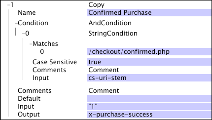

# Kopiera{#copy}

Kopiera-omformningen kopierar bara värdet i indatafältet till det angivna utdatafältet. Om indatafältet kan vara en vektor med strängar måste utdatafältet börja med &quot;x-&quot;.

| Parameter | Beskrivning | Standard |
|---|---|---|
| Namn | Beskrivande namn på omformningen. Här kan du ange valfritt namn. |  |
| Kommentarer | Valfritt. Anteckningar om omvandlingen. |  |
| Villkor | De villkor som den här omformningen används under. |  |
| Standard | Används om villkorstestet är true och indatavärdet inte är tillgängligt i den angivna loggposten. |  |
| Indata | Namnet på det fält som du vill kopiera från. |  |
| Utdata | Namnet på utdatafältet. |  |

I det här exemplet, som använder fält med data som samlats in från webbplatstrafiken, får utdatafältet x-purchase-success det literala värdet &quot;1&quot; varje gång cs-uri-stam matchar [!DNL /checkout/confirmed.php]. Om användaren inte [!DNL Condition] är nöjd (dvs. cs-uri-stam inte matchar [!DNL /checkout/confirmed.php]) ändras inte x-purchase-success.

