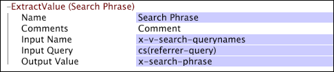

# ExtractValue{#extractvalue}

{{eol}}

Om du arbetar med webbdata kan du använda ExtractValue-omformningen för att extrahera ett värde från en frågesträng, cookie-fil eller liknande kodade fält i webbplatsdata.

Observera att namnen som motsvarar värdet som ska extraheras kan vara olika i varje loggpost.

<table id="table_D16A39BE035043628A4D6F7452952304"> 
 <thead> 
  <tr> 
   <th colname="col1" class="entry"> Parameter </th> 
   <th colname="col2" class="entry"> Beskrivning </th> 
   <th colname="col3" class="entry"> Standard </th> 
  </tr> 
 </thead>
 <tbody> 
  <tr> 
   <td colname="col1"> Namn </td> 
   <td colname="col2"> Beskrivande namn på omformningen. Här kan du ange valfritt namn. </td> 
   <td colname="col3"></td> 
  </tr> 
  <tr> 
   <td colname="col1"> Kommentarer </td> 
   <td colname="col2"> Valfritt. Anteckningar om omvandlingen. </td> 
   <td colname="col3"></td> 
  </tr> 
  <tr> 
   <td colname="col1"> Villkor </td> 
   <td colname="col2"> De villkor som den här omformningen används under. </td> 
   <td colname="col3"></td> 
  </tr> 
  <tr> 
   <td colname="col1"> Indatanamn </td> 
   <td colname="col2"> 
Namnet/namnen på de fält som ska extraheras från indatafrågan. 
 
 
Obs! Om indatanamnet är en vektor (d.v.s. det finns flera namn) extraheras bara ett värde. 
 
 </td> 
   <td colname="col3"></td> 
  </tr> 
  <tr> 
   <td colname="col1"> Indatafråga </td> 
   <td colname="col2"> Den kodade mappningen (frågesträng, cookie o.s.v.) som värdet ska extraheras från. </td> 
   <td colname="col3"></td> 
  </tr> 
  <tr> 
   <td colname="col1"> Utdatavärde </td> 
   <td colname="col2"> Namnet på fältet som används för att hämta det extraherade avkodade värdet. </td> 
   <td colname="col3"></td> 
  </tr> 
 </tbody> 
</table>

Om du vill extrahera en sökfras kan du extrahera hela frasen och, om du vill, dela frasen i söktermer med en [!DNL Tokenize] omformning. Mer information om [!DNL Tokenize] omformning, se [Tokenize](../../../../../home/c-dataset-const-proc/c-data-trans/c-transf-types/c-standard-transf/c-tokenize.md#concept-f460aa5df3a7476e971af29cf5d9b32c).

Det här exemplet konfigurerar en [!DNL ExtractValue] omformning för att extrahera värden i x-v-search-querynames-fältet från cs(reference-query) och lagra dem i x-search-phrase-fältet.

