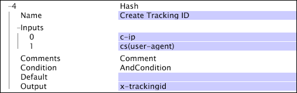

# Hash{#hash}

Hash-omformningen skapar en nästan unik sträng som representerar ett 64-bitars tal från indatavärdena.

Den här omformningen ger samma hash-värde när samma indata anges.

>[!NOTE]
>
>Resultatvärdet är nästan unikt eftersom omformningen använder ett 64-bitars tal som utrymme för möjliga hash-värden. För en miljon unika indata i [!DNL hash]-omformningen finns det en risk att få ett duplicerat hash-värde på 1 av 38 000 000.

| Parameter | Beskrivning | Standard |
|---|---|---|
| Namn | Beskrivande namn på omformningen. Här kan du ange valfritt namn. |  |
| Kommentarer | Valfritt. Anteckningar om omvandlingen. |  |
| Villkor | De villkor som den här omformningen används under. |  |
| Standard | Standardvärdet som ska användas om indatavärdet inte är tillgängligt. |  |
| Indata | Den uppsättning indata som ska användas för att skapa hash-värdet. |  |
| Utdata | Namnet på fältet för utdata. |  |

I det här exemplet används värdena i fälten c-ip och cs(user-agent) för att skapa ett spårnings-ID, som lagras i fältet x-trackingid.

>[!NOTE]
>
>Det här exemplet är inte en idealisk lösning för att skapa unika spårnings-ID:n. I situationer där arkivlogginformation används kan det dock vara den bästa metoden.
