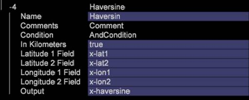

# Haversine{#haversine}

{{eol}}

I matematik är haversine-formeln en ekvation som ger cirkelavstånd mellan två punkter på en sfär som identifieras utifrån deras longituder och latituder.

Precis som formeln, [!DNL Haversine] omformning kräver två uppsättningar [!DNL Latitude] och [!DNL Longitude] med dessa fyra inmatningar för att beräkna det verkliga avståndet över jorden mellan två platser.

Avståndet kan representeras som engelska mil eller kilometer genom att flaggan&quot;In Kilometers&quot; ändras från false till true.

| Parameter | Beskrivning | Standard |
|---|---|---|
| Namn | Beskrivande namn på omformningen. Här kan du ange valfritt namn. |  |
| Kommentarer | Valfritt. Anteckningar om omvandlingen. |  |
| Villkor | De villkor som den här omformningen används under. |  |
| Latitude 1-fält | Latitud för punkt 1. |  |
| Latitude 2-fält | Latitud för punkt 2. |  |
| Longitud 1-fält | Longitud för punkt 1. |  |
| Longitud 2-fält | Longitud för punkt 2. |  |
| Utdata | När beräkningen är klar [!DNL Output] -fältet innehåller avstånd mellan de punkter som har angetts som element i en Dimension. |  |

Om du till exempel kodar Lat1, Lon1 i en latitud och longitud på deras butik och använder en IP-lookup lat och lång för sina kunder, kan avståndet till en butik som de flesta kunder köper från eller kommer från avgöras.

>[!NOTE]
>
>Om du vill identifiera avstånd för andra platser, måste varje enskild plats ha en egen uppsättning av sista- och längdfält.
