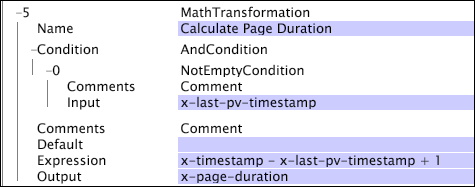

# Matematik{#math}

Med matematisk omformning kan du använda aritmetiska åtgärder på fält i loggposterna.

Åtgärderna kan innehålla decimalheltal och flyttalskonstanter.

<table id="table_FDF3DDF1960E43E391A67C9DC2A0E302"> 
 <thead> 
  <tr> 
   <th colname="col1" class="entry"> Fält </th> 
   <th colname="col2" class="entry"> Beskrivning </th> 
   <th colname="col3" class="entry"> Standard </th> 
  </tr> 
 </thead>
 <tbody> 
  <tr> 
   <td colname="col1"> Namn </td> 
   <td colname="col2"> Beskrivande namn på omformningen. Här kan du ange valfritt namn. </td> 
   <td colname="col3"></td> 
  </tr> 
  <tr> 
   <td colname="col1"> Kommentarer </td> 
   <td colname="col2"> Valfritt. Anteckningar om omvandlingen. </td> 
   <td colname="col3"></td> 
  </tr> 
  <tr> 
   <td colname="col1"> Villkor </td> 
   <td colname="col2"> De villkor som den här omformningen används under. </td> 
   <td colname="col3"></td> 
  </tr> 
  <tr> 
   <td colname="col1"> Uttryck </td> 
   <td colname="col2"> 
Ett aritmetiskt uttryck som beskriver den beräkning som ska utföras. 
 
 Du kan använda någon av åtgärderna och funktionerna som listas nedan och du kan infoga fältnamn i uttrycket: 
 
 Operationer 
     <ul id="ul_DB5915FADA0A41A3B11F1F48615F40A9">
      <li id="li_CA9EA97243F04760A81313C17EE057B3"> Tillägg (+) </li>
      <li id="li_908A272EBA2340098C20F22AA8D9ED26"> Subtraktion (-) </li>
      <li id="li_C62257FF3AAB436D9148BBEA441621D7"> Multiplikation (*) </li>
      <li id="li_B5A9EAB3E49D4CB9A297172199F23542"> Division (/) </li>
      <li id="li_D2D2B51DB2C8412A9B6F9D5F3CC03F8A"> Återstående (%) </li>
      <li id="li_07E7E368FFD2437A852B785E159848E5"> Exponentiering (^) </li>
     </ul>
 
Funktioner 
     <ul id="ul_E335AE8D684340AA998C4A2633FFDEE1">
      <li id="li_E036FF0B5DF244DDBFEDA9BFEDC62251"> sign(x). Returnerar 1 om x är positivt, 0 om x är noll eller -1 om x är negativt. </li>
      <li id="li_90CD8899DDC14778A95930C2768C82BC"> abs(x). Returnerar det absoluta värdet för x. </li>
      <li id="li_F4AF23F343F74BD88B7166B1C2BB065E"> floor(x). Returnerar det största heltalet mindre än eller lika med x. </li>
      <li id="li_A31379A3659240C3A629BFAF19A6DDF1"> round(x). Returnerar närmaste heltal till x. </li>
      <li id="li_9C0A0F3A4A304026B543F2A64B98B922"> log(b,x). Returnerar logaritmen för x-basen b. </li>
      <li id="li_124D62C2CA5A42CBBCC5DB18FAA8920E"> min(x,y,..). Returnerar det minsta av alla dess argument. </li>
      <li id="li_3B7B9FC1C0BF4E7688F9F49130B97B7F"> max(x,y,...). Returnerar det största av alla dess argument. </li>
     </ul>
 </td> 
   <td colname="col3"></td> 
  </tr> 
  <tr> 
   <td colname="col1"> Utdata </td> 
   <td colname="col2"> Namnet på fältet som innehåller resultatet av den aritmetiska åtgärden. </td> 
   <td colname="col3"></td> 
  </tr> 
 </tbody> 
</table>

I det här exemplet, som använder fält med data som samlats in från webbplatstrafiken, beräknas ett nytt fält med namnet x-page-duration genom att subtrahera x-last-pv-timestamp från x-timestamp och sedan lägga till 1. Utdata beräknas endast om det användardefinierade fältet x-last-pv-timestamp (som representerar tidsstämpeln för en besökares sista sidvy) fylls i eller&quot;inte tom&quot;.

Mer information om villkoret [!DNL Not Empty] finns i [Villkor](../../../../../home/c-dataset-const-proc/c-conditions/c-abt-cond.md).
