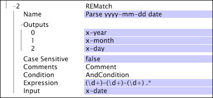

# REMatch{#rematch}

Omformningen REMatch är en mönstermatchningsomformning som använder reguljära uttryck för att ange ett eller flera mönster att söka efter och hämta i indata.

Omvandlingen skapar ett utdatafält för varje hämtat delmönster i det reguljära uttrycket. Om det reguljära uttrycket inte matchar indatafältet är utdata tomma och om utdatafältet redan finns ersätts värdena med tomma värden. En kort guide till hur du använder reguljära uttryck finns i [Reguljära uttryck](../../../../../home/c-dataset-const-proc/c-reg-exp.md#concept-070077baa419475094ef0469e92c5b9c).

>[!NOTE]
>
>Omvandlingen [!DNL REMatch] fungerar på liknande sätt som [!DNL RETransform] omvandlingen (se [RETransform](../../../../../home/c-dataset-const-proc/c-data-trans/c-transf-types/c-standard-transf/c-retransform.md#concept-23f80aa0bc204565b337e5c4931f6a74)), som använder reguljära uttryck för att hämta en sträng och lagrar strängen i ett enda utdatafält.

[!DNL REMatch] tolkar en sträng mer effektivt än flera [!DNL RETransform] omformningar eller en enda [!DNL RETransform] omformning följt av en [!DNL Flatten] omformning. Se [Förenkla](../../../../../home/c-dataset-const-proc/c-data-trans/c-transf-types/c-standard-transf/c-flatten.md#concept-7acd351a6d2444bd960ca412ae3333ce).

<table id="table_7077578512B249E986BC79AE770CBD9A"> 
 <thead> 
  <tr> 
   <th colname="col1" class="entry"> Parameter </th> 
   <th colname="col2" class="entry"> Beskrivning </th> 
   <th colname="col3" class="entry"> Standard </th> 
  </tr> 
 </thead>
 <tbody> 
  <tr> 
   <td colname="col1"> Namn </td> 
   <td colname="col2"> Beskrivande namn på omformningen. Här kan du ange valfritt namn. </td> 
   <td colname="col3"></td> 
  </tr> 
  <tr> 
   <td colname="col1"> Skiftlägeskänslig </td> 
   <td colname="col2"> Sant eller falskt. Anger om matchningen är skiftlägeskänslig. </td> 
   <td colname="col3"></td> 
  </tr> 
  <tr> 
   <td colname="col1"> Kommentarer </td> 
   <td colname="col2"> Valfritt. Anteckningar om omvandlingen. </td> 
   <td colname="col3"></td> 
  </tr> 
  <tr> 
   <td colname="col1"> Villkor </td> 
   <td colname="col2"> De villkor som den här omformningen används under. </td> 
   <td colname="col3"></td> 
  </tr> 
  <tr> 
   <td colname="col1"> Uttryck </td> 
   <td colname="col2"> Det reguljära uttryck som används för matchning. </td> 
   <td colname="col3"></td> 
  </tr> 
  <tr> 
   <td colname="col1"> Indata </td> 
   <td colname="col2"> Det fält som det reguljära uttrycket utvärderas mot. </td> 
   <td colname="col3"></td> 
  </tr> 
  <tr> 
   <td colname="col1"> Utdata </td> 
   <td colname="col2"> 
Namnet på utdatasträngen eller vektorn. När det gäller strängvektorer som indata är utdata även strängvektorer. 
 
 Det måste finnas ett utdatafält för varje hämtat delmönster i uttrycket. 
 </td> 
   <td colname="col3"></td> 
  </tr> 
 </tbody> 
</table>

>[!NOTE]
>
>[!DNL REMatch] omvandlingar kan vara mycket långsamma och kan stå för mycket av databehandlingstiden.

I det här exemplet tolkar en omformning ett datum med formatet YYYY-MM-DD i fälten x-year, x-month och x-day. [!DNL REMatch] För datumet 2007-01-02 är värdena för x-year, x-month och x-day 2007, 01 och 02.

