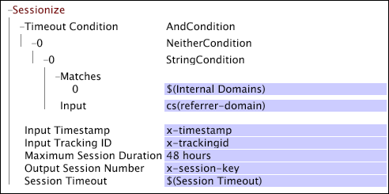

# Skändis{#sessionize}

{{eol}}

Om du arbetar med data som samlats in från webbplatstrafiken kan du använda Sessionsomvandling för att avgöra hur sessioner definieras.

Omvandlingen tar som indata en tidsstämpel och ett spårnings-ID och skickar ett sessionsnummer för varje loggpost. Sessionsnumret är &quot;1&quot; för den första sessionen med ett visst spårnings-ID, &quot;2&quot; för den andra sessionen med samma spårnings-ID osv. Utdata kan användas direkt som en sessionsnyckel eftersom den har ett unikt värde för varje session.

>[!NOTE]
>
>För att arbeta [!DNL Sessionize] för omformning krävs att data ordnas i tid och grupperas med spårnings-ID:t i källdata. Därför [!DNL Sessionize] fungerar bara när det definieras i [!DNL Transformation.cfg] eller i en [!DNL Transformation Dataset Include] -fil.

<table id="table_34984DF9340149C0A5016F08EABAD158"> 
 <thead> 
  <tr> 
   <th colname="col1" class="entry"> Parameter </th> 
   <th colname="col2" class="entry"> Beskrivning </th> 
   <th colname="col3" class="entry"> Standard </th> 
  </tr> 
 </thead>
 <tbody> 
  <tr> 
   <td colname="col1"> Namn </td> 
   <td colname="col2"> Beskrivande namn på omformningen. Här kan du ange valfritt namn. </td> 
   <td colname="col3"> </td> 
  </tr> 
  <tr> 
   <td colname="col1"> Kommentarer </td> 
   <td colname="col2"> Valfritt. Anteckningar om omvandlingen. </td> 
   <td colname="col3"> </td> 
  </tr> 
  <tr> 
   <td colname="col1"> Villkor </td> 
   <td colname="col2"> De villkor som den här omformningen används under. </td> 
   <td colname="col3"> </td> 
  </tr> 
  <tr> 
   <td colname="col1"> Tidsstämpel för indata </td> 
   <td colname="col2"> Fältet som innehåller värdena för den tidsstämpel som ska användas. </td> 
   <td colname="col3"> x-timestamp </td> 
  </tr> 
  <tr> 
   <td colname="col1"> ID för indataspårning </td> 
   <td colname="col2"> 
Fältet som innehåller värdena för det spårnings-ID som ska användas. Värdet måste vara ett 64-bitars (16 siffror) eller mindre hexadecimalt tal eller ett decimalt heltal på 16 siffror eller mindre. 
 
 
Obs! Om du vill använda ett annat fält än x-trackingid för spårnings-ID:t måste du hash-koda fältet först. Se <a href="../../../../../home/c-dataset-const-proc/c-data-trans/c-transf-types/c-standard-transf/c-hash.md#concept-9c353923264941c3aea4428fed66d369"> Hash</a>. 
 
 </td> 
   <td colname="col3"> x-trackingid </td> 
  </tr> 
  <tr> 
   <td colname="col1"> 
Maximal sessionstid 
 </td> 
   <td colname="col2">Den längsta sessionstiden innan en ny session startas. (Detta håller webbsidor med automatiskt innehåll uppdaterat från att skapa sessioner som är godtyckligt långa.) Om  Timeout-villkor är nöjd och referenten för ett klick är inställd på en av posterna i parametern Intern domän. Maximal sessionstid används för att definiera slutet av en session. Ingen session får vara längre än den angivna maximala sessionslängden, oavsett hur många klick den innehåller. Rekommenderat värde är 48 timmar. Mer information om parametrarna Maximal sessionsvaraktighet och Interna domäner finns i <a href="../../../../../home/c-dataset-const-proc/c-config-web-data/c-config-web-data.md#concept-9a306b65483a484bb3f6f3c1d7e77519"> Konfigurationsinställningar för webbdata</a>. </td> 
   <td colname="col3"> 48 timmar </td> 
  </tr> 
  <tr> 
   <td colname="col1"> Utdatasessionsnummer </td> 
   <td colname="col2"> Det fält som sessionsnumret lagras i. Det här fältet har ett unikt värde för varje session för varje besökare. </td> 
   <td colname="col3"> </td> 
  </tr> 
  <tr> 
   <td colname="col1"> Tidsgräns för session </td> 
   <td colname="col2"> 
Den tid som måste förflyta mellan loggposterna för en viss besökare för att avgöra slutet av en session och början av en ny session (det vill säga den vanliga tidsgränsen som används för att definiera en användarsession). Det rekommenderade värdet för den här parametern är 30 minuter. Om Timeout-villkoret inte uppfylls och referenten för ett klick inte är inställd på en av referenterna i parametern Internal Domains, används Sessionstimeout för att definiera sessionen. 
 
 Om Timeout-villkoret är uppfyllt och cs(referer-domain) för en loggpost finns i listan över interna domäner, bestämmer Maximal sessionstid om den aktuella loggposten är en del av en befintlig session eller om en ny session påbörjas. 
 
 Mer information om parametern Timeout för session finns i <a href="../../../../../home/c-dataset-const-proc/c-config-web-data/c-config-web-data.md#concept-9a306b65483a484bb3f6f3c1d7e77519"> Konfigurationsinställningar för webbdata</a>. 
 </td> 
   <td colname="col3"> 30 minuter </td> 
  </tr> 
  <tr> 
   <td colname="col1"> Timeout-villkor </td> 
   <td colname="col2"> Villkoret som måste uppfyllas för att en loggpost ska anses vara början av en ny session. Observera att tiden mellan loggposten och den föregående loggposten måste vara minst lika med värdet för parametern Timeout för session. </td> 
   <td colname="col3"> </td> 
  </tr> 
 </tbody> 
</table>

En ny session börjar när någon av följande situationer inträffar:

* Spårnings-ID ändras.
* Tiden sedan den sista loggposten är minst lika med värdet för parametern Timeout för session och Timeout-villkoret är uppfyllt.
* Tiden sedan den första loggposten för den senaste sessionen överskrider värdet för parametern Maximal sessionsvaraktighet.

>[!NOTE]
>
>Om du redan har definierat Maximal sessionstid och Sessionstimeout som parametrar i [!DNL Session Parameters.cfg] ska du inte ange värden för dem i konfigurationen. Du kan referera till parametrarna genom att skriva *$(parameternamn)* som i följande exempel. Mer information om de här parametrarna finns i [Konfigurationsinställningar för webbdata](../../../../../home/c-dataset-const-proc/c-config-web-data/c-config-web-data.md#concept-9a306b65483a484bb3f6f3c1d7e77519).

The [!DNL Sessionize] omformningen i det här exemplet tar x-timestamp- och x-trackingid-fälten som indata och registrerar sessionsnumret för varje loggpost i x-session-nyckelfältet. Omvandlingen [!DNL Timeout Condition] baseras på en [!DNL Neither] villkor: Om fältet cs(reference-domain) för en loggpost matchar en medlem i parametern Internal Domains utvärderas villkoret till false. Observera referenserna till parametrarna Interna domäner och Tidsgräns för session.

Mer information om [!DNL NeitherCondition], se [Villkor](../../../../../home/c-dataset-const-proc/c-conditions/c-abt-cond.md). Mer information om parametrarna för interna domäner och timeout för sessioner finns i [Konfigurationsinställningar för webbdata](../../../../../home/c-dataset-const-proc/c-config-web-data/c-config-web-data.md#concept-9a306b65483a484bb3f6f3c1d7e77519).

