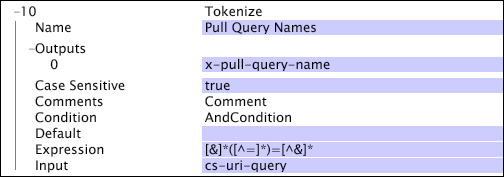

# Tokenize{#tokenize}

Transformeringen Tokenize använder iterativt ett reguljärt uttryck mot indatasträngen.

Till skillnad från [!DNL RETransform] behöver [!DNL Tokenize] inte matcha hela strängen: det reguljära uttrycket som används för omformningen [!DNL Tokenize] kan matcha en delmängd av indata. När en matchning har hittats använder [!DNL Tokenize] det reguljära uttrycket igen, med början vid tecknet efter slutet av den sista matchningen.

| Parameter | Beskrivning | Standard |
|---|---|---|
| Namn | Beskrivande namn på omformningen. Här kan du ange valfritt namn. |  |
| Skiftlägeskänslig | Sant eller falskt. Anger om matchningen är skiftlägeskänslig. |  |
| Kommentarer | Valfritt. Anteckningar om omvandlingen. |  |
| Villkor | De villkor som den här omformningen används under. |  |
| Standard | Det standardvärde som ska användas om villkoret är uppfyllt och indatavärdet antingen inte är tillgängligt eller om det reguljära uttrycket inte matchar indatavärdet. |  |
| Uttryck | Det reguljära uttryck som används för matchning. |  |
| Utdata | Namnen på utdatasträngarna. Du kan ha flera utdata för en given indatasträng. Antalet utdata måste motsvara antalet hämtade delmönster i det reguljära uttrycket. |  |

I följande exempel använder omformningen [!DNL Tokenize] ett reguljärt uttryck för att hämta namnen på frågesträngarna (i cs-uri-query) och returnerar det hämtade delmönstret (frågenamnet) till x-pull-query-name.

För frågesträngen &quot;a=b&amp;c=d&quot; skulle utdata vara en vektor som innehåller &quot;a&quot; och &quot;c&quot;.

Mer information om reguljära uttryck finns i [Reguljära uttryck](../../../../../home/c-dataset-const-proc/c-reg-exp.md#concept-070077baa419475094ef0469e92c5b9c).
