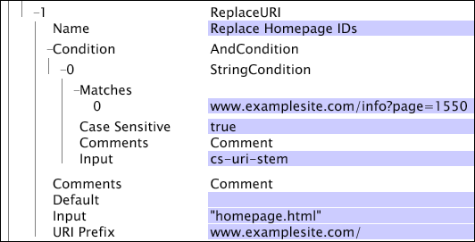

# ReplaceURI{#replaceuri}

{{eol}}

Omvandlingen ReplaceURI ändrar värdet i den interna URI-dimensionen till ett nytt värde.

If [!DNL URI Prefix] anges är resultatvärdet helt enkelt URI-prefixet som är sammanfogat med det angivna indatavärdet.

| Parameter | Beskrivning | Standard |
|---|---|---|
| Namn | Beskrivande namn på omformningen. Här kan du ange valfritt namn. |  |
| Kommentarer | Valfritt. Anteckningar om omvandlingen. |  |
| Villkor | De villkor som den här omformningen används under. |  |
| Standard | Standardvärdet som ska användas om villkoret är uppfyllt och indatavärdet inte är tillgängligt. |  |
| Indata | Värdet som ska ersätta URI:n. |  |
| URI-prefix | Värdet (strängen) som ska föregås av värdet i [!DNL Input] fält. |  |

>[!NOTE]
>
>Före användning [!DNL ReplaceURI] omformningar bör du skapa en ny enkel dimension med en överordnad till [!DNL Page View]från en kopia av cs-uri-stammar eller cs-uri. Kontakta Adobe om du behöver hjälp med detta.

I det här exemplet visas hur du använder [!DNL ReplaceURI] som ersätter &quot;page=*pageid*&quot; frågesträngar med &quot; [!DNL homepage.html]&quot; *pageid* anger att webbplatsens hemsida har visats. Slutresultatet är en användarvänlig vy av URI:n.

För omvandlingen visas sidan

* [!DNL www.examplesite.com/info.html?page=1550]

ändras till

* [!DNL www.examplesite.com/homepage.html]
