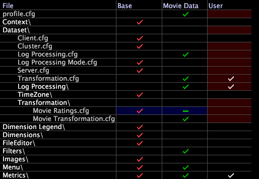

# Döljer datauppsättningskonfigurationsfiler{#hiding-dataset-configuration-files}

{{eol}}

Om du inte vill ärva en konfigurationsfil från en intern eller annan ärvd profil (d.v.s. att instruktionerna i filen ska ignoreras när datauppsättningen skapas), men du inte vill ändra filen, kan du skapa en tom (nollbyte) fil med samma namn och lagra filen i en annan profil.

**Till en datauppsättningskonfigurationsfil med nollbyte**

1. I [!DNL Profile Manager]öppnar du de mappar och undermappar som behövs för att leta reda på filen som du vill nollbyte.
1. Högerklicka på bockmarkeringen bredvid filens namn och klicka på **[!UICONTROL Make Local]**.
1. Öppna den lokala filen i en textredigerare som Anteckningar och ta bort innehållet.
1. Spara och stäng filen.
1. I [!DNL Profile Manager]sparar du filen med nollbyte i en profil till höger om den profil där originalfilen finns. (Du vill att nollbytefilen ska ha företräde framför originalfilen.)

   I [!DNL Profile Manager], ett bindestreck (-) i stället för en bockmarkering, identifierar i en kolumn filen med nollbyte enligt exemplet nedan.

   

När du bearbetar om datauppsättningen innehåller datauppsättningen inte de datauppsättningskomponenter som definieras i den ursprungliga filen.

>[!NOTE]
>
>Om du använder nollbyte för en konfigurationsfil som definierar en utökad dimension som används i en visualisering eller en metrisk definition, genererar data workbench ett fel för den visualiseringen eller mätningen.

Du kan också använda nollbytefiler för att flytta ett mått, en dimension eller ett filter till en annan plats i profilen eller för att dölja menyalternativ. Mer information finns i *Användarhandbok för Data Workbench*.
