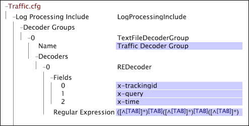

# Avkodningsgrupper för textfiler{#text-file-decoder-groups}

{{eol}}

Bearbetningen av loggfiler som loggkällor kräver att en avkodare definieras i filen Log Processing Data Include (Inkludera) för att extrahera datafält från loggposterna.

Om du definierar textfilsavkodningsgrupper för loggfilens loggkällor måste du känna till loggfilens struktur och innehåll, vilka data som ska extraheras och i vilka fält dessa data lagras. I det här avsnittet finns grundläggande beskrivningar av de parametrar som du kan ange för avkodare, men hur du använder en avkodare beror på loggfilen som innehåller källdata.

Information om formatkrav för loggfilens loggkällor finns i [Loggfiler](../../../../../home/c-dataset-const-proc/c-log-proc-config-file/c-log-sources.md#concept-3d4fb817c057447d90f166b1183b461e). Kontakta Adobe om du behöver hjälp med att definiera textfilsavkodare.

En textfilsavkodningsgrupp kan innehålla:

* [Avkodare för reguljära uttryck](../../../../../home/c-dataset-const-proc/c-dataset-inc-files/c-types-dataset-inc-files/c-log-proc-dataset-inc-files/c-text-file-dec-groups.md#section-67aca2c1f008404da7f845a64abec97c)
* [Avgränsade avkodare](../../../../../home/c-dataset-const-proc/c-dataset-inc-files/c-types-dataset-inc-files/c-log-proc-dataset-inc-files/c-text-file-dec-groups.md#section-7e0a23decdbc4c75ae750a42446997a6)

## Avkodare för reguljära uttryck {#section-67aca2c1f008404da7f845a64abec97c}

En avkodare för reguljära uttryck identifierar komplexa strängmönster inom loggposterna i en loggfil och extraherar dessa mönster som datafält. För varje avkodare måste antalet fält vara lika med antalet hämtade delmönster i det reguljära uttrycket. Den del av raden som matchar det n:te hämtade delmönstret tilldelas det n:e fältet för den raden.

**Lägga till en avkodare för reguljära uttryck i en textfilsavkodare**

1. Öppna [!DNL Log Processing Dataset Include] filen enligt beskrivningen i [Redigera befintlig datauppsättning Inkludera filer](../../../../../home/c-dataset-const-proc/c-dataset-inc-files/c-work-dataset-inc-files/t-edit-ex-dataset-inc-files.md#task-456c04e38ebc425fb35677a6bb6aa077) och lägga till en avkodningsgrupp för textfiler. Se tabellposten [Avkodningsgrupper](../../../../../home/c-dataset-const-proc/c-dataset-inc-files/c-types-dataset-inc-files/c-log-proc-dataset-inc-files/c-log-proc-dataset-inc-files.md#concept-999475a22519432e98844622ca95b6ab).

1. Högerklicka **[!UICONTROL Decoders]** under den nya avkodningsgruppen klickar du på **[!UICONTROL Add new]** > **[!UICONTROL Regular Expression]**.

1. Ange följande information:

   * **Fält:** Lista över fälten i loggfilen. Om något av fälten som definieras här ska skickas till omformningsfasen för datauppsättningens konstruktion, måste dessa fält listas i parametern Fields för ett av [!DNL Log Processing Dataset Include] -filer för datauppsättningen. Anpassade fältnamn måste börja med &quot;x-&quot;.

   * **Namn:** Valfri identifierare för avkodare.
   * **Reguljärt uttryck:** Används för att extrahera de önskade fälten från varje rad i filen.

1. Upprepa steg 4 och 5 för alla andra avkodare som du vill lägga till i gruppen.
1. Spara [!DNL Log Processing Dataset Include] fil, högerklicka **[!UICONTROL (modified)]** längst upp i fönstret och klicka på **[!UICONTROL Save]**.

1. Om du vill att de lokalt gjorda ändringarna ska gälla går du till [!DNL Profile Manager]högerklickar du på bockmarkeringen för filen i dialogrutan [!DNL User] kolumn. Klicka **[!UICONTROL Save to]** > *&lt;**[!UICONTROL profile name]**>*, där profilnamnet är namnet på datauppsättningsprofilen eller den ärvda profilen som datauppsättningsfilen tillhör.

Spara inte den ändrade konfigurationsfilen i någon av de interna profilerna som tillhandahålls av Adobe, eftersom ändringarna skrivs över när du installerar uppdateringar för de här profilerna.

>[!NOTE]
>
>En given loggfil kan ha flera avkodare för reguljära uttryck. Den ordning i vilken du definierar avkodare är viktig: den första avkodare som matchar en rad i loggfilen är den som används för att avkoda raden.

I det här exemplet visas hur du använder en avkodare för reguljära uttryck för att extrahera datafält från en tabbavgränsad textfil. Du kan uppnå samma resultat genom att definiera en avgränsad avkodare med en tabbavgränsare.

Mer information om dekodrar för reguljära uttryck, inklusive terminologi och syntax finns i [Reguljära uttryck](../../../../../home/c-dataset-const-proc/c-reg-exp.md#concept-070077baa419475094ef0469e92c5b9c).

## Avgränsade avkodare {#section-7e0a23decdbc4c75ae750a42446997a6}

En avgränsad avkodare avkodar en loggfil vars fält avgränsas av ett enda tecken. Antalet fält måste motsvara antalet kolumner i den avgränsade filen. men alla fält behöver inte namnges. Om ett fält lämnas tomt är kolumnen fortfarande obligatorisk i loggfilen, men avkodaren ignorerar den.

**Lägga till en avgränsad avkodare i en textfilsavkodningsgrupp**

1. Öppna [!DNL Log Processing Dataset Include] filen enligt beskrivningen i [Redigera befintlig datauppsättning Inkludera filer](../../../../../home/c-dataset-const-proc/c-dataset-inc-files/c-work-dataset-inc-files/t-edit-ex-dataset-inc-files.md#task-456c04e38ebc425fb35677a6bb6aa077) och lägga till en avkodningsgrupp för textfiler. Se tabellposten [Avkodningsgrupper](../../../../../home/c-dataset-const-proc/c-dataset-inc-files/c-types-dataset-inc-files/c-log-proc-dataset-inc-files/c-log-proc-dataset-inc-files.md#concept-999475a22519432e98844622ca95b6ab).

1. Högerklicka **[!UICONTROL Decoders]** under den nya avkodningsgruppen klickar du på **[!UICONTROL Add new]** > **[!UICONTROL Delimited]**.

1. Ange följande information:

   * **Fält:** Lista över fälten i loggfilen. Om något av fälten som definieras här ska skickas till omformningsfasen för datauppsättningens konstruktion, måste dessa fält listas i parametern Fields för ett av [!DNL Log Processing Dataset Include] -filer för datauppsättningen. Anpassade fältnamn måste börja med &quot;x-&quot;.

   * **Avgränsare:** Tecken som används för att separera fält i utdatafilen.

1. Upprepa steg 4 och 5 för alla andra avkodare som du vill lägga till i gruppen.
1. Spara [!DNL Log Processing Dataset Include] fil, högerklicka **[!UICONTROL (modified)]** längst upp i fönstret och klicka på **[!UICONTROL Save]**.

1. Om du vill att de lokalt gjorda ändringarna ska gälla går du till [!DNL Profile Manager]högerklickar du på bockmarkeringen för filen i dialogrutan [!DNL User] kolumn och klicka sedan på **[!UICONTROL Save to]** > *&lt;**[!UICONTROL profile name]**>*, där profilnamnet är namnet på datauppsättningsprofilen eller den ärvda profilen som datauppsättningsfilen tillhör.

>[!NOTE]
>
>Spara inte den ändrade konfigurationsfilen i någon av de interna profilerna som tillhandahålls av Adobe, eftersom ändringarna skrivs över när du installerar uppdateringar för de här profilerna.

I det här exemplet visas hur du använder en avgränsad avkodare för att extrahera datafält från en kommaavgränsad textfil som innehåller data om filmer.

