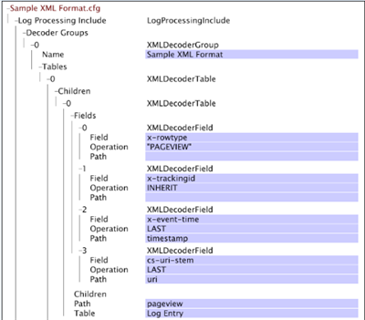

# XML-avkodningsgrupper{#xml-decoder-groups}

{{eol}}

Bearbetningen av XML-filer som loggkällor för att definiera avkodare för extrahering av data från XML-filen.

>[!NOTE]
>
>Om du definierar XML-avkodningsgrupper för XML-loggkällor måste du känna till XML-filens struktur och innehåll, vilka data som ska extraheras och i vilka fält dessa data lagras. I det här avsnittet finns grundläggande beskrivningar av de parametrar som du kan ange för avkodare. Hur du använder en avkodare beror på XML-filen som innehåller källdata.

Information om formatkrav för XML-loggkällor finns i [Loggkällor](../../../../../home/c-dataset-const-proc/c-log-proc-config-file/c-log-sources.md#concept-6714c720fac044cbb9af003bf401b2ea). Kontakta Adobe om du behöver hjälp med att definiera XML-avkodare.

Den översta nivån i en XML-avkodare är en avkodargrupp (XMLDecoderGroup), som är en uppsättning avkodartabeller som du använder för att extrahera data från en XML-fil i ett visst format. Om du har XML-filer med olika format måste du definiera en avkodningsgrupp för varje format. Varje avkodningsgrupp består av en eller flera avkodningstabeller.

I följande tabell beskrivs tabellparametern och alla underparametrar som du måste ange för att definiera en XML-avkodningsgrupp.

<table id="table_06C40C5149E94548A1B0C2ED4397624B"> 
 <thead> 
  <tr> 
   <th colname="col1" class="entry"> Parameter </th> 
   <th colname="col2" class="entry"> Beskrivning </th> 
  </tr> 
 </thead>
 <tbody> 
  <tr> 
   <td colname="col1"> Tabeller </td> 
   <td colname="col2"> <p>Varje tabell i en avkodningsgrupp representerar en nivå med data som ska extraheras från XML-filen. Om du till exempel vill extrahera data om besökare skapar du en avkodningstabell som består av den information du vill extrahera för varje besökare. Du kan också skapa avkodningstabeller i avkodningstabeller (se Underordnade). </p> <p> <b>Lägga till en tabell i en avkodningsgrupp</b> 
     <ul id="ul_C73CAD77440B4465B9FCE08BF4FA0749"> 
      <li id="li_C4B8CC5A85D942898F1EB76778105818"> Högerklicka <span class="uicontrol"> Tabeller </span> och klicka <span class="uicontrol"> Lägg till ny </span> &gt; <span class="uicontrol"> XMLDecoderTable </span>. </li> 
     </ul> </p> </td> 
  </tr> 
  <tr> 
   <td colname="col1"> Fält </td> 
   <td colname="col2"> <p>De utökade fält (till exempel x-trackingid, x-email) där data lagras. De data som ska lagras i fältet avgörs av underfälten Sökväg och/eller Åtgärd. </p> <p> Sökvägen är fältets nivå i den strukturerade XML-filen. Sökvägen till ett fält är relativ till sökvägen till den tabell i vilken det har definierats. Exempel <span class="filepath"> tag.tag.tag </span> eller <span class="filepath"> tag.tag.tag.@attribute </span>. Observera att banor är skiftlägeskänsliga. </p> <p> En operation används på varje rad i den angivna sökvägen för att skapa en utdatafil. Följande åtgärder är tillgängliga: 
     <ul id="ul_B264A411D7E3446288E7E69D62150B8B"> 
      <li id="li_5936E81C0EEF46AFB780E451A04A88E4"><b>SENASTE:</b> Fältet får värdet för sökvägens senaste förekomst i XML-filen. </li> 
      <li id="li_7BC4F24F2CA84C2EB64B06FE09B4CAF6"><b>INTERVALL:</b> Tilldelar ett slumpmässigt värde till fältet. Den här åtgärden är användbar om du behöver generera ett unikt ID, t.ex. för x-trackingid-fältet. </li> 
      <li id="li_C1D34EA11BFB4859A25A275A9B63FB56"><b>INHERIT:</b> Det definierade fältet ärver sitt värde från den överordnade tabellens motsvarande fält. </li> 
      <li id="li_F62FB8CD962E4E1495D9A2D5B7A78E2A"><b>"<i>konstant </i>":</b> Konstanten måste omges av citattecken. Du kan använda en konstant åtgärd för att kontrollera om det finns en viss sökväg. om sökvägen finns, tilldelas fältet konstantens värde. </li> 
     </ul> </p> <p> <b>Lägga till ett fält i en avkodningstabell</b> </p> <p> 
     <ul id="ul_91D104D927424DEA9E788E43B2F6FEA9"> 
      <li id="li_5448B01EE82349569BBFC99C9604D7B8"> Högerklicka <span class="uicontrol"> Fält </span>och sedan klicka <span class="uicontrol"> Lägg till ny </span> &gt; <span class="uicontrol"> XMLDecoderField </span>. Definiera fält, åtgärd och sökväg. </li> 
     </ul> </p> </td> 
  </tr> 
  <tr> 
   <td colname="col1"> Bana </td> 
   <td colname="col2"> <p>Nivån i den strukturerade XML-filen för vilken avkodningstabellen innehåller information. För en underordnad XML-avkodningstabell är sökvägen relativ till den överordnade tabellens sökväg. Observera att banor är skiftlägeskänsliga. </p> <p> Om XML-filen till exempel innehåller strukturen: </p> 

    &amp;Lt;besökare;
    
    &amp;nbsp;
    
    ...
    
    &amp;nbsp;
    
    &amp;lt;/visitor;
    
    &amp;lt;/logdata;&amp;nbsp; &lt;/code> &lt;p> blir sökvägen &lt;span class=&quot;filepath&quot;>logdata.visitor&lt;/span> . &lt;/p> &lt;/td>
</tr> 
  <tr> 
   <td colname="col1"> Tabell </td> 
   <td colname="col2"> <p>Värdet för den här parametern ska alltid vara "Loggpost". </p> <p> <p>Obs! Ändra inte det här värdet utan att rådfråga Adobe. </p> </p> </td> 
  </tr> 
  <tr> 
   <td colname="col1"> Barn </td> 
   <td colname="col2"> <p>Valfritt. En eller flera inbäddade avkodningstabeller. Varje underordnat objekt innehåller parametrarna Fält, Sökväg och Tabell som beskrivs ovan. </p> <p> <b>Lägga till ett underordnat objekt i en avkodningstabell</b> </p> <p> 
     <ul id="ul_902AC6CA5D66457D84CBA3194FF49BBE"> 
      <li id="li_07B4D60E7E2E4630B4878691E575936A"> Högerklicka <span class="uicontrol"> Barn </span> och klicka <span class="uicontrol"> Lägg till ny </span> &gt; <span class="uicontrol"> XMLDecoderTable </span>. Definiera fält, åtgärd och sökväg. </li> 
     </ul> </p> </td> 
  </tr> 
 </tbody> 
</table>

Om du vill använda en XML-fil som loggkälla för en datauppsättning måste grupper och tabeller för XML-avkodning definieras för att extrahera den information som ska bearbetas i datauppsättningen. I det här exemplet kan du se hur du definierar avkodningsgrupper och tabeller för en XML-exempelkälla för en webbdatauppsättning.

Följande XML-fil innehåller information om en besökare på webbplatsen, inklusive ett Experience Cloud-ID, en e-postadress, en fysisk adress och information om besökarens sidvisningar.


Eftersom vi har en enda XML-fil behöver vi bara en avkodningsgrupp, som vi kallar&quot;Sample XML Format&quot;. Den här avkodningsgruppen gäller för alla andra XML-filer i samma format som den här filen. För att börja konstruera XML-avkodningstabeller i den här avkodningsgruppen måste vi först avgöra vilken information vi vill extrahera och i vilka fält data ska lagras.

I det här exemplet extraherar vi information om besökaren och de sidvyer som är kopplade till besökaren. För att göra detta skapar vi en överordnad (överordnad) XML-avkodningstabell med information om besökaren och en inbäddad (underordnad) XML-avkodningstabell med information om besökarens sidvyer.

**Följande information finns för den överordnade tabellen (besökartabellen)**

* En datatypsidentifierare för varje datarad i XML-filen. Vi använder VISITOR som identifierare så att vi snabbt kan identifiera rader med data som gäller besökaren och inte sidvyerna. Värdet kan lagras i fältet x-rowtype.
* Besökarens ID, som vi lagrar i fältet x-trackingid.
* Besökarens e-postadress (contact.email), som vi lagrar i fältet x-email.
* Besökarens registreringsstatus. Om besökaren är en registrerad användare kan vi lagra värdet&quot;1&quot; i det x-is-registrerade fältet.
* Sökvägsvärdet är [!DNL logdata.visitor]och tabellvärdet är [!DNL Log Entry]. Mer information om de här parametrarna finns i tabellen XMLDecoderGroup ovan.

**Följande information finns för den underordnade tabellen (sidvy):**

* En datatypsidentifierare för varje datarad i XML-filen. Vi använder&quot;PAGEVIEW&quot; som identifierare så att vi snabbt kan identifiera rader med data som gäller besökarens sidvyer och inte bara besökaren. Värdet lagras i fältet x-rowtype.
* Besökarens ID. Detta värde ärvs från den överordnade tabellen och lagras i x-trackingid-fältet.
* Tidsstämpeln för varje sidvy, som lagras i fältet x-event-time.
* URI:n för varje sidvy, som lagras i fältet cs-uri-stam.
* Sökvägsvärdet är sidvy och tabellvärdet är &quot;Loggpost&quot;. Mer information om de här parametrarna finns i tabellen XMLDecoderGroup ovan.

I följande skärmbild visas en del av [!DNL Log Processing Dataset Include] -fil med den resulterande XML-avkodningsgruppen för XML-exempelfilen baserat på den beskrivna strukturen för den överordnade och underordnade XML-avkodningstabellen.




En tabell som visar resultatet av den här avkodaren för XML-exempelfilen ser ut ungefär så här:

| x-rowtype | cs—uri-system | x-email | x-is-registered | x-event-time | x-tracking-id |
|---|---|---|---|---|---|
| BESÖKARE |  | foo@bar.com | 1 |  | 1 |
| PAGEVIEW | /index.html |  |  | 2006-01-01 08:00:00 | 1 |
| PAGEVIEW | / |  |  | 2006-01-01 08:00:30 | 1 |

Du kan skapa en tabell som den ovan i data workbench med hjälp av ett fältvisningsgränssnitt. Mer information om fältvisningsprogrammets gränssnitt finns i [Verktyg för datauppsättningskonfiguration](../../../../../home/c-dataset-const-proc/c-dataset-config-tools/c-dataset-config-tools.md#concept-6e058b7691834cf79dcfd1573f78d4f5).

## Använda #value on XML element för att läsa dess attributvärde {#section-88758428afb94f0baa5a986604d53bc1}

Nu kan du använda **[!DNL #value]** i XML-sökvägar för att hämta värdet för ett XML-element.

Du kan till exempel ange sökvägen **`<Hit><Page name="Home Page" index="20">home.html</Page></Hit>`** lämnade det att du inte kunde läsa värdet på `<Page>` -tagg. Läsa värdet på en `<Page>` tagg och dess attribut kan du använda [!DNL Hit.Page.@name] och [!DNL Hit.Page.@index] respektive. Du kan också hämta värdet för taggen med **`Hit.Page.#value`** -uttryck.

Du kan till exempel läsa värdet för taggen `<varValue>` genom att lägga till följande fält i avkodaren:

```
7 = XMLDecoderField: 
Field = string: x-varvalue-name-added 
Operation = string: LAST 
Path = string:  
<b>#value</b> 
Path = string: varValue 
Table = string: Log Entry
```

På samma sätt kan du läsa värdet för taggen `<Rep>` genom att lägga till följande fält i avkodaren:

```
7 = XMLDecoderField: 
Field = string: x-rep-name-added 
Operation = string: LAST 
Path = string: Rep.# 
<b>value</b> 
Path = string: Reps 
Table = string: Log Entry
```

Om du däremot vill läsa värdet för elementtaggen utan attribut, ska du `<text>` tagg under `<line>` och dess värde kan läsas direkt genom att &quot; [!DNL text]&quot; i en bana eller med [!DNL line.text], beroende på hur du har byggt avkodaren.

```
2 = XMLDecoderField: 
Field = string: x-chat-text 
Operation = string: LAST 
Path = string:  
<b>text</b> 
Path = string:  
<b>line</b> 
Table = string: Log Entry
```
