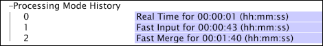

# Förbereda för ombearbetning eller omformning{#preparing-for-reprocessing-or-retransformation}

Steg för att säkerställa att ombearbetningen eller omformningen går smidigt och avslutas i tid så att användare av Data Workbench kan börja arbeta igen

1. Fastställ förfluten tid för föregående bearbetning eller omformning genom att kontrollera datauppsättningsprofilens [!DNL Processing Mode History] i [!DNL Detailed Status] gränssnittet.

   1. Öppna [!DNL Detailed Status] gränssnittet när du arbetar i datauppsättningsprofilen.
   1. Klicka **[!UICONTROL Processing Status]** > *&lt;**[!UICONTROL dataset profile name]**>* > **[!UICONTROL Processing Mode History]** för att visa de förflutna tiderna för tidigare bearbetning eller omformning.

      * Snabb inmatning är den totala tid som behövs för loggbearbetning.
      * Snabbsammanfogning är den totala tid som krävs för omformning.
      * Summan av de två gånger (snabb inmatning + snabb sammanslagning) är den totala tid som behövs för att bearbeta datauppsättningen.
      Exemplet nedan visar att loggbearbetningen tog cirka 43 sekunder, medan omvandlingen tog mindre än 2 minuter.

      

      Mer information om [!DNL Detailed Status] gränssnittet finns i *användarhandboken* för Data Workbench.

1. Schemalägg och planera ombearbetningen. Eftersom användare av Data Workbench inte har tillgång till data under loggbearbetningsfasen måste du schemalägga ombearbetningen så att den sker under en lämplig tid, t.ex. över helgen.
1. Övervaka förloppet för ombearbetningen och omformningen med hjälp av fälten i [!DNL Processing Legend.] Mer information om [!DNL Processing Legend]finns i användarhandboken för *Data Workbench*.
