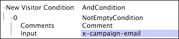

# Nytt besökarvillkor{#new-visitor-condition}

Det nya besökarvillkoret är en villkorsåtgärd som används med webbplatsdata för att avgöra vilka besökare som ska tas med i datauppsättningen.

[!DNL New Visitor Condition] definierar den första loggposten (sorterad efter tid) för en besökare som ska användas i datauppsättningen, och alla efterföljande loggposter för den här besökaren inkluderas i datauppsättningen oavsett om de uppfyller det här villkoret eller inte. Eftersom [!DNL New Visitor Condition] kräver att data sorteras efter besökare och tid, används de bara under datauppsättningens omformningsfas.

[!DNL New Visitor Condition] som visas i det här exemplet skapar en datauppsättning som endast innehåller loggposterna för besökare som svarar på e-postkampanjer. Detta uppnås genom att använda [!DNL NotEmptyCondition]-testet (se [Inte tom](../../../../home/c-dataset-const-proc/c-conditions/c-test-ops/c-test-op-con.md#section-1decb9d887894073a1b6b3d985729ac8)) och [!DNL x-campaign-email]-fältet som indata till det reguljära uttrycket. När de nya besökarna som uppfyller villkoret har identifierats, hämtas alla loggposter för dessa besökare.

