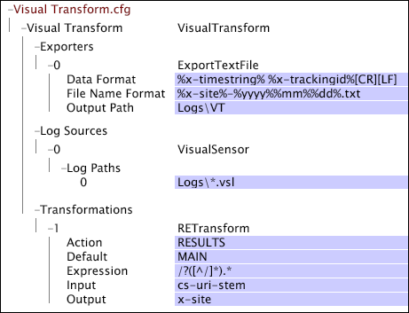

# Exempel på Data Workbench Transform.cfg-filer{#sample-data-workbench-transform-cfg-files}

Information om hur du anger parametrar i filen Transform.cfg baserat på flera scenarier.

* [A Simple Insight Transform.cfg File](../../../../../home/c-dataset-const-proc/c-transf-func/c-config-files-transf/t-ins-transf-file/c-sample-transf-files.md#section-b7e83cafa3a947c597bd09d316930190)
* [Utdata med kommaseparerade värden](../../../../../home/c-dataset-const-proc/c-transf-func/c-config-files-transf/t-ins-transf-file/c-sample-transf-files.md#section-03916934ad574efc8695abbae54a1816)
* [Exempelloggfiler](../../../../../home/c-dataset-const-proc/c-transf-func/c-config-files-transf/t-ins-transf-file/c-sample-transf-files.md#section-113b3b0c0c7547ea9536bb2f465c0875)
* [Dela upp loggfiler efter webbplatsavsnitt](../../../../../home/c-dataset-const-proc/c-transf-func/c-config-files-transf/t-ins-transf-file/c-sample-transf-files.md#section-2cac205cd3934d31abb6c6ed8780196d)

I varje exempel visas filen som ett [!DNL Transform.cfg]-fönster i data workbench.

## En enkel Data Workbench Transform.cfg-fil {#section-b7e83cafa3a947c597bd09d316930190}

I följande [!DNL Transform.cfg]-fönster finns anvisningar om hur du läser [!DNL .vsl]-filer från katalogen [!DNL Logs] och exporterar x-timestring- och x-trackingid-fälten till en textfil som lagras i katalogen Logs\VT. Eftersom ingen filrotationsperiod eller utdatafilens namnformat har angetts innehåller varje fil data för en kalenderdag och har ett namn i standardformatet [!DNL %yyyy%%mm%%dd%-%x-mask%.txt].

## Utdata med kommaseparerade värden {#section-03916934ad574efc8695abbae54a1816}

I följande [!DNL Transform.cfg]-fönster finns anvisningar om hur du läser [!DNL .vsl]-filer från katalogen Logs och exporterar fält 0 till 13 till en kommaavgränsad ( [!DNL .csv]) fil som lagras i mappen Logs\VT\CSV directory. Eftersom ingen filrotationsperiod har angetts innehåller varje fil data för en kalenderdag. Utdatafilerna är [!DNL .csv] filer med formatet [!DNL %yyyy%%mm%%dd%-%x-mask%.csv].

## Exempelloggfiler {#section-113b3b0c0c7547ea9536bb2f465c0875}

Du kan konfigurera omvandlingsfunktioner för att skapa och underhålla en uppdaterad, kompakt version av dina fullständiga loggfiler. På så sätt kan du testa datauppsättningskonfigurationerna snabbt, med ombearbetningstider på sekunder eller minuter i stället för timmar som behövs för att bearbeta hela datauppsättningen på nytt. Följande exempel innehåller ett exempel på hur du konfigurerar omformningsfunktioner för att göra detta.

Följande [!DNL Transform.cfg]-fönster innehåller anvisningar om hur du läser [!DNL .vsl]-filer från katalogen Logs och exporterar x-timestring- och x-trackingid-fälten till en textfil som lagras i katalogen Logs\VT. Det angivna hash-tröskelvärdet filtrerar vissa spårnings-ID:n från datauppsättningen och skapar därmed en datauppsättning som samplas med faktorn 100. Eftersom ingen filrotationsperiod har angetts innehåller varje fil data för en kalenderdag. Namnen på utdatafilerna har standardformatet [!DNL %yyyy%%mm%%dd%-%x-mask%.txt].

## Dela upp loggfiler efter webbplatsavsnitt {#section-2cac205cd3934d31abb6c6ed8780196d}

Följande [!DNL Transform.cfg]-fönster innehåller anvisningar om hur du läser [!DNL .vsl]filer från katalogen Logs och exporterar x-timestring- och x-trackingid-fälten till en textfil som lagras i katalogen Logs\VT. Omformningen av det reguljära uttrycket ( [!DNL RETransform]) tar cs-uri-stam-fältet som indata och skapar ett nytt fält (x-site) som definierar ett avsnitt på platsen. Fältet x-site inkluderas i namnet på utdatafilerna, som vart och ett innehåller data för en kalenderdag.

