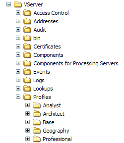

# Installera geografisk profil{#installing-the-geography-profile}

Geography-profilen som ingår i data workbenchGeography är en intern profil som ger ytterligare funktioner till ditt Adobe-program.

Precis som med alla andra interna profiler från Adobe får profilen inte ändras [!DNL Geography] . All anpassning måste ske i datauppsättningen, rollspecifika profiler eller andra profiler som du skapar.

Profilen innehåller flera omformningsdatauppsättningar med filer (som finns i [!DNL Geography] [!DNL Dataset\Transformation\Geography] mappen) som definierar geografiska dimensioner. Nedan följer en lista över transformeringsdatauppsättningen som innehåller filer som ingår i [!DNL Geography] profilen:

* [!DNL City.cfg]
* [!DNL Coordinates.cfg]
* [!DNL Country.cfg]
* [!DNL DMA.cfg]
* [!DNL Domain.cfg]

Var och en av filerna namnges för den utökade dimension som definieras i den. Ytterligare en fil, [!DNL IPLookup.cfg]definierar flera geografiska datafält som används för att definiera dimensioner i den andra omformningsdatauppsättningen, inklusive filer.

Mer information om att inkludera filer i omformningsdatauppsättningar finns i *konfigurationsguiden* för datauppsättningar.

**Så här installerar du[!DNL Geography]profilen på data workbench-servern**

>[!NOTE]
>
>Följande installationsanvisningar förutsätter att du har installerat data workbench och upprättat en anslutning mellan data workbench och den data workbench-server där du installerar data workbench [!DNL Geography]. Om du inte har gjort det läser du *användarhandboken* för Data Workbench.

1. Öppna mappen Profiler från den [!DNL .zip] fil du fått från Adobe.
1. Kopiera [!DNL Geography] mappen till mappen Profiles i installationskatalogen för data workbench-servern. Du vill avsluta med en [!DNL ...\Profiles\Geography] mapp på din data-workbench-server som i följande exempel. Namnen på de andra mapparna i mappen Profiler kan skilja sig från de som visas.

   

1. Följ de här stegen för att uppdatera [!DNL profile.cfg] filen för varje profil som du vill använda data workbench med [!DNL Geography].

   1. Öppna [!DNL Profile Manager].
   1. Högerklicka på bockmarkeringen bredvid [!DNL profile.cfg] och klicka **[!UICONTROL Make Local]**. En bock för den här filen visas i [!DNL User] kolumnen.

   1. Högerklicka på den nya bockmarkeringen och klicka på **[!UICONTROL Open]** > **[!UICONTROL from the workbench]**. Fönstret [!DNL profile.cfg] visas.

   1. Högerklicka i [!DNL profile.cfg] fönstret **[!UICONTROL Directories]** och klicka **[!UICONTROL Add new]** > **[!UICONTROL Directory]**.

      Om du vill lägga till den nya katalogen i slutet av kataloglistan högerklickar du på numret eller namnet på den sista katalogen i listan och klickar på **[!UICONTROL Add new]** > **[!UICONTROL Directory]**.

   1. Ange namnet på den nya katalogen: [!DNL Geography].
   1. Högerklicka **[!UICONTROL (modified)]** högst upp i fönstret och klicka sedan **[!UICONTROL Save]**.

   1. I [!DNL Profile Manager]högerklickar du på bockmarkeringen för [!DNL profile.cfg] i [!DNL User] kolumnen och klickar sedan på **[!UICONTROL Save to]** > *&lt;**[!UICONTROL profile name]**>*.

      >[!NOTE]
      >
      >Spara inte den ändrade konfigurationsfilen i någon av de interna profiler som tillhandahålls av Adobe (inklusive [!DNL Geography] profilen), eftersom ändringarna skrivs över när du installerar uppdateringar för de här profilerna.

