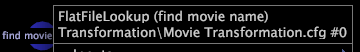
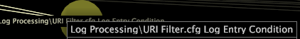
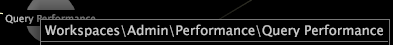

# Visa nodinformation{#view-node-details}

Information om hur du visar identifieringsinformation om en profilkomponent.

* Högerklicka på önskad nod och visa identifieringsinformationen högst upp i fönstret. Identifieringsinformationen som visas beror på komponenttypen.

**Loggkälla**

Namnet på loggkällan och namnet på den fil där loggkällan har definierats.

**Fält**

Fältets namn.

**Omformning**

Omvandlingens typ och namn, namnet på filen som omformningen är definierad i och transformeringens nummer i filen.

>[!NOTE]
>
>Prestandainformation för omvandlingen visas bara om alternativet är aktiverat för [!DNL Show Performance Data] beroendekartan. Mer information finns i [Visa prestandadata](../../../../../home/c-get-started/c-admin-intrf/c-dataset-mgrs/c-dep-maps/c-disp-perf-data.md#concept-974e2bac3e184f0dab530e63aa4f5ecb).

**Utökad dimension**

Den utökade dimensionens namn och typ, namnet på filen där dimensionen definieras och dimensionens nummer i filen.

>[!NOTE]
>
>Prestandainformation för den utökade dimensionen visas bara om alternativet [!DNL Show Performance Data] är aktiverat för beroendekartan. Mer information finns i [Visa prestandadata](../../../../../home/c-get-started/c-admin-intrf/c-dataset-mgrs/c-dep-maps/c-disp-perf-data.md#concept-974e2bac3e184f0dab530e63aa4f5ecb).

**Mått**

Måttets namn.

**Härledd dimension**

Den härledda dimensionens namn.

**Filter**

Om den definieras i datauppsättningen, sökvägen till konfigurationsfilen där filtret definieras och filtrets namn.

**Arbetsytor och rapporter**

Sökvägen till arbetsytan eller rapporten i profilens arbetsyta eller rapportkatalog.

**Menyalternativ**

Sökvägen för menyalternativet i profilens Menu-katalog.

**Så här visar du indata och utdata för en profilkomponent**

* Högerklicka på önskad nod och klicka på **[!UICONTROL Inputs]** eller **[!UICONTROL Outputs]**. En lista över in- och utdata visas.

