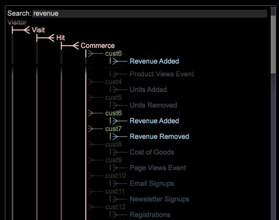

# Gränssnitt för dataset Schema{#dataset-schema-interface}

Gränssnittet Dataset Schema visar de utökade dimensionerna (räkningsbara, enkla, många-till-många, numeriska, denorala och tidsmått) som definieras i konfigurationsfilen för transformeringsdatauppsättningen och ger en vy över relationerna mellan dessa dimensioner.

Dessutom visar gränssnittet alla härledda dimensioner som du har definierat samt alla utökade dimensioner som har konfigurerats att vara dolda [!DNL Dataset Schema] .

>[!NOTE]
>
>Du kan söka efter dimensioner inifrån schemardiagrammet. Namnet på dimensionerna som hittas av söksträngen markeras och raderna i den överordnade klassen ändrar färg för alla träffar som hittas i underordnade dimensioner. De räkningsbara dimensionerna förblir synliga när du rullar för att ge visningshierarki och kontext.

**Så här tolkar du en dimensionstyp med[!DNL Dataset Schema]gränssnittet**

I följande tabell visas dimensionstyperna och färgerna i vilka deras namn visas i [!DNL Dataset Schema] gränssnittet. Överordnade för provdimensionerna (från exemplet ovan) noteras också.

<table id="table_CF888522626E49A4A10D87085CAB5CC1"> 
 <thead> 
  <tr> 
   <th colname="col1" class="entry"> Dimensionstyp </th> 
   <th colname="col2" class="entry"> Färg </th> 
   <th colname="col3" class="entry"> Exempeldimension och överordnad </th> 
  </tr> 
 </thead>
 <tbody> 
  <tr> 
   <td colname="col1"> Inventerbar </td> 
   <td colname="col2"> Rosa </td> 
   <td colname="col3"> 
Besökare - I det här schemat är Visitor en roträkningsbar dimension. 
 
Session - överordnad är besökare 
 </td> 
  </tr> 
  <tr> 
   <td colname="col1"> Denormal </td> 
   <td colname="col2"> Gul </td> 
   <td colname="col3"> DenormalPage - överordnad är sidvy </td> 
  </tr> 
  <tr> 
   <td colname="col1"> Härledd </td> 
   <td colname="col2"> Blå </td> 
   <td colname="col3"> Nästa sida - överordnad är Sidvy </td> 
  </tr> 
  <tr> 
   <td colname="col1"> Många-till-många </td> 
   <td colname="col2"> Rosa och grönt (stammen från den överordnade är rosa, medan dimensionsnamnet är grönt.) </td> 
   <td colname="col3"> Sökterm - parent is Session </td> 
  </tr> 
  <tr> 
   <td colname="col1"> Numeriskt </td> 
   <td colname="col2"> Grön </td> 
   <td colname="col3"> Exakt sidvaraktighet - överordnad är sidvy. I det här exemplet är Exakt sidvaraktighet en dold numerisk dimension. Se den dolda dimensionstypen i den här tabellen. </td> 
  </tr> 
  <tr> 
   <td colname="col1"> Enkel </td> 
   <td colname="col2"> Grön </td> 
   <td colname="col3"> Sida - överordnad är Sidvy </td> 
  </tr> 
  <tr> 
   <td colname="col1"> Tid </td> 
   <td colname="col2"> Grön </td> 
   <td colname="col3"> Timme - överordnad är session </td> 
  </tr> 
  <tr> 
   <td colname="col1"> Dold </td> 
   <td colname="col2"> Dolda dimensioner är en mörkare version av rätt dimensionstypfärg. En dold numerisk dimension är till exempel mörkare, mindre ljusgrön. </td> 
   <td colname="col3"> Exakt sidvaraktighet - överordnad är sidvy </td> 
  </tr> 
 </tbody> 
</table>

Mer information om de här dimensionstyperna finns i konfigurationsguiden för *datauppsättningar*.

**Visa standardvisualisering för en dimension**

* Klicka på önskad dimension i [!DNL Dataset Schema] gränssnittet. Standardvisualiseringen visas. Om standardvisualiseringen till exempel är en tabell som visar sessioner och den valda dimensionen och du klickar på URI-dimensionen, visar Data Workbench en tabell med URI efter sessioner.

   >[!NOTE]
   >
   >Om du vill ändra standardvisualiseringen som visas läser du [i Dataset Schema Interface](../../../home/c-get-started/c-admin-intrf/c-dtst-sch-intrf.md#concept-e147b3a5b542453ca2b121e1c85bb175).

**Visa en specifik visualisering för en dimension**

* Högerklicka på önskad dimension i [!DNL Dataset Schema] gränssnittet och klicka på **[!UICONTROL Add Visualization]** > *&lt;**[!UICONTROL visualization type]**>*.

