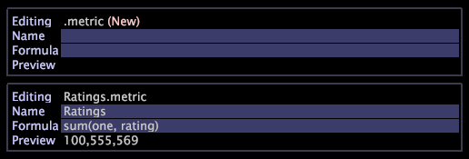

# Arbeta med härledda mätvärden{#work-with-derived-metrics}

Du definierar nya mätvärden (kallas härledda mätvärden) och redigerar befintliga mätdefinitioner med hjälp av Metrisk redigerare.

Mer information om mått än vad som anges i det här avsnittet och i [Query Language Syntax](../../../../home/c-get-started/c-qry-lang-syntx/c-qry-lang-syntx.md#concept-15d1d3f5164a47d49468c5acb7299d9f)finns i *Metrisk, Dimensioner och Filter Guide*.

## Skapa ett härlett mått {#section-d57b98bf0a9940daba4920ff7efc808d}

Du använder en [!DNL Metric Editor] för att definiera ett nytt mått efter namn, formel och format, som sparas i mappen User\*profile_name*\Metrics för senare bruk.

1. Öppna ett nytt [!DNL Metric Editor] med **[!UICONTROL Admin]** > **[!UICONTROL Profile]** -menyalternativet eller genom att högerklicka på **[!UICONTROL User]** kolumnen för mappen där du vill skapa måttet och klicka **[!UICONTROL Create]** > **[!UICONTROL New Metric]**.

   En [!DNL Metric Editor] skärm.

1. Skriv ett namn för det nya måttet i parametern Namn.

   Observera att mellanslag ( ) tillåts men understreck (_) inte. Du kan inte heller använda följande symboler:

   `+ - * /`

   

1. Skriv ett uttryck för det nya måttet i parametern Formel. Observera att filter måste definieras inom hakparenteser [ ] i uttrycket.

   Ytterligare syntaxregler för uttryck i metrisk information finns i [Syntax for Metric Expressions](../../../../home/c-get-started/c-qry-lang-syntx/c-syntx-mtrc-exp.md#concept-bbf440a0307549e088df491b51b51d66).

   Följande tabell innehåller exempeluttryck för utökade mått.

   <table id="table_ED77997FC08F492490DCAC3C4153781C"> 
   <thead> 
   <tr> 
      <th colname="col1" class="entry"> Namn på utökat mått </th> 
      <th colname="col2" class="entry"> Uttryck </th> 
   </tr>
   </thead>
   <tbody> 
   <tr> 
      <td colname="col1"> 
Procent av första sessioner 
 </td> 
      <td colname="col2"> 
 Sessioner [Session_Number="1"]/sessioner 
 </td> 
   </tr> 
   <tr> 
      <td colname="col1"> 
Konvertera första sessioner 
 </td> 
      <td colname="col2"> 
 Konvertering [Session_Number="1"] 
 </td> 
   </tr> 
   <tr> 
      <td colname="col1"> 
Genomsnittligt värde per besökare 
 </td> 
      <td colname="col2"> 
 Värde/besökare 
 </td> 
   </tr> 
   </tbody> 
   </table>

   >[!NOTE]
   >
   >När ett lämpligt uttryck anges visas värdet för det nya måttet på förhandsvisningsraden. Om det finns ett fel i uttrycket visar förhandsvisningsraden ett felmeddelande.

1. Högerklicka **[!UICONTROL (New)]** och klicka **[!UICONTROL Save]**.

   När du sparar måttet skapas en fil som representerar det nya måttet på datorn i installationskatalogen för Data Workbench \User\*profilnamn*\Metrics.

   

Nu kan du använda det nya måttet i hela den aktuella profilen genom att markera det på samma sätt som för andra inbyggda mätvärden. Om du vill ändra i vilken ordning mätvärdena visas på mätenas-menyn läser du [Anpassa menyer med hjälp av Order.txt-filer](../../../../home/c-get-started/c-intf-anlys-ftrs/c-ctm-menus/t-cstm-menus-ordr-files.md#task-a391800a8dd444deb3e1516d5189f999).

Om du vill att alla användare av profilen ska använda det mått som du har skapat måste du publicera det till arbetsprofilen med hjälp av [!DNL Profile Manager]. Se [Publicera filer i din arbetsprofil](../../../../home/c-get-started/c-admin-intrf/c-prof-mgr/t-pub-files-wkg-prof.md#task-a0106e010c834d16bd60eef4721b6af9).

## Redigera härledda mått {#section-db6d924cf4e14bcc8d57cfe1059fc797}

1. Högerklicka på bockmarkeringen för den mätfil som du vill redigera i kolumnen [!DNL Profile Manager] profilnamn [!DNL Metrics Manager], *eller* i kolumnen för profilnamn **[!UICONTROL Make Local]**. Klicka sedan på.
1. Högerklicka på bockmarkeringen för måttfilen i [!DNL User] kolumnen och klicka på **[!UICONTROL Open]** > **[!UICONTROL from the workbench]**.

   >[!NOTE]
   >
   >Du kan också öppna en [!DNL Metric Editor] genom att högerklicka på ett mätrelaterat område i en visualisering för att visa mätmenyn. Mer information finns i [Arbeta med mät- och dimensionsmenyer](../../../../home/c-get-started/c-vis/c-met-dim-menus.md#concept-50f07ae47c3e4f94ad7d3d7f8293ccac).

1. I [!DNL Metric Editor]redigerar och sparar du måttdefinitionen efter behov med steg 2-4 i [Skapa nya härledda mått](../../../../home/c-get-started/c-admin-intrf/c-prof-mgr/c-drvd-mtrcs.md#section-d57b98bf0a9940daba4920ff7efc808d).

   Om du vill att alla användare av profilen ska använda måttet som du redigerade måste du publicera det i arbetsprofilen med hjälp av [!DNL Profile Manager]. Se [Publicera filer i din arbetsprofil](../../../../home/c-get-started/c-admin-intrf/c-prof-mgr/t-pub-files-wkg-prof.md#task-a0106e010c834d16bd60eef4721b6af9).

