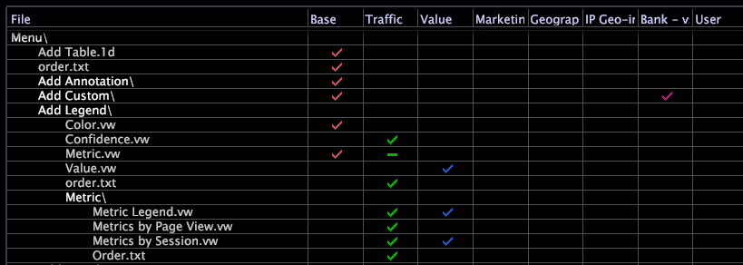

# Dölja en fil genom att tömma den (nollbyte){#hide-a-file-by-emptying-it-zero-byte}

{{eol}}

Om du inte har behörighet att ta bort filer från en profil eller om du inte vill ta bort en fil permanent, kan du använda tomma (nollbyte) filer för att dölja filer.

I [!DNL Profile Manager], ett bindestreck (-) i stället för en bockmarkering, identifierar en nollbytefil i en kolumn.

Till skillnad från andra metoder att dölja filer (till exempel [!DNL order.txt], parametern Show och parametern Hidden) hanterar Datan Workbench nollbytefiler som obefintliga. Om du till exempel nollbyte anger en dimension som har använts i en visualisering eller en metrisk definition, genereras ett fel för visualiseringen respektive mätvärdena i Datan Workbench.

Den här funktionen är användbar av flera skäl, bland annat när du vill göra följande:

* **Göra en fil oanvändbar** i Data Workbench utan att du behöver de profilbehörigheter som krävs för att ta bort filen.
* **Flytta ett mått, en dimension eller ett filter** till en annan plats utan att du behöver de profilbehörigheter som krävs för att ta bort filen från den ursprungliga platsen.
* **Dölj menyalternativ.** Till exempel [!DNL Base] har en [!DNL Metric Legend] definieras i [!DNL Metric.vw] -fil. Anta att ditt företag har skapat tre måttförklaringar som du vill ska visas på undermenyn Lägg till förklaring > Metrisk. Du kan nollbyte [!DNL Base] profil [!DNL Metric.vw] så att bara den nya undermenyn och tre nya måttförklaringar visas.

**Så här döljer du en fil**

1. I [!DNL Profile Manager]öppnar du de mappar och undermappar som behövs för att leta reda på filen som du vill nollbyte.
1. Högerklicka på bockmarkeringen bredvid filens namn och klicka på **[!UICONTROL Make Local]**.
1. Öppna den lokala filen och ta bort dess innehåll.
1. Spara och stäng filen.
