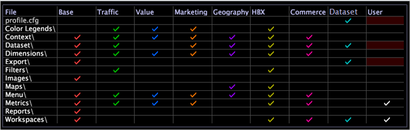
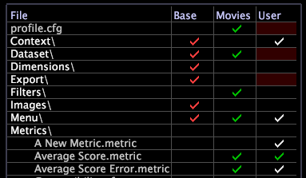

# Profilhanteraren{#profile-manager}

De mapp- och filnamn som ingår i implementeringen visas till vänster i Profilhanteraren.

De profiler som programmet består av visas som de enskilda kolumnerna i [!DNL Profile Manager]. Dessa profiler innehåller flera ärvda profiler och en enda arbetsprofil.

>[!NOTE]
>
>Din arbetsprofil (antingen en datauppsättningsprofil eller en rollspecifik profil) är den profil som du läser in när du öppnar Data Workbench.

Kryssmarkeringarna (och deras färger) anger profilmappen/profilmapparna på den Data Workbench- och Data Workbench-dator där varje fil finns, om det finns flera kopior av en fil och om dessa flera kopior har samma ändringsdatum och -tid. De här filerna synkroniseras mellan Data Workbench- och Data Workbench-datorerna vid hämtning av profiler.

Nedan följer ett exempel på [!DNL Profile Manager] för en HBX implementering:

På menyn [!DNL Profile Manager] kan du öppna någon av de andra hanterarna (till exempel [!DNL Dimensions Manager] eller [!DNL Reports Manager]) som endast visar vissa delar av [!DNL Profile Manager]. Du kan också skapa nya profilhanterare. Se [Skapa nya profilhanterare](../../../../home/c-get-started/c-intf-anlys-ftrs/c-cstm-prof-files-mgrs/c-new-prof-mgrs.md#concept-0021e006523e4d538aaa16322731d9d3).

En bockmarkering bredvid ett filnamn i en viss kolumn anger att en fil med det namnet finns i den mapp som heter i den kolumnen (profilen). När du flyttar till höger i [!DNL Profile Manager] har filerna företräde framför dem till vänster, det vill säga att varje ärvd profil bygger på profilerna till vänster i [!DNL Profile Manager]. Om du till exempel har en fil med samma namn och på samma plats i [!DNL Base]-profilen (kolumn) och i [!DNL User]-profilen (kolumn) används filen i [!DNL User]-profilen i stället för filen i [!DNL Base]-profilen.

## Sök efter profiler {#section-91f873f1d7ed4fd6a5f3c3ac08cfa623}

I Data Workbench 5.5 har ett sökfält lagts till för att hitta de profiler som krävs i [!DNL Profile Manager].

Följande typer av kolumner visas i [!DNL Profile Manager]:

* Kolumnerna *för det ärvda profilnamnet* innehåller markeringar för filer som finns i respektive profilmapp. Ärvda profiler innehåller interna profiler från Adobe samt företagsspecifika eller rollspecifika profiler som du skapar och underhåller. I exemplet ovan innehåller de interna profilerna Base, Traffic, Value, Marketing och så vidare. Den interna [!DNL Base]-profilen, som innehåller de grundläggande byggstenarna och konfigurationsinformationen som behövs för att köra ditt Adobe-program, medföljer alla implementeringar. De andra interna profilerna innehåller element (arbetsytor, mått, härledda dimensioner och så vidare) som rör särskilda typer av information, som webbtrafik eller marknadsföring. Adobe tillhandahåller bara de profiler som är lämpliga för den typ av data som du analyserar och för din bransch.

   >[!NOTE]
   >
   >Som standard kan inte interna profiler (de som tillhandahålls av Adobe) ändras. All anpassning måste ske i datauppsättningen, rollspecifika profiler eller andra profiler som du skapar. Om du skapar ett nytt program och behöver ändra en intern profil måste du ändra parametern Ändra interna profiler i filen [!DNL Insight.cfg]. Mer information finns i [Insight Configuration Parameters](../../../../home/c-get-started/c-insght-config-param.md#concept-14da97d0756348e885c08ca9e866074b). Kontakta Adobe Consulting Services innan du gör det.

* Kolumnen *arbetsprofilnamn*, som alltid är kolumnen närmast föregående, innehåller markeringar för filer som finns i den aktuella arbetsprofilens mapp. I exemplet ovan är arbetsprofilen datauppsättning. Din arbetsprofil är antingen en datauppsättningsprofil eller en rollspecifik profil. Filerna i den här mappen har företräde framför filer med samma namn i alla ärvda profilmappar.
* Kolumnen [!DNL User], som alltid är den sista kolumnen, innehåller markeringar för filer och mappar som finns som lokala filer i mappen User\*profile name*. Mappens katalogstruktur liknar arbetsprofilens katalogstruktur, och varje mapp med användarprofilens namn* innehåller lokala kopior av arbetsytor, mått och konfigurationsfiler för den aktuella profilen. Dessa lokala kopior har företräde framför alla filer med samma namn i alla ärvda mappar eller mappar med arbetsprofiler. Filerna i kolumnen [!DNL User] skapades och sparades antingen bara i mappen User\*profile name*, eller så finns de i en intern profil eller arbetsprofil samt i mappen User\*profile name*. Filerna i varje mapp kan vara identiska eller inte och kan ha samma ändringsdatum och -tid eller inte.

   >[!NOTE]
   >
   >
   >    
   >    
   >    * För att undvika att datauppsättningen endast ändras lokalt ignoreras de lokala kopiorna av [!DNL profile.cfg]-filen och eventuella filer i datauppsättnings- eller exportmapparna i Datan Workbench User\*profile name*. Ignorerade filer identifieras med en röd bakgrund i kolumnen [!DNL User] och en&quot;Ignorerad i användarkatalogen&quot;-varning på snabbmenyn. Om du vill implementera de ändringar du gör i dina lokala kopior av dessa filer måste du spara dem i din arbetsprofil så att de kan synkroniseras med Datan Workbench. Anvisningar om hur du sparar filer i din arbetsprofil finns i [Publicera filer till din arbetsprofil](../../../../home/c-get-started/c-admin-intrf/c-prof-mgr/t-pub-files-wkg-prof.md#task-a0106e010c834d16bd60eef4721b6af9).
      >    
      >    
   * Ett bindestreck (-) i stället för en bock i en kolumn identifierar en tom (nollbyte) fil. Data Workbench behandlar nollbytefiler som icke-existerande, vilket gör att du kan använda dem för att dölja filer som ingår i en profil till vänster. Se [Dölja filer med tomma (nollbyte) filer](../../../../home/c-get-started/c-admin-intrf/c-prof-mgr/c-empty-files.md#concept-e776fac9e5904bed8c13b9d5eb17c491).

## Bestämma filversioner {#section-225d732246b94cbe87acdfa9c881d6af}

Som nämndes i föregående avsnitt är markeringarna i [!DNL Profile Manager] färgkodade så att du enkelt kan identifiera var en fil finns och om de olika kopiorna av en fil ändrades vid olika tidpunkter.

Om en fil eller en komprimerad katalog är exakt densamma som filen eller katalogen till vänster om den, har den samma färgbock som filen eller katalogen i den kolumnen (profilen). Om den skiljer sig från en fil eller katalog till vänster, eller om filen eller katalogen bara finns i kolumnen [!DNL User], är bockmarkeringen vit.

[!DNL Profile Manager] som visas i exemplet ovan anger följande:

* En vit bockmarkering för filen [!DNL A New Metric.metric] visas bara i kolumnen [!DNL User], vilket anger att du bara har en lokal kopia av filen. Den har inte publicerats (eller överförts) på Data Workbench-servern så att andra användare av Datan Workbench kan komma åt den.

* Markeringar för filnamnet [!DNL Average Score.metric] visas i kolumnerna Filmer och [!DNL User]. Kryssmarkeringen i kolumnen [!DNL User] har samma färg som bockmarkeringen i kolumnen Filmer, vilket anger att den lokala kopian av filen har samma ändringsdatum och -tid som filen i mappen Filmer.

* Markeringar för filnamnet [!DNL Average Score Error.metric] visas i kolumnerna Filmer och [!DNL User]. Kryssmarkeringen i kolumnen [!DNL User] är vit, vilket anger att den lokala kopian av filen har ett annat datum eller en annan tid för ändring än filen i mappen Filmer.

