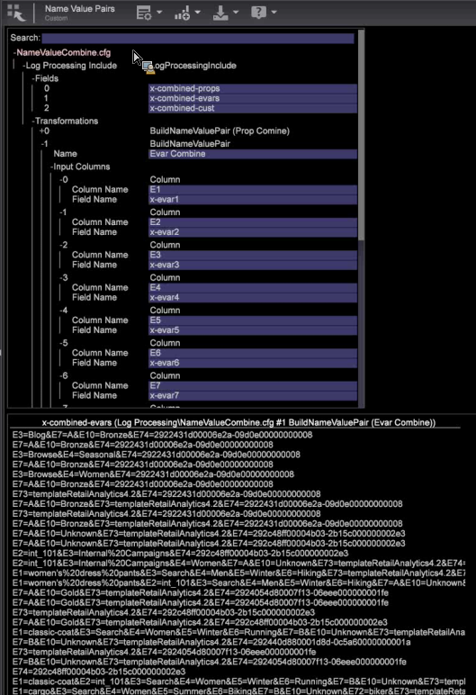

# Frågesträngsgruppering{#query-string-grouping}

{{eol}}

Med frågesträngsgruppering kan du integrera ett stort antal fält tillsammans.

Frågesträngsgruppering är specifik för varje profil, men fungerar bra i omformningar som i det här exemplet:

1. Skapa de par du vill paketera genom att lägga till en anpassad konfigurationsfil ( [!DNL E:\...\Dataset\Log Processing\SC Fields.cfg]) och sedan lägga till omformningstypen *BuildNameValuePair* som en parameter.

   ```
   2 = BuildNameValuePair:  
         Comments = Comment: 0 items 
         Condition = AndCondition: 0 items 
         Delimiter = string:  
         Input Columns = vector: 1 items 
           0 = Column:  
             Column Name = string: e100 
             Field Name = string: x-cust100 
             ...  
     (all the fields you wish to build)
             Name = string: Custom Events 
             Output = string: x-event-list       
   ```

1. Skapa en ny fil för att extrahera komprimerade data till de fält som du vill använda genom att lägga till en anpassad konfigurationsfil ( [!DNL E:\...\Dataset\Transformation\SC Fields Transformation.cfg]) och sedan lägga till omformningstypen *ExtractNameValuePairs* som en parameter.

   ```
   2 = ExtractNameValuePairs:  
         Comments = Comment: 0 items 
         Condition = AndCondition: 0 items 
         Delimiter = string:  
         Input Field = string: x-event-list 
         Name = string: Custom Events 
         Output Columns = vector: 1 items 
           0 = Column:  
             Column Name = string: e100 
             Field Name = string: x-cust100 
             ...  
     (all the fields you wish to extract) 
             Name = string: Custom Events 
             Output = string: x-event-list   
   ```

## Andra användningsområden {#section-cc5d2b0c9e194fc88a5a18a06ef22f5e}

Om du har många fält med anpassade variabler, utkast och variabler kan du under loggbearbetningen skapa ett namnvärdepar för att kombinera fält i en rapport. Du kan till exempel skapa namngivna värdepar i kombinerade fält för att minska [!DNL tempDB] filstorlek.


