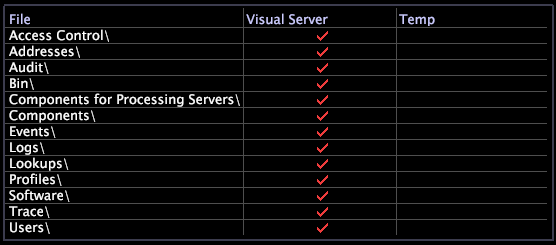

# Hanteraren för serverfiler{#server-files-manager}

Med Serverfilhanteraren kan du fjärradministrera och hantera Data Workbench från alla behöriga Data Workbench genom att ge åtkomst till alla kataloger och filer i produktens installationskatalog, inklusive konfigurations- och sökningsfiler.

Du kan komma åt [!DNL Server Files Manager] via menyn [!DNL Admin] och högerklicka på noden på serverdatorn i [!DNL Servers Manager] och klicka på **[!UICONTROL Server Files]**.

>[!NOTE]
>
>Du kan skapa nya serverfilhanterare som visar valda kataloger. Se [Skapa nya serverfilshanterare](../../../home/c-get-started/c-intf-anlys-ftrs/c-cstm-prof-files-mgrs/c-new-svr-files-mgrs.md#concept-6e8f63273109443699a8f61b1a2ea816).

I den vänstra kolumnen i [!DNL Server Files Manager] visas fil- och mappnamn. Kryssmarkeringarna i kolumnerna mitt och höger anger var i filstrukturen katalogerna och filerna finns.

Om en fil finns i produktens installationskatalog innehåller kolumnen *servernamn* (till exempel Data Workbench server) en bock. Om en fil finns på Datans Workbench dator i *Datans Workbench installationskatalog*\Temp innehåller kolumnen [!DNL Temp] en bockmarkering. Färgen på bockmarkeringarna anger om de filer som finns på olika platser har ändrats samtidigt.

* En röd bockmarkering i servernamnskolumnen anger att Datan Workbench eller filen finns på serverdatorn.
* En röd bockmarkering i kolumnen [!DNL Temp] anger att den lokala kopian av filen eller mappen har samma ändringsdatum och -tid som filen eller Datan Workbench på serverdatorn.
* En vit bockmarkering i kolumnen [!DNL Temp] anger att filen eller mappen i *Datans Workbench installationskatalog*\Temp har ett annat ändringsdatum och -klockslag än filen eller Datan Workbench på serverdatorn.

I följande bild visas [!DNL Server Files Manager] med både röda och vita bockmarkeringar:

**Hantera kataloger och filer med[!DNL Server Files Manager]**

Du kan använda [!DNL Server Files Manager] för att ändra kataloger och filer på en Data Workbench.

I följande tabell visas de uppgifter som kan utföras med [!DNL Server Files Manager]:

<table id="table_D217AE5A878542EC8B604812A61819C3"> 
 <thead> 
  <tr> 
   <th colname="col1" class="entry"> För att utföra den här uppgiften.. </th> 
   <th colname="col2" class="entry"> Gör det här.. </th> 
  </tr> 
 </thead>
 <tbody> 
  <tr> 
   <td colname="col1"> 
Visa filerna i en katalog 
 </td> 
   <td colname="col2"> 
Klicka på katalognamnet för att visa dess innehåll. 
 </td> 
  </tr> 
  <tr> 
   <td colname="col1"> 
Så här döljer du innehållet i en katalog 
 </td> 
   <td colname="col2"> 
Klicka på katalognamnet. 
 </td> 
  </tr> 
  <tr> 
   <td colname="col1"> 
Visa information om en katalog 
 </td> 
   <td colname="col2"> 
Högerklicka på cellen bredvid katalogen i antingen servernamnet eller i kolumnen  Temp. Följande information finns: 
 
    <ul id="ul_2DA5C8D0E95F4BCC8F7E25D05F00EB02"> 
     <li id="li_3FDECC14D62543B183C3509C338DF432">Bana. Katalogens sökväg. </li> 
     <li id="li_9CF3989FD9E2427995F070E043FAD02C">Dir. Katalogens namn. </li> 
     <li id="li_68AAA11907404D0BBF407ECD7CA2E467">Från. Platsen för katalogen, Remote eller Temp. </li> 
     <li id="li_CB4AEEC89E424868B758465EC0B701B5">Datum (endast tillfällig kolumn). Skapad den lokala kopian eller den senaste versionen. </li> 
    </ul> </td> 
  </tr> 
  <tr> 
   <td colname="col1"> 
Så här visar du information om en fil 
 </td> 
   <td colname="col2"> 
Högerklicka på bockmarkeringen bredvid filen i antingen servernamnet eller i kolumnen  Tillfällig. Följande information finns: 
 
 
     <ul id="ul_C4E6CB86D1774D739B5ECF48AF8DB628"> 
      <li id="li_7A6D39CF8C064FDDAB87F8D4E50FA832">Bana. Filens sökväg. </li> 
      <li id="li_9C735B6F0A2541F1992B845359C3685A">Fil. Filens namn. </li> 
      <li id="li_3EB903E4F4C44A6093732C588F0125EF">Från. Platsen för katalogen, Remote eller Temp. </li> 
      <li id="li_C1FED4F98F854D5892DBAD9F9E1D47B8">Datum. Datum för den senaste versionen av filen. </li> 
      <li id="li_7477C727C62F4406BB2026063E41F2AE">Storlek. Filens storlek. </li> 
     </ul> 
 </td> 
  </tr> 
  <tr> 
   <td colname="col1"> 
Så här hämtar du en katalog till din lokala dator 
 </td> 
   <td colname="col2"> 
Högerklicka på bockmarkeringen i kolumnen <i>servernamn</i> för den här katalogen och klicka på  Gör katalog lokal. En bock för katalogen visas i kolumnen  Temp. 
 </td> 
  </tr> 
  <tr> 
   <td colname="col1"> 
Så här hämtar du en fil till den lokala datorn 
 </td> 
   <td colname="col2"> 
Högerklicka på bockmarkeringen i kolumnen <i>servernamn</i> för den här filen och klicka på  Gör lokal. En bock för filen visas i kolumnen  Temp. 
 </td> 
  </tr> 
  <tr> 
   <td colname="col1"> 
Så här hämtar du den sista delen av en loggfil till den lokala datorn 
 </td> 
   <td colname="col2"> 
För att undvika att behöva ladda ned en hel loggfil (särskilt när du vet att felmeddelandet ligger nära filens slut) högerklickar du på bockmarkeringen i filens servernamnskolumn, klickar på  Tail och väljer storleken på den del som du vill hämta. En bock för filen visas i kolumnen  Temp. Den lokala filen innehåller bara den datamängd som du har angett, med början i filslutet. 
 </td> 
  </tr> 
  <tr> 
   <td colname="col1"> 
Öppna en katalog 
 </td> 
   <td colname="col2"> 
Högerklicka på bockmarkeringen för katalogen i kolumnen  Temp och klicka på  Öppna &gt;  mapp. 
 </td> 
  </tr> 
  <tr> 
   <td colname="col1"> 
Så här öppnar du en fil 
 </td> 
   <td colname="col2"> 
Högerklicka på bockmarkeringen för filen i kolumnen  Temp, klicka på  Öppna, klicka sedan i  Data Workbench,  i Anteckningar eller  mapp. 
 </td> 
  </tr> 
  <tr> 
   <td colname="col1"> 
Spara en lokal kopia av en katalog på Data Workbench-servern 
 </td> 
   <td colname="col2"> 
Högerklicka på bockmarkeringen för katalogen i kolumnen  Temp och klicka på  Spara katalog till &gt; <i>&lt; profilnamn&gt;</i>. 
 </td> 
  </tr> 
  <tr> 
   <td colname="col1"> 
Spara en lokal kopia av en fil på Data Workbench-servern 
 </td> 
   <td colname="col2"> 
Högerklicka på bockmarkeringen för filen i kolumnen  Temp och klicka på  Spara till &gt; <i>&lt; profilnamn&gt;</i>. 
 </td> 
  </tr> 
  <tr> 
   <td colname="col1"> 
Ta bort en lokal kopia av en katalog eller fil 
 </td> 
   <td colname="col2"> 
Högerklicka på bockmarkeringen för katalogen eller filen i kolumnen  Temp och klicka på  Ta bort. 
 </td> 
  </tr> 
  <tr> 
   <td colname="col1"> 
Kopiera och klistra in en fil som en e-postbilaga i Microsoft Outlook 
 </td> 
   <td colname="col2"> 
Högerklicka på bockmarkeringen för filen i kolumnen  Temp och klicka på  Kopiera. Bifoga filen genom att trycka på Ctrl+V i e-postmeddelandets brödtext. 
 </td> 
  </tr> 
 </tbody> 
</table>
