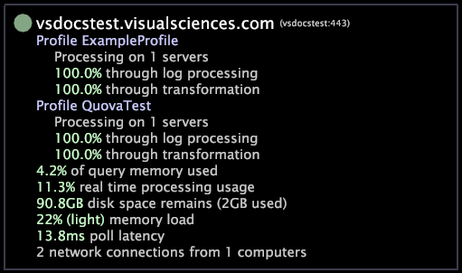

# Gränssnitt för serverövervakaren{#server-monitor-interface}

Gränssnittet Serverövervakaren är användbart för felsökning eller för att helt enkelt spåra prestandaparametrarna för Data Workbench-serverdatorer och rapportdatorer som är Data Workbench serverdatorer.

Gränssnittet för Serverövervakaren visar antingen en grön punkt eller en röd punkt högst upp till vänster om datornamnet. En grön punkt anger att datorn fungerar utan problem. En röd punkt anger att ett eller flera fel har inträffat på datorn.

I den nedre delen av gränssnittet för Serverövervakaren visas bearbetningsstatusen för var och en av dina tillgängliga profiler samt prestandainformation om datorn.

Mer information om [!DNL Data Workbench servers] finns i *Installations- och administrationshandboken för serverprodukter*. Mer information om [!DNL Report] finns i *Data Workbench Report Guide*.

**Så här öppnar du gränssnittet Serverövervakning**

* I Serverhanteraren högerklickar du på noden på Datan Workbench eller på datorn [!DNL Report]. t

Klicka på **[!UICONTROL Server Monitor]** om du vill visa information om en server eller klicka på **[!UICONTROL Related Servers]** > **[!UICONTROL Server Monitor List]** om du vill visa information om ett kluster med relaterade servrar.

Gränssnittet [!DNL Server Monitor]uppdateras automatiskt var 10:e sekund.

I följande tabell visas de uppgifter som kan utföras med gränssnittet [!DNL Server Monitor].

<table id="table_A65426669ADE44B5A6BAD9D4E99A5CAC"> 
 <thead> 
  <tr> 
   <th colname="col1" class="entry"> För att utföra den här uppgiften.. </th> 
   <th colname="col2" class="entry"> Gör det här.. </th> 
  </tr> 
 </thead>
 <tbody> 
  <tr> 
   <td colname="col1"> 
Kontrollera loggbearbetningsstatus för en profil 
 </td> 
   <td colname="col2"> 
Visa profilen <i>Profil</i> Namnvektor. I exemplet ovan skulle du visa vektorn Profile ExampleProfile för att se att ExampleProfile-processen på en server och dess loggbearbetning är 100 % slutförd. 
 </td> 
  </tr> 
  <tr> 
   <td colname="col1"> 
Så här avgör du hur lång tid det tar för datorn att svara på förfrågningar 
 </td> 
   <td colname="col2"> 
Visa fältet för avfrågningsfördröjning. Om värdet är större än 1 000 ms kontaktar du Adobe Support Services. 
 </td> 
  </tr> 
  <tr> 
   <td colname="col1"> 
Så här visar du en uppskattning av hur lång tid det kan ta att slutföra omformningen eller frågan 
 </td> 
   <td colname="col2"> 
Visa fältet för svepningstid (hh:mm:ss), som bara finns under omformning eller frågor. 
 </td> 
  </tr> 
  <tr> 
   <td colname="col1"> 
För att fastställa det aktuella antalet nätverksanslutningar till datorn 
 </td> 
   <td colname="col2"> 
Visa den sista raden i datorns  Server Monitor-information. I exemplet ovan ser du att två nätverksanslutningar för närvarande kommer från en dator. 
 </td> 
  </tr> 
 </tbody> 
</table>
