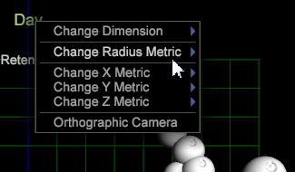

# 3D-punktdiagram{#d-scatter-plots}

En 3D-punktdiagram visar elementen i en datamåkning (t.ex. Dagar eller Referenswebbplats) i ett tredimensionellt rutnät där x-, y- och z-axlarna representerar olika mätvärden.

Precis som [punktdiagram 2D](https://docs.adobe.com/content/help/en/data-workbench/using/client/t-open-ins.html#Scatter_Plots)är den här visualiseringen användbar när du vill förstå förhållandet mellan ett stort antal olika objekt med olika mätvärden.

**Så här använder du 3D-punktritningsvisualisering:**

1. Öppna en ny arbetsyta.

   När du har öppnat en ny arbetsyta kan du behöva klicka på **Lägg till** > Lås **upp** tillfälligt.
1. Högerklicka och välj **Visualisering** > **3D-punktdiagram**.

   En menylista **[!UICONTROL Dimensions]** öppnas.

1. Välj en dimension för frågan.

   3D-punktritningen öppnar standardmåtten för den dimensionen.

   

   Om du väljer **[!UICONTROL Days]** menyn visas följande 3D-punktdiagram med dessa standardvärden på följande axlar: **[!UICONTROL x=Visits]**, **[!UICONTROL y=Retention]** och **[!UICONTROL z=Visits]**.

1. Ändra mätvärden. Högerklicka på måttetiketten i x-, y- eller z-axeln och välj **[!UICONTROL Change Metric]**. Välj sedan ett annat mått för den markerade axeln.

   

   >[!IMPORTANT]
   >
   >
   >    
   >    
   >    * Dra ett mätresultat till en av de tre axeletiketterna och släpp det om du vill ändra den markerade axeln till det släppta måttet.
   >    * Dra ett mätvärde någon annanstans i visualiseringen och släpp det för att ändra radiemått för den axeln.
   >    * Dra en dimension till valfri plats i visualiseringen och släpp den för att ändra dimensionen för visualiseringen.

1. Ändra radiemått. Högerklicka på titeln längst upp på sidan (efter den valda dimensionen) och välj **[!UICONTROL Change Radius Metric]**.

   Radiemeterialet definierar storleken på den plottade punkten baserat på det valda måttet. Punktens relativa position ändras inte i punktytan, men de plottade punktstorlekarna i visualiseringen ökar baserat på måttvärdet.

   

1. Driftsätt **[!UICONTROL Orthographic Camera]** programmet. Med det här alternativet kan du identifiera de plottade punkterna i förhållande till deras verkliga perspektiv baserat på radiemått för att undvika tredimensionell förvrängning.

   När 3D-punktdiagram visas först, visas de i en tredimensionell roterande projektion, vilket orsakar en viss förvrängning för punkter som ritas närmare perspektivet, eller i en virtuell&quot;kamera&quot;. (Ritytorna nära kameran är mycket större än punkterna som roterar längre bort från kameran.)

   För att undvika den här perspektivförvrängningen kan du välja alternativet genom att högerklicka på titeln och välja det på menyn. **[!UICONTROL Orthographic Camera]** På så sätt kan du representera de tredimensionella objekten i tvådimensionella dimensioner. Detta gör att de plottade punkterna återges som platta och visar punkterna i förhållande till radiemätningen, vilket minskar den 3-dimensionella förskjutningen.

1. Välj punkter från punktritytan.

   * **Så här tar du bort en punkt eller en punktgrupp**: Klicka på punkten.
   * **Så här lägger du till ytterligare en punkt eller grupp med punkter i markeringen**: **Ctrl** + **klicka på** en punkt eller **Ctrl** + **dra** över flera punkter.

   * **Så här tar du bort en punkt eller en grupp med punkter från markeringen**: **Skift** + **klicka** på en punkt eller **Skift** **+** dra **** över flera punkter.

<!--  -->

