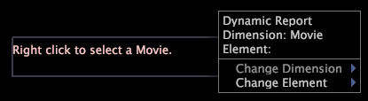

# Dynamiska rubrikanteckningar{#dynamic-title-annotations}

Med Report kan du generera rapporter dynamiskt för dimensionselementen som du anger i en uppslagsfil eller för ett visst antal dimensionselement, till exempel för användare med de tio högsta ordersiffrorna.

Med en dynamisk titelanteckning kan du visa en titel i en dynamisk rapport som identifierar antingen dimensionselementets namn som för närvarande bearbetas av [!DNL Report] eller det dimensionselementnamn som du har valt att visa. Med dynamiska rubrikanteckningar kan du identifiera vilket elements data du visar i rapporten utan att ändra någon av de andra visualiseringarna eller oavsiktligt sortera en markering efter ett visst element.

>[!NOTE]
>
>Den här funktionen är bara tillgänglig om du har licensierat [!DNL Report]. Mer information om [!DNL Report] finns i *Data Workbench Report Guide*.

Mer information om hur du skapar rapporter dynamiskt finns i *Insight Report Guide*.

**Ställa in en dynamisk titelanteckning**

* Högerklicka i den dynamiska titelanteckningen och klicka på **[!UICONTROL Change Dimension]** > *&lt;**[!UICONTROL dimension name]**>*.

   

* Om du vill visa information för ett visst element klickar du på **[!UICONTROL Change Element]** och sedan på det önskade elementet för att förhandsgranska rapporten för det aktuella elementet.

   

   **Exportera till Microsoft Excel**

   Mer information om att exportera fönster finns i [Exportera fönsterdata](../../../../home/c-get-started/c-wk-win-wksp/c-exp-win-data.md#concept-8df61d64ed434cc5a499023c44197349).
