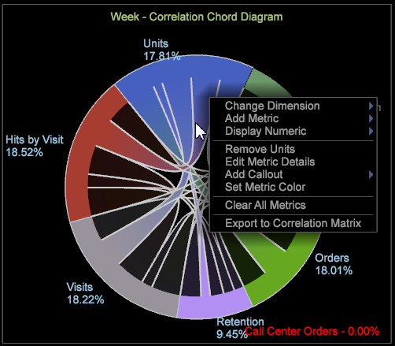

# Visualisering av ord{#chord-visualization}

Med kodvisualiseringen kan du visa både proportionen och korrelationen mellan mätvärden, vilket visar större ord som en indikation på en starkare korrelation.

Med kodvisualiseringen kan du identifiera korrelationer mellan mätvärden, så att du enkelt kan lägga till och utvärdera möjliga korrelationer. Den ger även en annan vy i tidigare genererad [korrelationsmatris](https://docs.adobe.com/content/help/en/data-workbench/using/client/analysis-visualizations/correlation-analysis/c-correlation-analysis.html). Om du använder kodvisualisering kan du inte identifiera en positiv eller negativ korrelation mellan måtten, utan bara att det finns en korrelation. I vissa fall kan man identifiera en direkt eller omvänd relation genom att använda räknarmått.

1. **Öppna **[!UICONTROL Chord]**visualiseringen**.

   Högerklicka på arbetsytan [!DNL Visualization > Predictive Analytics > Chord].

1. **Välj en dimension på menyn**.

   En tom visualisering öppnas där du kan välja en dimension. Dimensionsnamnet visas högst upp i den tomma ordvisualiseringen.

   >[!NOTE]
   >
   >Om du redan har en korrelationsmatris öppen på arbetsytan kan du även återge den som en ordvisualisering.

1. **Välj mätvärden som ska korreleras**.

   Dra mätvärden från **[!UICONTROL Finder]** genom att klicka **[!UICONTROL Ctrl-Alt]** för att dra mätvärden från tabellen till diagrammet. När två eller flera mätvärden har valts uppdateras diagrammet automatiskt och du kan börja visa korrelationsdata. Fortsätt lägga till mätvärden efter behov för att korrelera datapunkter.

   

   I Nätvisualiseringen visas andelen av hela delen som representeras av området för varje segment. Fortsätt lägga till mätvärden efter behov för att identifiera och undersöka viktiga relationer.

   

1. **Visa Chordvisualisering**.

   Håll pekaren över varje mätvärde i visualiseringen för att se hur relationen ser ut. I det här exemplet kan du se en korrelation mellan Enheter och de flesta andra mätvärden (förutom för **Besökets varaktighet** ).

   

   När du hovrar över **Besök Varaktighet** -måttet på kordavisualisering ser du att det finns en väldigt liten eller svag korrelation mellan alla andra mätvärden.

   

1. **Ändra inställningar.** Högerklicka på ordvisualiseringen för att öppna en meny där du kan ändra måttet, visa måtten som absoluta tal eller som procenttal, ta bort det valda måttet eller alla mått, redigera färger och detaljer samt exportera värden till en korrelationsmatris.

   

