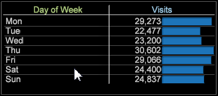

# Korrelationsmatris{#correlation-matrix}

Statistiska korrelationer mäter meningsfulla relationer för att identifiera möjligheter genom avancerad datautvinning.

Med korrelationsmatrisen [Pearsons korrelationskoefficient](../../../../home/c-get-started/c-analysis-vis/c-correlation-analysis/c-correlation-pearsons.md#concept-5996cb8c89fd4df5b47b7318e7a1d29c) får du relevant information för att bättre kunna identifiera nästa steg i en marknadsföringskampanj, för att förbättra webbplatsens design eller för att fortsätta en djupgående kundanalys för ytterligare korrelationsberoenden.

## Skapa en korrelationsmatris {#section-87ed12ccc1af4196a1b6534e621c4cbb}

Korrelationsmatrisen jämför mätvärden över en räkningsbar eller icke-räkningsbar dimension. Matrisen kan sedan ändras för att framhäva korrelationer i visualiseringen genom färgval eller för att återge den som en textruta, värmekarta eller både och.

1. Öppna en korrelationsmatris.

   Högerklicka [!DNL Visualization] > [!DNL Predictive Analytics] > [!DNL Correlation Matrix]. Dimensionstabellen öppnas.

   

   Välj en dimension, till exempel [!DNL Time] > [!DNL Day of the Week] på den här menyn. Korrelationstabellen öppnas med måttet som identifieras i matrisens hörn och tillhörande mått i rad och kolumn. För dimensionen Dag i veckan är **[!UICONTROL Visits]** det associerade måttet.

   

   Korrelationen är 1 000 eftersom du jämför ett mätvärde med sig själv (vilket avspeglar ett perfekt, men oanvändbart, samband).

1. Ändra en av mätvärdena.

   Högerklicka och välj **[!UICONTROL Change Metric]** om du vill ändra ett mått i raden eller kolumnen. Detta skapar en korrelation mellan två värdemått.

   I det här exemplet ändrar du **[!UICONTROL Visits]**-måttet i kolumnen till **[!UICONTROL Internal Searches]**. Högerklicka och välj [!DNL Metric] > [!DNL Custom Events] > [!DNL Custom Event 1-10] > [!DNL Internal Searches].

   

1. Lägg till fler mätvärden i korrelationsmatrisen.

   Högerklicka i en måttkolumn eller rad. På menyn Metrisk lägger du till [!DNL Metric] > [!DNL Custom Events] > [!DNL Custom Event 1-10] > [!DNL Sign in Error].

   

   Det nya måttet visas i en kolumn med ett korrelationsnummer. Du kan lägga till andra mått, som **[!UICONTROL Email Signups]**, för att skapa tabellen.

   

   Eller lägg till mätvärden till rader för att jämföra dem med mätvärden i kolumner.

   

1. (valfritt) Begränsa ett mått genom att lägga till ett dimensionselement.

   Högerklicka på arbetsytan och välj **[!UICONTROL Table]**. I den öppna dimensionstabellen trycker du på Ctrl + Alt och drar elementet över ett mätvärde i en kolumn eller rad. Elementet visas inom hakparenteser bredvid måttet.

   För måttet **[!UICONTROL Visits]** kan du begränsa det genom att välja **[!UICONTROL Country]** som **[!UICONTROL New Zealand]**.

   

   Observera att när du väljer ett dimensionselement ändras korrelationen i alla mätvärden baserat på det valda dimensionselementet. Endast besöksmåtten begränsas för &quot;Nya Zeeland&quot; när dimensionsfönstret stängs.

   >[!NOTE]
   >
   >Om du ändrar ett mätvärde med en dimensionsbegränsning (genom att högerklicka och välja **[!UICONTROL Change Metric]**), kommer det dimensionselement som begränsar måttet att gå förlorat. Du måste lägga till dimensionselementet igen.

1. Skapa ett [binärt filter](../../../../home/c-get-started/c-analysis-vis/c-correlation-analysis/c-correlation-binary-filter.md#concept-24e1daff43c540f69019f236976da31c) om du vill begränsa mätningen ytterligare. Högerklicka på måttet i tabellen och välj Binärt filter på menyn.

## Mål för korrelationsplanering och analys {#section-cc322da60b7e417ba29e72b0afeb6f79}

Här följer några allmänna mål för att skapa en korrelationsmatris.

**Identifiera relationen mellan två mätvärden mot en angiven dimension**. I exemplet skapades matrisen kring huvuddimensionen, Dag i veckan, med måtten Besök, E-postmeddelanden och Inloggningsfel jämfört med Interna sökningar, Inloggning och Undersökningsvisning.

**Utveckla hypoteser för fokusanalys**. När du har kört en korrelationsanalys är nästa steg att söka efter beroenden och korrelation för mätvärdena. Att förstå att interna sökningar påverkar e-postregistreringar är till exempel en väg för att förutse relationen och för att ändra marknadsföringskampanjer eller design av webbplatsnavigering.

**Identifiera mätvärden för att inkludera mer avancerade datautvinningsalgoritmer**. I de flesta fall identifieras nyckelmåtten eftersom de kommer att ses som påverkar flera korrelationer. Ni kan nu använda dessa nyckeltal och använda dem i ytterligare datautvinningsanalyser för att få djupare insikter.

## Korrelationsmatris - funktionskommentarer {#section-ef3626c665ea468a9ecdad624b4132f5}

**Om du filtrerar och väljer ett dimensionselement i en tabell jämförs det som värden**. Om du till exempel använder dimensionen Dag i veckan och sedan klickar på ett element i den kärndimensionen, till exempel klickar på en viss dag i dimensionstabellen Dag i veckan, återges en till en matchning på 100 % som inte ger någon användbar korrelation. Eftersom rotdimensionen var Dag i veckan ändras matrisen till en 1:1-korrelation om du väljer något i Dag i måtttabellen Vecka.

Korrelationen 1 till 1 (när en enskild markering består av alla element) finns dock bara på den aktuella dagen. Om du gör flera markeringar förblir den inte nödvändigtvis 1 till 1-korrelation och ger inte alltid 100 procents matchning oavsett om du väljer 1 eller 1+ dagar i veckan.

**Statistiska korrelationer är inte lika med Correlated Data Model**, den historiska referensen för Adobe Analytics-produkter. Den statistiska korrelationen i data workbench baseras på [Pearson Correlation model](../../../../home/c-get-started/c-analysis-vis/c-correlation-analysis/c-correlation-pearsons.md#concept-5996cb8c89fd4df5b47b7318e7a1d29c).

**Visa korrelation i en punktdiagram**. Högerklicka på titeln på ett punktdiagram och välj [!DNL Display Correlation] på menyn [!DNL Visualization]. Korrelationsvärdet visas i den övre högra delen av punktritningen.

>[!NOTE]
>
>Matrisen Punktdiagram och Pearsons visar &quot;Beräkningsfel&quot; om programmet inte kan köra korrelationsberäkningen för Pearsons. Detta beror vanligtvis på otillräckliga data, vilket kan göra att ekvationen försöker dividera med 0.
