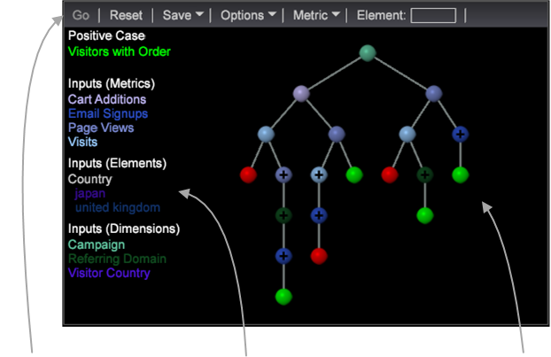

# Beslutsträdsbyggaren{#decision-tree-builder}

Beslutsträd är en visualisering för prediktiv analys som används för att utvärdera besökares egenskaper och relationer. Beslutsträdsbyggaren genererar en beslutsträdsvisualisering baserad på ett angivet positivt fall och en uppsättning indata.

Ett beslutsträd är en binär klassificerare med en uppsättning regler (eller filter) som identifierar besökare som uppfyller specifika regler baserade på ett positivt fall. Ett beslutsträd anger regler för att klassificera besökare som uppfyller (eller inte uppfyller) detta positiva fall. Dessa regler genererar en trädkarta som ger en viss grad av förtroende för att uppnå dessa positiva ärenderesultat.

Ett beslutsträd byggs genom att man undersöker indata på varje nivå och väljer det som ger maximal informationsvinst vid en viss delningspunkt. Delningspunkter för varje variabelnivå genererar två uppsättningar:

* värden som är mindre än eller lika med delningspunkten, och
* Värden större än delningspunkten.

Använd beslutsträd för att

* Genomför meningsfulla analyser och tolkningar på kortare tid.
* Använd automatiserad segmentgenerering.
* Skapa snabbt slutsatser utifrån en modell som bygger på en stor mängd data.

<table id="table_FCC5D63EF8A843D79B2338BD951025EA"> 
 <tbody> 
  <tr> 
   <td colname="col1"> 
<b>Verktygsfält och menyer</b> 
 
Verktygsfältet innehåller knappar och menykommandon för beslutsträdet, inklusive funktioner för att ställa in positiv skiftläge och lägga till inmatningslistor. 
 
Precis som med andra visualiseringar kan du dra och släppa dimensioner och element i rutan  Element , men du kan även dra direkt från rutan Finders. 
 
Mer information finns i Alternativ <a href="../../../../home/c-get-started/c-analysis-vis/c-decision-trees/c-decision-trees-menu.md#concept-bfc4e80651a243d3966cc770b205606c"> för beslutsträd</a>. 
 </td> 
   <td colname="col2"> 
<b>Inmatningslista</b> 
 
I det här området visas indata i trädmodellen. De är färgkodade så att de matchar noderna i trädvisningsområdet. 
 
Om du högerklickar på en inmatning kan du ta bort inmatningen från modellen och återställa den. 
 
Om du hovrar över en trädnod visas delningsvillkoren längs grenen till den noden och förutsägelsen vid den noden med dess konfidensvärde. 
 </td> 
   <td colname="col3"> 
<b>Trädvisning</b> 
 
I det här området visas trädmodellen med lövnoder som är färgkodade baserat på dess förutsägelse: grönt för en True-förutsägelse av det positiva fallet och rött för en False-förutsägelse. 
 
De delade noderna färgkodas enligt de indata som matchar deras markeringsvillkor. När du hovrar över en nod visas information om delningen och inmatningslistan expanderas så att de delade punkterna visas längs grenen och kursens distribution. 
 
Noder under ett tröskelvärde visas inte som standard. Klicka på en utökningsbar nod (indikeras av symbolen +) för att utforska en gren. Klicka på rotnoden för att återgå till den fullständiga trädvisningen. 
 </td> 
  </tr> 
 </tbody> 
</table>

<!--  -->

