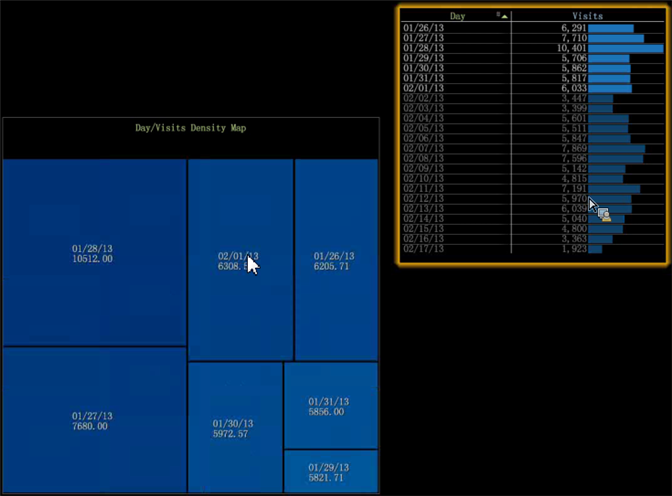

# Densitetskarta{#density-map}

{{eol}}

I densitetskartan visas element som skuggade rektanglar inom en fyrkantig karta.

Rektanglarnas storlek beror på elementvärden, där större värden representeras av rektanglar med större område. På samma sätt som ett cirkeldiagram kan du med den här visualiseringen snabbt se vilka element som utgör den största procentandelen av den valda dimensionen.

Så här skapar du en densitetskarta:

1. Öppna en ny arbetsyta.

   När du har öppnat en ny arbetsyta kan du behöva klicka **Lägg till** > **Lås upp tillfälligt**.
1. Klicka på **[!UICONTROL Visualization]** > **[!UICONTROL Density Map]**.

1. Välj en **[!UICONTROL Dimension]** på menyn.

   Välj till exempel **[!UICONTROL Time]** > **[!UICONTROL Days]**.

   I kontrast, markera **[!UICONTROL Time]** > **[!UICONTROL Hours]** ger dig fler element med mindre värden som visas som mindre rektanglar.

   >[!NOTE]
   >
   >Du ska välja en dimension med flera element efter dina behov. Den aktuella gränsen är 200 av de största elementen för varje dimension.

1. Du kan ändra dimensionsvyer genom att öppna **[!UICONTROL Visualization]** > **[!UICONTROL Table]** och markera över element från tabellen som ska visas på kartan.

   

   Kartan svarar på markeringar i tabellen.

1. Om du hovrar över små element visas deras namn och värde i text som visas nära musmarkören.
1. Maskera element genom att högerklicka och välja **[!UICONTROL Mask]** väljer du sedan ett alternativ.

   

   Om du vill visa alla maskerade noder väljer du **[!UICONTROL Unhide All]**.

1. Markera element genom att högerklicka och välja **[!UICONTROL Spotlight]** väljer du sedan ett alternativ. Med spotlighting kan du markera och tona ned element i ett intervall.
1. Lägg till en färgförklaring på arbetsytan. Du kan identifiera värden på kartan med hjälp av färgförklaringen.

   Du kan lägga till en färgförklaring på arbetsytan så ändrar noderna färg baserat på den extra datamängden.
1. Ändra måttet eller måttet genom att högerklicka på karttiteln och välja på menyn.

   

1. Lägga till bildtexter genom att högerklicka i en cell och markera **[!UICONTROL Add Callout]**. Du kan välja mellan olika typer eller visualiseringar på menyn.

   

1. Precis som i alla visualiseringar kan du högerklicka ovanför namnlisten för att visa en visualisering utan kantlinje genom att välja något av grundkommandona Stäng, Spara, Exportera till Microsoft Excel, Ordna, Kopiera, Minimera och Kantlös.

   

1. Med täthetskartan kan du markera och avmarkera flera element som liknar andra visualiseringar:

* Vänsterklicka för att markera ett element.
* Ctrl-klicka om du vill markera flera element.
* Skift-klicka om du vill avmarkera ett element.
* Högerklicka i de markerade elementen för att öppna en meny. Välj sedan **[!UICONTROL Deselect]** eller **[!UICONTROL Deselect All]** för att ta bort markerade element.

## Ytterligare alternativ {#section-d77defb012424de4a7ced8e5c93115bc}

Högerklicka på Täthetskartan för att öppna en meny med följande alternativ:

<table id="table_3ADA85031C834792BFD041E186962A41"> 
 <thead> 
  <tr> 
   <th colname="col1" class="entry"> Alternativ </th> 
   <th colname="col2" class="entry"> Beskrivning </th> 
  </tr>
 </thead>
 <tbody> 
  <tr> 
   <td colname="col1"> Lägg till bildtext </td> 
   <td colname="col2">Lägg till en text eller grafik som en bildtext i visualiseringen för att ytterligare identifiera eller beskriva ett element. 
Du kan också välja en tom måttförklaring, tabell, linjediagram eller punktdiagram baserat på det valda elementet i täthetsschemat. Du kan sedan lägga till mått och mått till dessa tomma visualiseringar efter behov. 
 </td> 
  </tr> 
  <tr> 
   <td colname="col1"> Mask </td> 
   <td colname="col2">Med maskalternativen kan du dölja markerade element. Högerklicka för att visa maskalternativ. 
 Dölj det här elementet—Välj det här alternativet om du vill maskera ett enskilt element som du har markerat. 
 
 Dölj markerade—Välj det här alternativet om du vill maskera flera element som du har markerat. 
 
 Visa överkant- Välj det här alternativet om du bara vill visa de 100, 50, 25 eller 10 översta elementen baserat på värdena i densitetskartan. 
 
 Visa nederkant- Välj det här alternativet om du bara vill visa de nedersta elementen på 100, 50, 25 eller 10 överst baserat på värdena i Täthetskartan. 
 </td> 
  </tr> 
  <tr> 
   <td colname="col1"> Strålkastare </td> 
   <td colname="col2"> Med spotlighting kan du markera och tona ned element i ett intervall. Högerklicka för att öppna en meny med alternativ. 
 Visa överkant- Välj det här alternativet om du bara vill markera de översta 100, 50, 25 eller 10 toppelementen baserat på värdena i densitetskartan. 
 
 Visa nederkant- Välj det här alternativet om du bara vill framhäva de nedersta elementen på 100, 50, 25 eller 10 överst baserat på värdena i Täthetskartan. 
 </td> 
  </tr> 
  <tr> 
   <td colname="col1"> 
Avmarkera 
 
Avmarkera allt 
 </td> 
   <td colname="col2"> 
 Markera de här kommandona om du vill avmarkera det aktuella elementet, om det är markerat, eller avmarkera alla element som är markerade. 
 </td> 
  </tr> 
 </tbody> 
</table>
