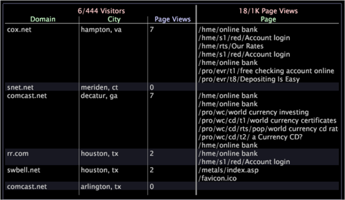

# Detaljtabell{#detail-table}

Med detaljtabeller kan du visa ytterligare information om en delmängd av data, som definieras av de val du gör i andra visualiseringar.

Den ytterligare information du ser är ett urval av alla tillgängliga data.

I följande tabell beskrivs elementen i en detaljtabell.

<table id="table_C88C7F7F5AEA4820B908923E45CC0A62"> 
 <thead> 
  <tr> 
   <th colname="col1" class="entry"> Element </th> 
   <th colname="col02" class="entry"> Färg </th> 
   <th colname="col2" class="entry"> Beskrivning </th> 
  </tr> 
 </thead>
 <tbody> 
  <tr> 
   <td colname="col1"> 
Nivå 
 </td> 
   <td colname="col02"> 
Rosa 
 </td> 
   <td colname="col2"> 
Alla räkningsbara dimensioner för vilka du vill visa detaljerad attribut och mätinformation. Nivån föregås av det antal element som visas av antalet tillgängliga element, t.ex. 6/444 anger att 6 element visas utanför ett möjligt 444. I exemplet ovan anger nivån Besökare att all information som anges baseras på besökare. Nivåerna Sidvyer anger att alla detaljer som anges baseras på sidvyn. Det är praktiskt att visa flera nivåer samtidigt när du vill analysera data som har olika räkningsbara överordnade. 
 </td> 
  </tr> 
  <tr> 
   <td colname="col1"> 
Attribut 
 </td> 
   <td colname="col02"> 
Grön 
 </td> 
   <td colname="col2"> 
Alla dimensioner som är en-till-många eller en-till-en med nivån, till exempel Ort till besökare. Varje rad visar det element som är relaterat till varje element på den nivå som du har valt. I exemplet ovan listar attributen Domän och Ort domänen och Ort för var och en av exempelbesökarna. 
 </td> 
  </tr> 
  <tr> 
   <td colname="col1"> 
Mått 
 </td> 
   <td colname="col02"> 
Blå 
 </td> 
   <td colname="col2"> 
Måttdetaljer om den nivå du har valt. I exemplet ovan, med nivån inställd på Besökare, visar de måttliga sidvyerna antalet sidvyer för en enskild besökare, medan nivån Sidvyer ger information om var och en av dessa sidvyer. 
 </td> 
  </tr> 
 </tbody> 
</table>

Säg att ni arbetar med webbplatsdata och vill ta reda på vilka sidor besökare i vissa städer och från vissa domäner har besökt under en viss tidsperiod.

Först måste du skapa en visualisering som visar den tidsram som du är intresserad av, sedan måste du markera den tidsramen. Nu kan du lägga till en detaljtabell för att visa önskad information för ett exempelantal besökare i datauppsättningen.

Om du vill visa den information som beskrivs ovan måste du utföra följande steg:

1. Högerklicka i detaljtabellen och klicka på **[!UICONTROL Add Level]** > **[!UICONTROL Visitor]**.
1. Högerklicka i detaljtabellen och klicka på **[!UICONTROL Add Level]** > **[!UICONTROL Page View]**.
1. Högerklicka på nivårubriken **[!UICONTROL Visitors]** och klicka på **[!UICONTROL Add Attribute]** > **[!UICONTROL Geography]** > **[!UICONTROL Domain]**.
1. Högerklicka i rubriken på besökarnivån och klicka på **[!UICONTROL Add Attribute]** > **[!UICONTROL Geography]** > **[!UICONTROL City]**.
1. Högerklicka i rubriken på besökarnivån och klicka på **[!UICONTROL Add Metric]** > **[!UICONTROL Page Views]**.
1. Högerklicka i rubriken för sidvisningsnivån och klicka på **[!UICONTROL Add Attribute]** > **[!UICONTROL Page]** > **[!UICONTROL Page]**.

I följande exempelarbetsyta visas de relaterade detaljerna för ett slumpmässigt urval av sex besökare på webbplatsen under den tidsperiod som du angav.

## Lägg till en nivå {#section-f948d3361fd84906ac4d9ebce520bfd0}

* Högerklicka i detaljtabellen och klicka på **[!UICONTROL Add Level]** > *&lt;**[!UICONTROL dimension name]**>*.

## Ta bort en nivå {#section-a8c820e0b656451e98e5ea75373edefc}

* Högerklicka på den befintliga nivårubriken och klicka på **[!UICONTROL Remove Level]** > *&lt;**[!UICONTROL dimension name]**>*.

## Lägg till attribut och mått {#section-cdda2df3c9a448d5b9770686c8b8efb3}

* Högerklicka på ett attribut eller en måttrubrik och klicka på **[!UICONTROL Add Attribute]** > *&lt;**[!UICONTROL attribute name]**>* eller **[!UICONTROL Add Metric]** > *&lt;**[!UICONTROL metric name]**>*.

## Ta bort attribut och mått {#section-4002ac957a2846678f9940270987d651}

* Högerklicka på den kolumn som du vill ta bort och klicka på **[!UICONTROL Remove Attribute]** > *&lt;**[!UICONTROL attribute name]**>* eller **[!UICONTROL Remove Metric]** > *&lt;**[!UICONTROL metric name]**>*.

## Exportera till Microsoft Excel {#section-a9eaba63c88a4598836a34669ba8cac1}

Mer information om att exportera fönster finns i [Exportera fönsterdata](../../../home/c-get-started/c-wk-win-wksp/c-exp-win-data.md#concept-8df61d64ed434cc5a499023c44197349).
