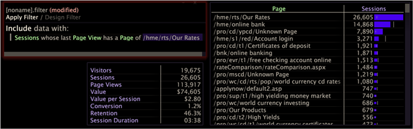

# Arbeta med filtervillkor{#working-with-filter-conditions}

Information om hur du arbetar med filtervillkor, inklusive hur du skapar ett nytt filter och lägger till ett villkor i ett nytt filter.

## Skapa ett filter {#section-70ba51ae625e493fa3ca70b93ffba406}

* Öppna en filterredigerare på arbetsytan genom att högerklicka **[!UICONTROL Add Visualization]** > **[!UICONTROL Filter Editor]**.

   -or-

* Om du redan har en filterredigerare öppen och ett filter har lästs in högerklickar du på det aktuella filtrets namn och klickar på **[!UICONTROL New Blank Filter]**.

## Lägga till ett villkor i ett nytt filter {#section-50986db80f1148c489630a8a63fe9f28}

1. Skapa ett nytt filter. Kontrollera att Designfilter är markerat (till skillnad från Använd filter), vilket anger att du arbetar i designfilterläge.
1. Högerklicka i det markerade området **[!UICONTROL Right-click to build filter]** och välj något av följande alternativ:

   * Om du vill skapa ett inkluderingsfilter klickar du på **[!UICONTROL Include group with]**.
   * Om du vill skapa ett exkluderingsfilter klickar du på **[!UICONTROL Exclude group with]**.

1. Välj den typ av villkor som ska läggas till i filtret.

   Följande tabell innehåller beskrivningar av de tillgängliga filtervillkorstyperna:

<table id="table_3B35B57FF32349F09E91E8256FF1672A"> 
 <thead> 
  <tr> 
   <th colname="col1" class="entry"> Villkorstyp </th> 
   <th colname="col2" class="entry"> Beskrivning </th> 
  </tr>
 </thead>
 <tbody> 
  <tr> 
   <td colname="col1"> 
val av arbetsyta 
 </td> 
   <td colname="col2"> 
Definierar ett filtervillkor baserat på valen på arbetsytan. Det här alternativet är bara tillgängligt om det finns en eller flera markeringar i arbetsytan. 
 
Om du vill visa mer information om markeringen högerklickar du på villkoret och klickar på  Visa detaljer. En pratbubbla visas för villkoret. 
 
Om du gör en annan markering på arbetsytan kan du lägga till markeringen som ett undervillkor till den första markeringen. Markeringarna grupperas tillsammans som logiska AND:er. Därför måste de data som inkluderas eller exkluderas av villkoret uppfylla alla arbetsyteval. 
 </td> 
  </tr> 
  <tr> 
   <td colname="col1"> 
minst en 
 </td> 
   <td colname="col2">Definierar ett filtervillkor baserat på om det finns minst ett (valfritt) element av en dimension som du väljer. Om du vill redigera villkoret högerklickar du på villkoret och klickar på  Ändra villkor till. Klicka på en av de tillgängliga dimensionerna. </td> 
  </tr> 
  <tr> 
   <td colname="col1"> 
formel 
 </td> 
   <td colname="col2"> 
Definierar ett filtervillkor baserat på formeln som du anger. Du måste använda rätt syntax för att filtret ska fungera. 
 
 
Obs! Mer information om syntaxen för att definiera filter finns i <a href="../../../../home/c-get-started/c-qry-lang-syntx/c-syntx-fltr-exp.md#concept-72f2563f809747a2a3cff7ec72462a15"> Syntax för filteruttryck</a>. 
 
 </td> 
  </tr> 
  <tr> 
   <td colname="col1"> 
måttvärde 
 </td> 
   <td colname="col2"> 
Definierar ett filtervillkor baserat på ett måttvärde som du anger. 
 
Så här definierar du villkoret: 
     <ul id="ul_B69D31258A36460E94535709239CD165"> 
      <li id="li_51317A681E654DD7A9D997DF9F2F22BA">Högerklicka  [välj nivå] &gt; Ändra nivå  för att välja nivå och mätvärde från en lista med dimensioner i datauppsättningen. </li> 
      <li id="li_975E56C335824FDCB988344952DE2E9F">Högerklicka på  [välj mått] &gt; Ändra mått  för att välja måttet från en lista med mätvärden i datauppsättningen. </li> 
      <li id="li_D00B3AF3D8DE472C9D0E9EABBBCAAF61">Högerklicka på mindre än och klicka på  Ändra jämförelse för att välja ett av de tillgängliga jämförelsevillkoren (mindre än, mer än, exakt, åtminstone eller som mest). </li> 
      <li id="li_3334CE0A0950448590E5442AB243F46B">Ange det önskade värdet för måttet. </li> 
     </ul> 
 </td> 
  </tr> 
  <tr> 
   <td colname="col1"> 
första/sista 
 </td> 
   <td colname="col2"> 
Definierar ett filter som gör att du kan inkludera eller exkludera en nivå med en angiven dimension. Du kan till exempel ange ett första/sista filter som ska inkluderas (eller exkluderas): 
 
Sessioner vars sista sidvy innehåller en sida med  /tim/tim/Våra priser. 
 
Så här definierar du ett första/sista villkor: 
     <ul id="ul_5AD916DA093844B8AC70127B1EB9BFC8"> 
      <li id="li_AB9FF22ADC8843A79856FED60B9478FA">Välj  Inkludera grupp med eller  Uteslut grupp med &gt;  första/sista som ett nytt villkor i Filterredigeraren. </li> 
      <li id="li_92F536FCC2A74DDE97F66C6C45ACC3DC">Högerklicka  [välj behållare] &gt;  Ändra behållare för att markera behållaren. </li> 
      <li id="li_1E5DBE04ABC74D84B7C0EF6886CDB5DC">Högerklicka  först eller  sist för att ange nivån. </li> 
      <li id="li_8B73EBF5D06E4513B5F0376EB2805D1C">Högerklicka för att ange en dimension och ange sedan ett värde i det tillgängliga fältet. </li> 
      <li id="li_A9E02EF6C6004DDF9B00EB853B6E54EE">Klicka på  Använd. </li> 
     </ul> 
 </td> 
  </tr> 
 </tbody> 
</table>

Filtret i det här exemplet definierar ett första/sista filter för användare vars sista sidvy var [!DNL /hme/rts/Our Rates]:

1. (Valfritt) Om du vill lägga till fler villkor i filtret högerklickar du i det område i fönstret där du skapar filtret och väljer typ av filter (se steg 2) och villkorsregeln (se steg 3).

   >[!NOTE]
   >
   >Flera inkluderingsvillkor grupperas tillsammans som logiska ELLER. Därför måste de data som ingår i filtret uppfylla minst ett av de definierade inkluderingsvillkoren. Flera exkluderingsvillkor grupperas också som logiska ELLER. För att kunna uteslutas måste uppgifterna uppfylla minst ett av villkoren för uteslutning.

Filtret i det här exemplet definierar en delmängd av data som består av filmvisningsprogram (användare) som har klassificerat många filmer men inte gett någon film ett högt betyg (4 eller 5). Filtret (med passande namn Mycket svårt att använda) består av två tillstånd:

* **Ett villkor för måttvärde:** Villkoret omfattar användare som har klassificerat minst 500 filmer.
* **Ett villkor för val av arbetsyta:** Villkoret utesluter användare som har gett en film poängen 4 eller 5. I bildtexten står det att 4 och 5 var de element som valdes ut från bakgrundsmusiken.

## Ta bort ett filtervillkor {#section-3092e0d7ac624885b8fe24616279de13}

>[!NOTE]
>
>Du kan bara ta bort villkor när du arbetar i designfilterläge. Om du har använt ett filter på arbetsytan måste du klicka på Designfilter för att återgå till designfilterläget innan du kan ta bort ett eller flera av filtervillkoren.

* Klicka på **x** till vänster om villkoret för att ta bort det.

## Redigera en villkorsbeskrivning {#section-5015fd2c88ed4b6a95be7f0d53be2db0}

Du kan lägga till beskrivningar för varje villkor som du lägger till i ett filter. Du kan redigera eller ta bort beskrivningarna efter behov.

>[!NOTE]
>
>Beskrivningar av villkor visas bara när du arbetar i designfilterläge.

* Högerklicka på villkoret och klicka **[!UICONTROL Edit description]**.

   * Om du vill lägga till eller redigera en beskrivning skriver du beskrivningen i [!DNL Edit condition description] fältet. Beskrivningen visas inom citattecken ovanför villkoret i filterredigeringsfönstret.

      

* Om du vill ta bort en beskrivning klickar du på **[!UICONTROL Remove description]**. Villkoret finns kvar i filterredigeringsfönstret.

