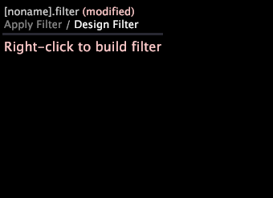

# Filterredigerare{#filter-editors}

{{eol}}

En filterredigerare är en specialvisualisering för att skapa och redigera filter.

Andra visualiseringar i Datan Workbench visar data från datauppsättningen, men med en filterredigerare kan du ange vilken del eller del av data som ska visas i visualiseringarna.

 **Knappen Spara filter.** När du markerar ett objekt på en arbetsyta - en detaljtabell, visualisering, filter eller något annat objekt - en **Spara filter** öppnas i verktygsfältet där du kan skapa ett filter för det markerade objektet. Alternativet för att ange ett namn visas när du klickar på ikonen Spara filter. Filtret kan sedan sparas i profilen.

Du skapar ett filter genom att öppna ett filterredigeringsfönster på arbetsytan och lägga till ett eller flera villkor. För att underlätta definieringen av filtervillkoren visas redigerbara fält i filterredigeringsfönstret som textrutor eller markeras när du för musen över dem. Du klickar bara i textrutan för att lägga till text eller högerklickar på det markerade fältet för att se vilka alternativ som är tillgängliga. Filtret som du skapar läser som en mening, vilket gör det enkelt att förstå vilka delar av data som inkluderas eller utesluts. Om du vill kan du skapa en beskrivning för varje filtervillkor så att etiketten i filterredigeraren blir mer meningsfull för dig eller ditt team.

Du kan dessutom använda filterredigeraren för att öppna och redigera [!DNL .filter] -fil.

>[!NOTE]
>
>När du öppnar filtret för första gången uppdaterar filterredigeraren filterdefinitionen så att den matchar filterredigeringsformatet.
