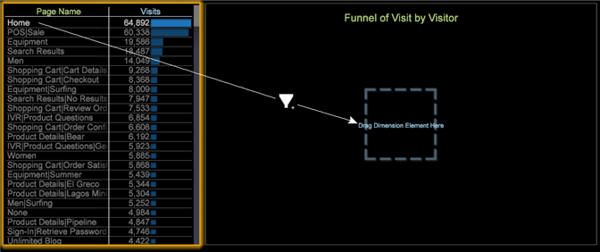

# Bygga en tratt{#building-a-funnel}

{{eol}}

Följ de här stegen för att skapa en ny kanalvisualisering

<!--  -->

1. Öppna en dimensionstabell från en ny arbetsyta.

   

   Högerklicka till exempel på arbetsytan och välj **[!UICONTROL Table > Site Content > Page Name]**

1. Öppna en trattvisualisering.

   Högerklicka till exempel på arbetsytan och välj **[!UICONTROL Visualization > Funnel]**.

   

1. Lägg till en dimension genom att markera elementet och dra samtidigt som du håller ned **[!UICONTROL `<Ctrl>`]** + **[!UICONTROL `<Alt>`]**.

1. Dra elementet till rätt position över målzonen, **[!UICONTROL Drag Dimension Element Here]**.

   

1. Lägg till ytterligare dimensioner.

   Du kan lägga till upp till åtta steg i tratten.
1. Släpp tabellmarkeringen som du gjorde för att visa tratten baserat på den totala publiken.

   Trattvisualiseringar följer mönstret för alla andra visualiseringar, vilket gör att det markerade elementet kan styra det datasegment som du visualiserar.
1. Ändra trattklippets dimension, nivådimension och mätvärden.

   Högerklicka på titeln för att justera alternativen baserat på de mått och mått som definieras i din anpassade profil.

   

Från tratten kan ni identifiera bortfall och nedgång i takt med att kunderna konverterar försäljningen och efterföljande kampanjer eller innehållsvägar. Om du vill ha mer information kan du öppna en [Sökvägsläsaren](../../../../home/c-get-started/c-analysis-vis/c-funnel-visualization/c-path-browser-funnel.md#concept-b0cedf7a28ae422696ded1258c9a4119) om du vill visa en detaljerad lista över de sidor som tagits innan den valda sidan kom fram och de banor som tagits efter att de lämnat sidan.

Se ytterligare [Funktioner](../../../../home/c-get-started/c-analysis-vis/c-funnel-visualization/c-funnel-visualization-features.md#concept-e65c81fe17794acd8d00d796b1780dc3).
