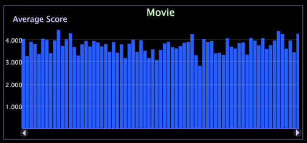

# Diagram{#graphs}

Ett diagram kan visa en eller flera mätvärden över en eller två datamängder.

Diagram är mycket kraftfulla visualiseringar, och om du lär dig att använda dem kan du svara på många olika frågor.

Med diagram kan du enkelt se trender i affärsstatistik över kontinuerliga data eftersom du kan välja en delmängd av en dimension som mätvärdena är graderade över (till exempel en viss tidsram) och zooma in för att titta närmare på data för den perioden. Instruktioner om hur du zoomar in ett diagram eller en tabell finns i [Zooma in visualiseringar](../../../../home/c-get-started/c-vis/c-zoom-vis.md#concept-7e33670bb5344f78a316f1a84cc20530).

I följande exempel visas ett stolpdiagram där antalet sessioner som är associerade med varje dag avbildas av fältets längd. När du flyttar muspekaren över fältet för en viss dag visas det numeriska värdet som fältet representerar.

**Övertoningsövertäckning i ett diagram**

Du kan högerklicka och välja en **övertoningsövertäckning** på menyn för att bättre visa diagramelement.

* **Ingen övertoningsövertäckning**  (standard). Välj det här alternativet om du vill visa staplar utan övertoningsövertäckning.
* **Bakgrund från vänster**. Välj det här alternativet om du vill visa en färggradering över alla staplar från vänster till höger.
* **Bakgrund från höger**. Välj det här alternativet om du vill visa en färggradering över alla staplar från höger till vänster.
* **Cylinder**. Välj det här alternativet om du vill visa övertoning av färger från mitten av varje fält till kanten av varje fält.

**Lägga till bildtexter i ett diagram**

Du kan också lägga till hänvisningar till linjära diagram. Se [Lägga till bildtexter på en arbetsyta](../../../../home/c-get-started/c-vis/c-call-wkspc.md#concept-212b09e763044d938987b4a9c658adc0).

Om du vill lägga till en bildtext i diagramvisualiseringar måste du högerklicka längst ned i visualiseringen (basaxeln) för att öppna en meny och välja **Lägg till bildtext**.

