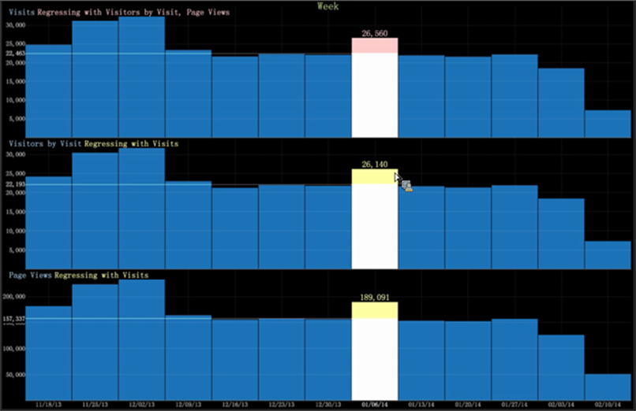

# Diagram för regressionsanalys{#regression-analysis-graph}

{{eol}}

Stolpdiagrammet i Data Workbench innehåller nu en regressionsjämförelse för flera mätvärden i flera diagram.

[Stolpdiagram](https://experienceleague.adobe.com/docs/data-workbench/using/client/analysis-visualizations/graphs/c-graphs.html) i Data Workbench kan du komprimera måtten i ett diagram till måtten i ett annat diagram. Om du har flera diagram kan du jämföra ett mätvärde (som den oberoende variabeln) med ett diagram som utvärderar andra mätvärden (som beroende variabler). På så sätt kan du bestämma styrkan för relationen mellan en beroende variabel (det mätvärde som etablerats först) och en serie andra ändringsvärden (regressioner med det etablerade beroende mätvärdet).

Med regressionsanalysen på en grafvisualisering kan analytiker utföra &quot;konsekvensscenarier&quot;. Om antalet besök till exempel ökar till denna nivå, hur påverkar denna ökning intäkterna?

**Ställa in regressionsanalys**

1. Välj diagram som ett beroende mått för en regressionsjämförelse.

   Högerklicka på diagrammet och välj **Ange som basmått för regression**.

   

1. Ange andra måttdiagram som oberoende variabler.

   Högerklicka och välj **[!UICONTROL Regress with `<base metric name>`]** för andra mätvärden.

   

1. Visa regression genom att högerklicka på diagrammet för att flytta fältet uppåt och nedåt.

   Om du högerklickar på diagrammet för ett specifikt värde kan du se regressionsförhållandet för varje mätvärde baserat på värden uppåt eller nedåt.

   

   Om t.ex. min sidvy minskar till 86 041 får de andra måtten följande värden: Besök 12 183 och besök 12 028.

   

   Om besökarnas värden ökar till 26 141 blir de andra värdena Besök vid 26 560 och Sidvyer vid 189 091.
