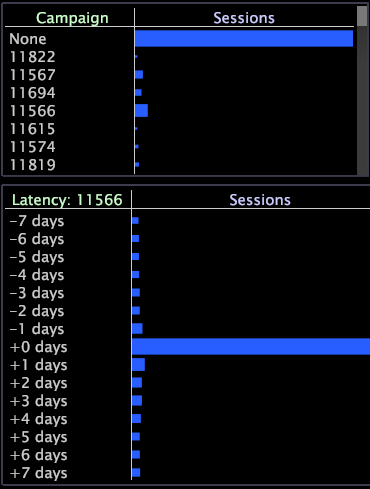

# Latenstabeller{#latency-tables}

Visualiseringar av svarstidstabeller är register som innehåller en latensdimension, som är en typ av härledd dimension som mäter den tid som har förflutit sedan en viss händelse inträffade.

Du definierar händelsen genom att göra markeringar inom en eller flera visualiseringar och ange dessa markeringar som händelsen med hjälp av alternativet för snabbmenyn Ange händelse. Latenstabeller är särskilt användbara för att spåra aktiviteter relaterade till en kampanj eller till en viss kundorder där du letar efter en tidskorrelation.

I [!DNL Site] innehåller latenstabeller information om besökarsessioner som inträffade så många som sju dagar före eller efter händelsen, men du kan konfigurera latenstabeller för att ge information om olika räkningsbara dimensioner och tidsdimensioner. Se [Konfigurera svarstabeller](../../../home/c-get-started/c-intf-anlys-ftrs/c-config-ltcy-tbls/c-config-ltcy-tbls.md#concept-7175c3defec64556994f0dfcccb7d15c).

Element i den överordnade dimensionen, t.ex. en session, som är en del av den specifika händelse som du har markerat, har fördröjningen noll. Alla andra element tilldelas latenser som avspeglar avståndet (i rätt tidsdimension) från händelsen.

Följande exempel visar hur du kan använda latenstabellen.

**Identifiera värdehändelser i relation till en kampanj**

Säg att ni vill spåra kundernas aktivitet under de sju dagarna före och efter att de svarat på en viss reklamkampanj. Om du vill visa fördröjningen för en viss annonskampanj anger du den aktuella kampanjen som händelse för latenstabellen.

Svarstiden i arbetsytan nedan baseras på valet av Campaign 11566 (sessionerna som svar på kampanjen).

En fördröjning på &quot;+0 dagar&quot; identifierar sessionerna som svar på Campaign 11566, samt alla andra sessioner för samma kunder som ägde rum samma dag.

En fördröjning på&quot;-2 dagar&quot; identifierar sessionerna för samma kunder som ägde rum två dagar innan kunderna svarade på kampanjen.

En fördröjning på &quot;+7 dagar&quot; identifierar sessionerna för samma kunder som inträffade sju dagar efter att de svarade på kampanjen.

Förutom de procedurer som anges i följande avsnitt kan du utföra samma uppgifter som du kan utföra i en tabell, till exempel sortera element, maskelement, lägga till serieförklaringar, exportera data och så vidare. Mer information finns i [Tabeller](../../../home/c-get-started/c-analysis-vis/c-tables/c-tables.md#concept-c632cb8ad9724f90ac5c294d52ae667f).

## Skapa en latenstabell {#section-31a03031d9854ef7acc2462d4f37678d}

Om du vill skapa en latenstabell börjar du med att göra en markering och anger sedan den markeringen som den händelse som du vill spåra fördröjningen för.

1. Högerklicka på en arbetsyta och öppna önskad visualisering(ar), som måste baseras på den räkningsbara dimension som används för att konfigurera latenstabellen.

   I [!DNL Site] måste till exempel visualiseringen/visualiseringarna vara sessionsbaserade.

1. Öppna en tom latenstabell.
1. Gör en markering på arbetsytan.
1. Högerklicka i latenstabellen och klicka på **[!UICONTROL Set Event]**.

>[!NOTE]
>
>Händelser som du väljer bevaras inte såvida du inte sparar markeringarna som en latensdimension. Anvisningar finns i [Återanvända en Latency-Dimension](../../../home/c-get-started/c-analysis-vis/c-lat-tbls.md#section-29c6483bf9ba476fb1c24ad1df253f46).

## Återanvända en latenstabell {#section-05f741169d204213b6537dce553e4f73}

Om du vill använda samma svarstabell igen kan du spara latenstabellen lokalt eller om du har rätt behörighet kan du spara den på servern så att alla användare i en viss profil kan komma åt den.

**Spara latenstabellen för användning i andra arbetsytor**

1. Högerklicka på visualiseringens övre kant och klicka på **[!UICONTROL Save]**. Fönstret [!DNL Save] visas. Standardplatsen för att spara är användar-\*profilnamnet*\Arbetsmapp.
1. I fältet [!DNL File name] anger du ett beskrivande namn för visualiseringen och klickar på **[!UICONTROL Save]**.

**Så här hämtar du den sparade latenstabellen**

1. Högerklicka på arbetsytan och klicka på **[!UICONTROL Open]** > **[!UICONTROL File]**. Fönstret [!DNL Open Visualization] visas.
1. Navigera till latenstabellen som du sparade.
1. Markera visualiseringsfilen för latenstabellen ( [!DNL *.vw]) och klicka på **[!UICONTROL Open]**.

## Återanvänd en fördröjningsdimension {#section-29c6483bf9ba476fb1c24ad1df253f46}

Om du vill använda samma fördröjningsdimension igen kan du spara latensdimensionen lokalt eller om du har rätt behörighet kan du spara den på servern så att alla användare av en viss profil kan komma åt den.

Eventuella latensdimensioner som du skapar sparas i profilens katalog för Dimensioner och finns tillgängliga i listrutan [!DNL Change Dimension] i Datan Workbench.

**Spara latensdimensionen för andra arbetsytor**

1. Högerklicka på kolumnetiketten [!DNL Latency] eller något av elementen i den och klicka på **[!UICONTROL Save Dimension]**. Fönstret [!DNL Save Dimension As] visas.
1. Markera eller skapa lämplig underkatalog i katalogen Dimensions.
1. I fältet [!DNL File name] anger du ett beskrivande namn för dimensionen (till exempel [!DNL Latency for Campaign 11565.dim]) och klickar på **[!UICONTROL Save]**.

**Så här hämtar du den sparade fördröjningsdimensionen**

1. Högerklicka på arbetsytan och klicka på **[!UICONTROL Open]** > **[!UICONTROL File]**. Fönstret [!DNL Open Visualization] visas.
1. Navigera till den fördröjningsvisualisering som du sparade i mappen User\*profile name*\Dimensions.
1. Markera latensdimensionsfilen ( [!DNL *.dim]) och klicka på **[!UICONTROL Open]**.

## Exportera till Microsoft Excel {#section-3dffa5c3aab14cdaa40c78b81b08fe53}

Mer information om att exportera fönster finns i [Exportera fönsterdata](../../../home/c-get-started/c-wk-win-wksp/c-exp-win-data.md#concept-8df61d64ed434cc5a499023c44197349).

## Exportera till en TSV-fil {#section-fd921f351c994ed0a94f63d3bd5b5a87}

Mer information om att exportera fönster finns i [Exportera fönsterdata](../../../home/c-get-started/c-wk-win-wksp/c-exp-win-data.md#concept-8df61d64ed434cc5a499023c44197349).
