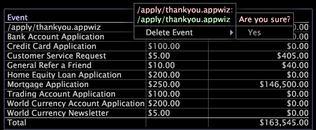

# Värdeförklaringar{#value-legends}

{{eol}}

En värdeförklaring visar definierade värdehändelser.

Värdeförklaringen är bara konfigurerad i HBX och [!DNL Site] -program, men de kan konfigureras för andra program. Mer information får du av Adobe Consulting Services.

I HBX och [!DNL Site]definieras en värdehändelse som en session som genererade ett affärsvärde. Händelsedataposterna som är kopplade till särskilda sidvyer (t.ex. en tacksida eller en avslutningssida för en order) kan till exempel representera värdehändelser för en affärsorganisation.

Med värdehändelser kan du mäta och spåra mängden värde som genereras av webbplatsen. Du kan utvärdera affärsvärdet i dollar för varje evenemang och svara på frågor som:

* Vilken är den mest lönsamma vägen genom webbplatsen?
* Vilken hänvisare eller kampanj har genererat mest värde?

För varje händelse visar förklaringen händelsens enhetsvärde (värde per händelse) och det totala värde som genereras av händelsen. Du använder teckenförklaringen för att definiera och ändra värdehändelser och för att tilldela enhetsvärden till dem.

I följande tabell visas de mått som relateras till värdehändelser.

| Mått | Beskrivning |
|---|---|
| Konvertering | Procentandel sessioner som genererade affärsvärde |
| Värde | Totalt genererat affärsvärde i dollar |
| Medel Värde | Det genomsnittliga affärsvärde som genereras, i dollar, per session |

Du kan enkelt definiera allt som besökarna gör på webbplatsen som en värdefull händelse: publicera en kundtjänstförfrågan, fylla i en ansökan, visa en del av innehållet eller slutföra ett köp. Varje värdehändelse motsvarar en användare som öppnar en viss sida eller uppsättning sidor på webbplatsen och är kopplad till ett affärsvärde i dollar. Du kan till exempel anta att varje användare som når sidan&quot;Tack för att du köpt&quot; genererar en täckningsmarginal på i genomsnitt 20 USD. Du definierar en värdehändelse för den sidan som har värdet 20 USD.

## Definiera nya värdehändelser {#section-2ea4d168336e4d2e98b22b636ed43853}

**Definiera en ny värdehändelse i HBX eller[!DNL Site]**

När du skapar en värdehändelse drar du webbsidor som representerar värde från en visualisering till en värdeförklaring.

1. Öppna en värdeförklaring.

   

1. Lägg till värdehändelser i förklaringen från processkartor, URI-sidtabeller eller sidhierarkivyer:

   * Dra noder från processkartan från en processkarta till teckenförklaringen.
   * Från en URI-sidtabell trycker du på Ctrl+Alt och drar en sida från tabellen till teckenförklaringen.
   * I sidhierarkivyn klickar du till vänster om en nod (mapp, sida eller grupp) och drar den till teckenförklaringen.

   

   Muspekaren visar ordet &quot;Nej&quot; tills musen når teckenförklaringen.

1. Tilldela ett affärsvärde till varje session som händelsen inträffar för i värdesförklaringen:

   1. I [!DNL Value per Event] klickar du på cellen som motsvarar sidan som du har lagt till som en värdehändelse.
   1. Ange det dollarbelopp som ska tilldelas värdet för händelsen och tryck på Retur.

   

   Som standard visas URL-adressen till sidan som du definierade som en värdehändelse i värdeförklaringen. Om du vill kan du dubbelklicka på den här URL:en i förklaringen för att gå in i redigeringsläge och byta namn på händelsen. Du kan också när som helst redigera värdet för en viss händelse. Värdehändelsebaserade Data Workbench som medelvärde och konvertering beräknas automatiskt om av servern.

När du har definierat minst en värdehändelse blir värdesegmentsdimensionen tillgänglig för användning. Den här dimensionen representerar det totala värdet som en besökare har genererat i alla sessioner.

## Ta bort värdehändelser {#section-25cd90a859384ca183c0fc0998f888cf}

* Högerklicka på önskad händelse och klicka på **[!UICONTROL Delete Event]**.

   

>[!NOTE]
>
>Datan Workbench beräknar mätvärden för hela uppsättningen data som är tillgängliga för profilen som du använder. Som standard är [!DNL Data Workbench Server] beräknar värden som Värde, Värdehändelser, Genomsnittligt värde och Konvertering för alla data i analysdatauppsättningen, även om data inte kommer från samma logiska källa.

## Exportera till Microsoft Excel {#section-feaa7a8eb8124fafbc74169bebaed6d8}

Mer information om att exportera fönster finns i [Exporterar fönsterdata](../../../../home/c-get-started/c-wk-win-wksp/c-exp-win-data.md#concept-8df61d64ed434cc5a499023c44197349).
