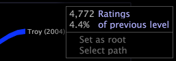

# Webbläsare{#path-browsers}

Med en sökvägsläsare kan du analysera den sekvens i vilken en viss dimensions element användes.

Du skapar en sökvägsläsare genom att dra och släppa ett element av en dimension på en tom visualisering i en sökvägsläsare. Det element som du drar och släpper till sökvägsläsaren blir roten i sökvägsläsaren. I sökvägsläsaren visas sökvägar som passerar genom roten, vilket gör att du kan se sekvensen med element som öppnats före och efter roten.

I följande sökvägsläsare visas den filmsekvens som tittarna betygsatt före och efter att filmen *The Aviator*, som är roten i sökvägsläsaren. Varje filmnamn är ett element i dimensionen Film, som definieras i en datamängd som består av filmdata som innehåller filmernas namn och tittarnas omdömen om filmerna.

Du kan skapa sökvägsläsare för att visa den sekvens i vilken element av någon dimension i datauppsättningen har öppnats. Om du till exempel arbetar med webbplatsdata kan du skapa en sökvägsläsare som visar ordningen på de webbplatssidor som öppnats före och efter roten för varje session som roten visades i eller för varje besökare som visade roten.

Varje sökvägsläsare har en associerad basdimension, gruppdimension, nivådimension och mätvärde, som tillhandahåller nycklar för tolkning av data som visas i sökvägsläsaren.

* **Basdimension:** När du drar och släpper ett rotelement i banwebbläsaren drar och släpper du ett element i basdimensionen. Alla andra element som visas i banorna är element i basdimensionen. Du kan ändra basdimensionen genom att dra och släppa ett element med en annan dimension i banwebbläsaren.
* **Nivådimension:** Varje dimension i datauppsättningen har en associerad nivådimension (kallas även överordnad). Nivådimensionen för din sökvägsläsare ska vara densamma som nivådimensionen (eller den överordnade) för din sökvägsläsares basdimension. En webbläsares nivådimension är viktig av två huvudorsaker:

   * När du följer en bana från ett basdimensionselement till nästa, går du från ett nivådimensionselement till nästa. Anta till exempel att du har skapat en sökvägsläsare som visar sidor på en webbplats. Varje sida är ett element i siddimensionen och sidans nivådimension är Sidvy. När du går från en sida till nästa går du från en sida till nästa.
   * När du väljer en sökväg med basdimensionselement i en sökvägsläsare, markerar du data för motsvarande element i nivådimensionen. Markeringen innehåller alltid de element i nivådimensionen som relaterar till roten, och den förfinas genom att fler element läggs till i banan. När du t.ex. väljer en sökväg med sidor, t.ex. roten > A > B, väljer du data för de sidvyer som är kopplade till roten där nästa sida är A och nästa sida är B.

      Mer information om hur du väljer en bana i en sökvägsläsare finns i [Markera banor](../../../../home/c-get-started/c-analysis-vis/c-path-browsers/t-sel-paths.md#task-bf44d08c71954ef2adec4b82f840adeb). Mer information om markeringar finns i [Göra markeringar i visualiseringar](../../../../home/c-get-started/c-vis/c-sel-vis/c-sel-vis.md#concept-012870ec22c7476e9afbf3b8b2515746).
   >[!NOTE]
   >
   >Sökvägsläsaren ignorerar elementen i nivådimensionen utan tillhörande basdimensionselement. Detta kan inträffa när du skapar en sökvägsläsare från en processkarta. Se [Skapa sökvägsläsare](../../../../home/c-get-started/c-analysis-vis/c-path-browsers/c-create-path-browsers.md#concept-e120de6a740d4b6f98dda9e2b638f6ff).

* **Gruppdimension:** Gruppdimensionen bestämmer hur elementen i nivådimensionen grupperas för att bilda sökvägarna i en sökvägsläsare. De nivådimensionselement som är kopplade till en enskild sökväg i en sökvägsläsare kan inte omfatta mer än ett element i en gruppdimension.

   För att förstå detta bör du överväga ett exempel med webbdata. Anta att bas-, nivå- och gruppdimensionerna för sökvägsläsaren är Sida, Sidvy respektive Session. En sökväg i sökvägsläsaren visar sidsekvensen A > B > C. Gruppdimensionen (session) anger att sidvyerna (element i sidvisningsdimensionen) som är kopplade till sidsekvensen A > B > C inträffade under en session. Det är viktigt att notera att det kan finnas flera sessioner under vilka det fanns sidvyer för sidsekvensen A > B > C. Sökvägen som visar sidsekvensen A > B > C representerar därför alla enskilda sessioner där sidvyerna för den sekvensen inträffade.

* **Mått**: Tjockleken på banan som leder till ett givet element är proportionerlig till måttets värde för det elementet. De tunnare banorna visar större mätvärden än tunnare banor.

Etiketten i det övre vänstra hörnet av sökvägsläsaren namnger bas- och gruppdimensionerna som representeras i visualiseringen. Namnet på nivådimensionen visas inte i visualiseringen av sökvägsläsaren. Etiketten har formatet &quot;Sekvens för *basdimensionsnamn*+s för varje *gruppdimensionsnamn*.&quot; Etiketten Sekvens med filmer för varje användare anger till exempel att basdimensionen är Film och gruppdimensionen är Användare.

Genom att högerklicka på ett element i sökvägsläsaren kan du se namnet på måttet som är kopplat till sökvägsläsaren och dess värde för det elementet.

>[!NOTE]
>
>Du kan ändra standardmåtten och måtten för en sökvägsläsare. Instruktioner om hur du konfigurerar visualisering för sökvägsläsare finns i [Konfigurera sökvägsläsare](../../../../home/c-get-started/c-intf-anlys-ftrs/t-config-path-brwsr.md#task-bbb3ddaa140a414f984b697c2b8202a3).
