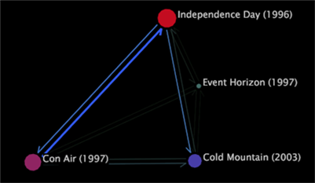

# Processkarta{#process-map}

{{eol}}

Med processkartor kan du analysera aktivitetsflödet mellan element i en dimension.

Du skapar processkartor genom att dra och släppa element från en dimension på en tom tvådimensionell (2D) eller tredimensionell (3D) karta. Elementen blir noder på kartan. Noder är cirklar i 2D-processkartor och staplar i 3D-processkartor.

>[!NOTE]
>
>En processkarta hämtar sitt namn från dess användning vid analys av aktivitetsflödet mellan stegen i en process. I den här typen av analyser representerar varje element på kartan ett steg i processen.

Till skillnad från webbläsare med sökvägar kan processkartor visa så få eller så många element som behövs för din analys. Du kan välja intressanta element och dra och släppa dem på kartan. Till skillnad från sökvägswebbläsare visar processmappningar aktivitetsflödet i båda riktningarna mellan ett element och ett eller flera andra element.

>[!NOTE]
>
>För att dessa kartor ska fungera så effektivt som möjligt bör du öppna en färgförklaring på arbetsytan. Mer information om hur du använder färgteckenförklaringar med processkartor finns i [Aktivera färglänkar](../../../../home/c-get-started/c-analysis-vis/c-proc-maps/c-act-color-lnks.md#concept-2c9b9f67f2bd4cd7a5431fa21c094edc). Mer information om färgteckenförklaringar finns i [Färgförklaringar](../../../../home/c-get-started/c-analysis-vis/c-legends/c-color-leg.md#concept-f84d51dc0d6547f981d0642fc2d01358).

Varje processkarta har en associerad basdimension, gruppdimension, nivådimension och mätvärde, som tillhandahåller nycklar för tolkning av data som visas i processkartan.

Standardinställningarna för en processmappnings mått och mätvärden beror på vilket Data Workbench du använder. Information om vilka dimensioner och mätvärden som är tillgängliga för dig för dina processkartor finns i programguiden för ditt Data Workbench-program.

* **Basdimension:** När du drar och släpper ett element på en processkarta drar och släpper du ett element i basdimensionen.
* **Nivådimension:** Varje dimension i datauppsättningen har en associerad nivådimension (kallas även överordnad). Nivådimensionen för din processkarta ska vara densamma som nivådimensionen (eller den överordnade) för processmappningens basdimension. Om du till exempel drar en sida (ett element i siddimensionen) till kartan blir motsvarande nivådimension Sidvy.
* **Gruppdimension:** Gruppdimensionen bestämmer hur elementen i nivådimensionen grupperas för att skapa anslutningar mellan noder. För processkartor är gruppdimensionen viktig av tre huvudorsaker:

   * En anslutning mellan två noder kan inte omfatta mer än ett element i en gruppdimension. För att förstå detta bör du överväga ett exempel med webbdata. Anta att bas-, nivå- och gruppdimensionerna för processkartan är Sida, Sidvy respektive Session. En anslutning från sida A till sida B anger att under en session inträffade en sidvy av sida A före en sidvy av sida B utan mellanliggande sidvyer av andra sidor (noder) på kartan. Observera att sidvyer av andra sidor på webbplatsen kan ha förekommit mellan sidvyer för sidorna A och B under samma session, men dessa sidor visas inte på den här kartan.
   * En anslutning mellan två noder kan representera flera element i gruppdimensionen. Det kan till exempel finnas flera sessioner där en sidvy av sida A inträffade före en sidvy av sida B. Anslutningen mellan sida A och sida B representerar därför alla enskilda sessioner där en sidvy av sida A inträffade före en sidvy av sida B utan mellanliggande sidvyer av andra sidor (noder) på kartan.
   * När du gör en markering baserat på en nod i en processkarta, markerar du alla element i gruppdimensionen som involverade den noden. Se [Göra markeringar i visualiseringar](../../../../home/c-get-started/c-vis/c-sel-vis/c-sel-vis.md#concept-012870ec22c7476e9afbf3b8b2515746). Mer information om markeringar finns i [Göra markeringar i visualiseringar](../../../../home/c-get-started/c-vis/c-sel-vis/c-sel-vis.md#concept-012870ec22c7476e9afbf3b8b2515746).

* **Mått:** Nodstorleken för ett givet element är proportionell mot måttets värde för det elementet. Större noder visar större mätvärden än mindre noder.

Om du till exempel använder [!DNL Site] I HBX kan du som standard dra element från siddimensionen till processkartan. Storleken på varje nod är relaterad till antalet sessioner (som definieras av sessionsmåttet) där sidan visades.

>[!NOTE]
>
>Du kan ändra standardmåtten eller måtten för en processkarta. Anvisningar om hur du konfigurerar en processkarta finns i [Konfigurera processkartor](../../../../home/c-get-started/c-intf-anlys-ftrs/t-config-proc-maps.md#task-4a95730b18a14bc790a77c013832b2d6).
