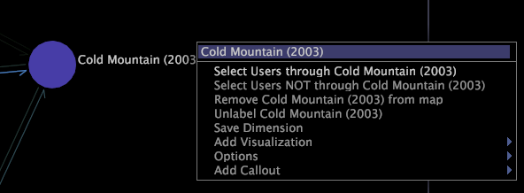
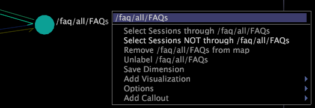
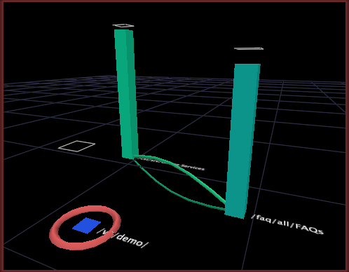

# Göra en markering från en processkarta{#make-a-selection-from-a-process-map}

Du kan markera i processkartor för att skapa filter som innehåller eller exkluderar data som är kopplade till en viss nod.

När du gör en markering i en processkarta används kartans gruppdimension, som bestämmer hur elementen i basdimensionen (dvs. noderna i kartan) grupperas för att skapa anslutningar mellan noder.

>[!NOTE]
>
>Du kan ändra standardgruppdimensionen för en processkarta. Se [Konfigurera processkartor](../../../../home/c-get-started/c-intf-anlys-ftrs/t-config-proc-maps.md#task-4a95730b18a14bc790a77c013832b2d6).

När du gör en markering baserat på en nod i en processkarta, markerar du alla element i gruppdimensionen som involverade den noden. Ta följande exempel för att förstå gruppdimensionens roll bättre:

* Filmer kan grupperas efter de tittare som har klassificerat dem. Varje visningsprogram är ett element i användardimensionen, så användardimensionen blir gruppdimensionen för processkartan. När du gör ett val från en nod för en viss film skapar du ett filter som visar data för de användare som bedömde eller inte graderade den filmen.
* Webbplatssidor kan grupperas efter de sessioner där de visades. Varje session är en del av sessionsdimensionen, så sessionsdimensionen blir gruppdimensionen för processkartan. När du gör ett val från en nod för en viss sida skapar du ett filter som visar data för de sessioner där sidan visades eller inte visades.

**Göra en markering**

1. Högerklicka på en nod i en processkarta.
1. Klicka på något av följande alternativ för att göra ett val baserat på noden:

   * **[!UICONTROL Select]*** **[!UICONTROL group dimension name +s]*** **[!UICONTROL through node name]**: Filtrerar data så att de innehåller alla element i gruppdimensionen som passerat noden genom att filtrera bort alla sessioner som inte gick igenom noden.

   * **[!UICONTROL Select]*** **[!UICONTROL group dimension name +s]*** **[!UICONTROL NOT through node name]**: Filtrerar data så att de innehåller alla element i gruppdimensionen som inte gick igenom noden genom att filtrera bort alla sessioner som passerat genom noden.

När du gör en markering i ett 3D-processschema kommer den nod som markeringen görs för att ringas in. Benchmarks appears around each bar help you compare metric values with and without the selection. Se [Förstå riktmärken](../../../../home/c-get-started/c-vis/c-ustd-benchmks.md#concept-c7b0f4102e92458096f8c4765cbe2914).

