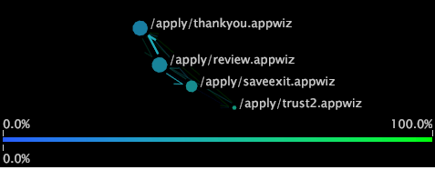

# Typer av processkartor{#types-of-process-maps}

Information om olika typer av processkartor.

## 2D-processkartor {#section-ea7fbdb80b1b44aebcd9e4090b6540bf}

Tvådimensionella processkartor ger en tvådimensionell vy över aktiviteten mellan dimensionselement. Storleken på en nod i en 2D-processmappning är proportionerlig till värdet för det mätvärde som är associerat med den noden. Dessutom är både tjockleken och intensiteten för en pil mellan två noder proportionella mot medelvärdet för måttets värden för dessa noder.

Du kan göra något av följande i en 2D-processöversikt:

* Markera, flytta, ta bort och etikettera noder
* Gör markeringar
* Spara dimensioner
* Skapa andra visualiseringar
* Aktivera färglänkar
* Visa måttkvantiteter
* Lägg till bildtexter

2D-processkartan i följande exempel visar noder som motsvarar namnen på filmerna. Varje filmnamn är ett element i dimensionen Film, som definieras i en datamängd som består av filmdata. Filmdimensionen är basdimensionen för den här processkartan.

I exemplet är storleken på varje nod och tjockleken och intensiteten för varje pil proportionell mot graderingsmåttet, som är antalet graderingar som en film har fått. Därför har en film med en stor nod, som *Självständighetsdagen*, fler omdömen än en film med en liten nod, som *HändelseHorisont*. Du kan också se att fler filmtittare betygsatte *Självständighetsdagen* före *Cold Mountain* än betygsatte samma filmer i motsatt ordning. Observera att pilarna inte anger att tittarna rankade *Självständighetsdagen* och sedan rankade *Cold Mountain* omedelbart därefter, eller vice versa. Visningsprogrammen kan ha klassificerat andra filmer däremellan, men dessa filmer visas inte på kartan.

## 2D-måttscheman {#section-a9b846fc71224058918fbc378315effe}

Tvådimensionella metriska kartor är en typ av 2D-processmappning som placerar noder baserat på värdet för ett visst mått. I många fall är det mätvärde som används med 2D-måttschemat antingen Konvertering eller Behåll. Konverterings- och kvarhållningskartor hjälper er att förstå vilka steg i processerna i era kundcentrerade kanaler som påverkar kundkonverteringen och kundlojaliteten.

>[!NOTE]
>
>Det mätvärde som du använder med en 2D-mätkarta måste uttryckas i procent.

I en måttkarta för konvertering ritas noder med 0 procents konvertering till vänster om diagrammet, och sidor med 100 procents konvertering ritas till höger. Aktivitet mellan noder visas, vilket gör det enkelt att se vilka steg i en process som leder till ökad eller minskad konvertering och vilka steg som leder till avbruten konvertering. En processkonverteringsanalys är ett effektivt sätt att jämföra processer eller jämföra olika implementeringar av samma process.

På samma sätt visas element med 0 procents behållning till vänster om diagrammet och element med 100 procents behållning till höger. Du kan se kvarhållningsfrekvensen för varje nod på kartan, vilket hjälper dig att avgöra vilka element som påverkar kunderna att returnera.

>[!NOTE]
>
>Du kan inte flytta noder på 2D-måttscheman vågrätt. Måttscheman är utformade för att placera noder från vänster till höger baserat på deras måttvärden.

## 3D-processkartor {#section-80acb63ea0994af1af7faef3c6264e51}

Tredimensionella processkartor ger en tredimensionell vy över aktiviteten mellan dimensionselement. Höjden på en stapel i en 3D-processkarta är proportionerlig till värdet på det mätvärde som är associerat med den noden. Precis som för 2D-processmappningar är både tjockleken och intensiteten för kopplingarna mellan två noder proportionella mot medelvärdet för mätvärdena för dessa noder. Du kan göra något av följande inom en 3D-processkarta:

* Markera, flytta, ta bort och etikettera noder
* Gör markeringar
* Spara dimensioner
* Skapa andra visualiseringar
* Aktivera färglänkar

3D-processkartan i följande exempel visar noder som motsvarar sidorna på en webbplats. Varje sida är ett element i siddimensionen, som definieras i en datamängd som består av webbtrafikdata. Siddimensionen är basdimensionen för den här processkartan.

I exemplet är höjden på varje streck och tjockleken och intensiteten för varje koppling proportionella mot sessionsmåttet, ett antal sessioner där sidorna visades. Därför har en sida med högt fält, t.ex. /faq/all/FAQs, visats under fler sessioner än en sida med ett kort fält, t.ex. /vs/demo. Observera att anslutningarna mellan två sidor inte indikerar att en sida visades omedelbart före eller efter en annan under en given session. Andra sidor kan ha visats under samma session, men dessa sidor visas inte på kartan.
