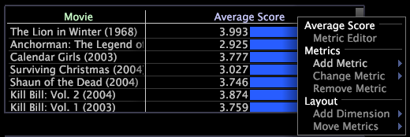

# Lägga till och ändra ett mått{#add-and-change-a-metric}

Information om hur du lägger till och ändrar mätvärden.

**Lägga till ett nytt mått**

* Högerklicka på etiketten eller ett element i måttet och klicka på **[!UICONTROL Add Metric]** > *&lt;**[!UICONTROL metric name]**>.* Måttet läggs till till till höger om det mätvärde som du valde från början.

   

I följande exempel visas medelpoängsmåttet för filstorleken (i den övre tabellen) och samma tabell med ett andra mått, Medelpoängsfel, som lagts till i tabellen.

**Ändra ett mätvärde**

* Högerklicka på etiketten eller ett element i måttet som du vill ändra och klicka sedan på **[!UICONTROL Change Metric]** > *&lt;**[!UICONTROL metric name]**>*. Det nya måttet ersätter det ursprungliga måttet.
